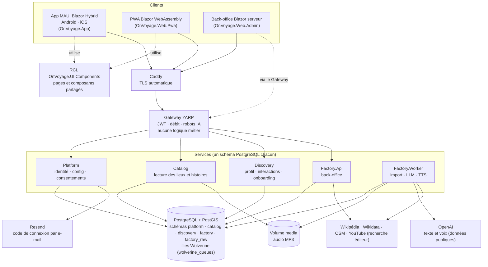
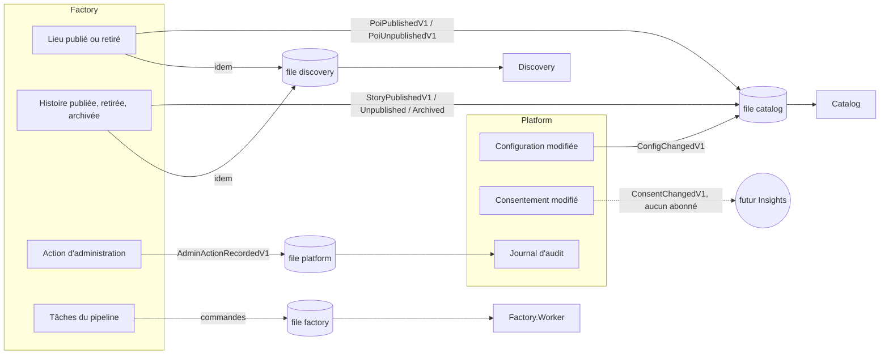
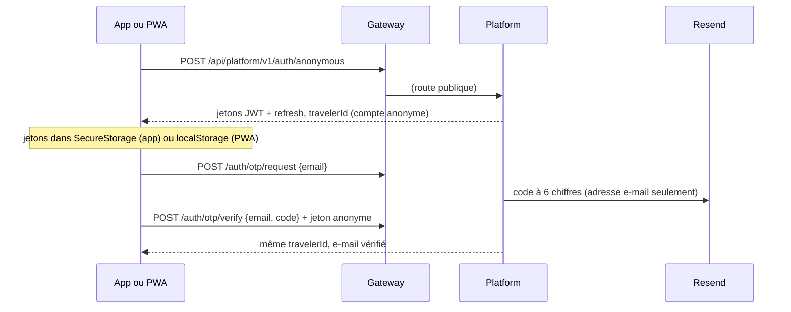
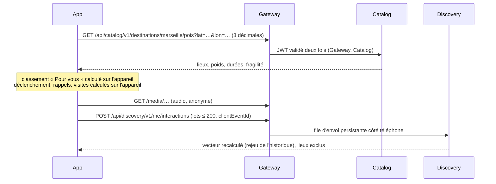
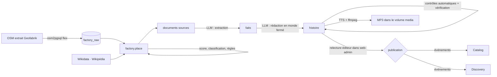
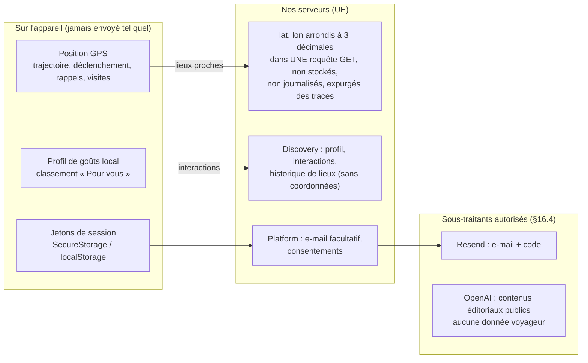

# Architecture — ON.VOYAGE

Ce document décrit l'architecture **telle qu'elle est construite au 2026-10-01** (tranche MVP-0), vérifiée dans le code ; la cible complète est au §9 du cahier des charges. Chaque écart avec la cible est signalé. Décisions détaillées : `docs/adr/`.

## Vue d'ensemble

Hors de ce schéma, **non construits** : Insights, Billing, Ads, Creators (Insights, Creators et Web.Public sont en cours de développement ; Creators existe avec ses profils fondateurs, voir ADR-0016), Supabase Auth et le stockage S3/CDN du §9.1 (remplacés pour le MVP-0 par l'identité maison de l'ADR-0005 et un volume local servi par Catalog).

Règles qui structurent tout le reste :

- **Le client ne parle qu'au Gateway** (API et fichiers `/media`). Aucune ressource tierce dans les pages ; les contenus externes s'ouvrent par lien sortant.
- **Aucun appel HTTP synchrone de service à service.** Les services s'envoient des événements d'intégration par la file PostgreSQL de Wolverine. La seule exception est technique : le Gateway lit les réglages `security.*` de Platform (`GET /api/platform/v1/config?scope=edge`, jeton interne de 5 min) toutes les 60 s.
- **Un service possède son schéma** ; personne ne lit celui d'un autre.
- **LLM et synthèse vocale uniquement dans Factory, en tâche de fond**, avec des données publiques ; jamais sur le chemin d'une requête voyageur.

## Services

| Hôte | Rôle | Schéma | Projets | Publie | Consomme |
| --- | --- | --- | --- | --- | --- |
| **Gateway** | Proxy YARP : routage, validation JWT, limitation de débit, blocage des robots d'IA, CORS | — | `OnVoyage.Gateway` | — | — |
| **Platform** | Sessions anonymes et connexion par code (JWT HS256), configuration distante, drapeaux, consentements, journal d'audit | `platform` | `Platform.Api` + Application/Domain/Infrastructure/Contracts | `ConfigChangedV1` (vers `catalog`), `ConsentChangedV1` (sans abonné aujourd'hui) | `AdminActionRecordedV1` |
| **Catalog** | Lecture publique : destinations, lieux, histoires, liens, taxonomie ; sert `/media` | `catalog` | `Catalog.Api` + … | — | `PoiPublishedV1`, `PoiUnpublishedV1`, `StoryPublishedV1`, `StoryUnpublishedV1`, `StoryArchivedV1`, `ConfigChangedV1` |
| **Discovery** | Profil d'intérêts (rejeu de l'historique), interactions, avis, visites, onboarding | `discovery` | `Discovery.Api` + … | — | `PoiPublishedV1`, `PoiUnpublishedV1`, `StoryPublishedV1` (extraits), `StoryUnpublishedV1`, `StoryArchivedV1` |
| **Factory** | Import OSM, enrichissement, scores, faits, rédaction, contrôles, voix, lots, signalements, atelier éditorial | `factory`, `factory_raw` | `Factory.Api` (back-office), `Factory.Worker` (tâches) + … | `PoiPublishedV1`, `PoiUnpublishedV1`, `StoryPublishedV1`, `StoryUnpublishedV1`, `StoryArchivedV1` (vers `catalog` et `discovery`), `AdminActionRecordedV1` (vers `platform`) | commandes de tâches sur sa propre file `factory` |
| **web-admin** | Back-office Blazor serveur ; ne parle qu'au Gateway avec le jeton de l'éditeur | — | `Web.Admin` | — | — |
| **web-studio** | Espace créateur Blazor serveur (inscription et CGU, profil, contenus, conseils) ; ne parle qu'au Gateway avec le jeton du créateur | — | `Web.Studio` | — | — |
| **web-pwa** | PWA (fichiers statiques) | — | `Web.Pwa` | — | — |

Bibliothèques partagées : `OnVoyage.ServiceDefaults` (OpenTelemetry avec expurgation, santé, résilience HTTP, authentification JWT et politiques, projection de configuration, contrôle de version minimale), `OnVoyage.Messaging` (configuration Wolverine commune), `OnVoyage.Recommendation.Engine` (apprentissage du profil, classement, planificateur de visite : C# pur, partagé serveur et app), `OnVoyage.Taxonomy` (74 dimensions).

Côté client : `OnVoyage.App.Core` (logique pure : déclenchement, audio, retours, rappels, carte), `OnVoyage.App.Infrastructure` (client HTTP du Gateway), `OnVoyage.App.LocalData` (SQLite `user.db`, file d'envoi, lecteur de packs ; hôte MAUI seulement), `OnVoyage.UI.Components` (RCL Razor sans dépendance MAUI, seul JavaScript : `map.js`).

### Découpage interne d'un service

`Api → Application → Domain` ; `Infrastructure → Application, Domain` (implémente les ports) ; `Api` ou `Worker` est la racine de composition et ne référence `Infrastructure` que pour l'injection. Les endpoints sont minces (liaison, envoi au bus Wolverine, traduction du résultat), les cas d'usage sont dans `Application/Features/<Cas>/`, les handlers d'événements d'intégration dans `Application/IntegrationEvents/`. Ces règles sont **vérifiées par `tests/OnVoyage.ArchitectureTests`** (couches, références entre services uniquement par `*.Contracts`, paquets de base de données confinés à l'infrastructure, Gateway sans domaine, RCL et cœur client sans MAUI, aucun SDK d'analyse, de plantage, de publicité ou de paiement tiers, aucun secret dans la configuration de production, seul Platform émet des jetons, aucune ressource tierce dans le HTML client).

## Messagerie

Wolverine, avec persistance et transport PostgreSQL (`OnVoyage.Messaging`) : boîte d'envoi et de réception durables dans le schéma du service, **une file par service consommateur** dans le schéma `wolverine_queues`, transactions automatiques, réessais à délais croissants puis lettre morte (`MoveToErrorQueue`) — rien n'est perdu. Les consommateurs sont idempotents (`EventId`, `Version`).

- Au démarrage, Platform **republie** la version courante de chaque clé de configuration (`Platform:RepublishOnStart`) : un service qui a manqué des événements rattrape son retard.
- Les routes d'abonnement de la configuration sont dans `Messaging:ConfigSubscribers` de Platform (par défaut `catalog`).
- Les commandes longues de Factory (import, enrichissement, scores, sources, faits, rédaction, audio, tâche de lot) sont postées sur la file `factory` : l'API ne fait que les enregistrer (`202`) et **le worker les exécute** ; un enchaînement (import, puis enrichissement, puis scores) remet chaque étape en file pour la réessayer seule. Le plafond de tâches simultanées est `Factory:Jobs:MaxParallel` (4).
- Contrats des événements : `*.Contracts` de chaque service (`PlatformContracts.cs`, `FactoryEvents.cs`). Écarts avec le §13 : `PoiProjectionChangedV1` n'existe pas (Discovery lit directement les événements de Factory, ADR-0011) ; les événements de suppression et d'export (`TravelerDeletionRequestedV1`…) ne sont pas encore écrits.

## Flux de données

### Première ouverture et connexion

Aucun mot de passe, aucune connexion sociale. Seule l'empreinte HMAC du code est stockée.

### Parcours voyageur (accueil, fiche, écoute, retours)

Le serveur est la source du vecteur d'intérêts : à chaque lot, Discovery enregistre les événements nouveaux, rejoue **tout** l'historique dans l'ordre et renvoie le résultat, que l'app adopte (ADR-0011). Un événement tardif ou renvoyé ne pose donc aucun cas particulier.

### Production de contenu (Factory)

Prompts versionnés dans `prompts/` (embarqués dans l'assemblage), sorties structurées, version du prompt stockée avec chaque brouillon ; fournisseurs simulés en test (voir [TESTING.md](TESTING.md)). Détails : ADR-0007 et ADR-0008.

### Configuration distante

Platform tient `remote_config` et les drapeaux, versionnés et journalisés. Chaque modification publie `ConfigChangedV1`; Catalog garde sa projection (`catalog.config_snapshot`) et applique le contrôle `app.min_app_version` (`426`). L'app lit `GET /api/platform/v1/config`. Le Gateway relit ses réglages de protection par le chemin technique décrit plus haut.

## Frontières de vie privée

- **Aucune donnée voyageur à un tiers**, hormis l'adresse e-mail et le code envoyés à Resend. OpenAI ne reçoit que des textes publics (articles, faits dérivés).
- **Aucune position stockée, journalisée ou tracée** : les coordonnées ne figurent que dans `lat`/`lon` de `GET …/pois`. L'instrumentation OpenTelemetry remplace `url.query` et `url.full` ; les catégories de journaux qui impriment l'URL sont plafonnées à `Warning` ; Caddy supprime la requête de ses journaux ; le collecteur d'observabilité masque encore les paramètres de position.
- **Aucun SDK d'analyse, de plantage, de publicité ou de paiement tiers** (test d'architecture), **aucune ressource tierce** dans les pages (bibliothèques de carte embarquées, tuiles PMTiles à nous).
- Les statistiques d'usage (Insights) ne partiront qu'avec le consentement ; **tant qu'aucun choix n'est fait, c'est un refus** (§16.3). Ce flux n'existe pas encore.
- Registre complet : [PRIVACY.md](PRIVACY.md) ; schémas concernés : [DATABASE.md](DATABASE.md).

## Sécurité

- Jetons d'accès JWT HS256 (60 min), émis par Platform seul (`iss`/`aud` `on.voyage`), validés par le Gateway **et** par chaque service avec la même clé `Auth:JwtSecret` (32 octets au minimum). Politiques `traveler`, `account`, `admin`, `creator`, `internal`.
- Gateway : limitation de débit par adresse et par voyageur, blocage des `User-Agent` d'IA (`security.blocked_user_agents`), CORS par liste d'origines.
- Secrets : variables d'environnement ou paramètres Aspire, jamais dans le dépôt ; sauvegardes chiffrées avec `age` ([runbooks/restore.md](runbooks/restore.md)).
- Écarts avec le §15 : un seul rôle PostgreSQL pour tous les services (SEC-07), pas de validation des coordonnées contre l'emprise des destinations (SEC-05), revue ASVS à faire (T-1102).

## Déploiement et observabilité

Développement : Aspire (`dotnet run --project src/Aspire/OnVoyage.AppHost`). Staging : Docker Compose derrière Caddy ([DEPLOYMENT.md](DEPLOYMENT.md)). Traces, métriques et journaux OpenTelemetry vers un collecteur, Prometheus, Loki, Tempo et Grafana ([runbooks/observability.md](runbooks/observability.md)).

## Décisions (ADR)

| ADR | Sujet |
| --- | --- |
| [0001](adr/0001-pwa-blazor-webassembly.md) | PWA en Blazor WebAssembly partageant la RCL |
| [0002](adr/0002-mvp0-slice.md) | Tranche verticale initiale du MVP-0 |
| [0003](adr/0003-catalog-postgis.md) | Catalog sur PostgreSQL/PostGIS |
| [0004](adr/0004-messaging-and-platform.md) | Messagerie Wolverine et service Platform |
| [0005](adr/0005-identity-otp-resend.md) | Identité maison : session anonyme + code par e-mail (Resend) |
| [0006](adr/0006-gateway-edge-protection.md) | Protection du Gateway : débit, robots, traces |
| [0007](adr/0007-factory-places-pipeline.md) | Factory : pipeline des lieux |
| [0008](adr/0008-factory-content-pipeline.md) | Factory : pipeline de contenu |
| [0009](adr/0009-admin-blazor.md) | Back-office Blazor |
| [0010](adr/0010-mobile-discovery-audio-map-localdata.md) | App : déclenchement, audio, carte, données locales |
| [0011](adr/0011-discovery-service-learning-feedback-planning.md) | Discovery : apprentissage, retours, envies, planification |
| [0019](adr/0019-web-studio.md) | Espace créateur `Web.Studio` : inscription, rôle, conseils, contenus |

Questions ouvertes : `docs/questions/` (sources de Factory, OpenAI, Resend).
