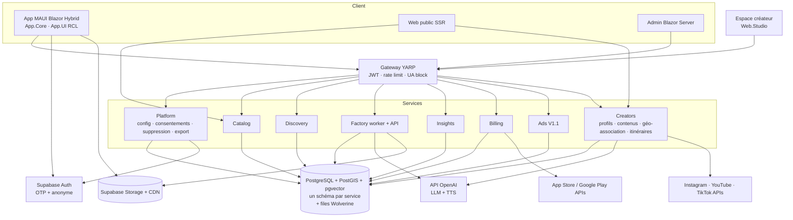

# ON.VOYAGE — Cahier des charges v2 (spécification pour développement par agent IA)

> **Le guide de voyage qui apprend à vous connaître — et qui vous emmène là où les autres ne vont pas.**

| Champ | Valeur |
| --- | --- |
| Version | 2.0 — 29/09/2026 |
| Remplace | « Cahier des charges — ON.VOYAGE MVP » (v1, benchmark inclus) |
| Propriétaire produit | Ben (benoit-bernard) |
| Destinataire principal | Agent de développement IA (Claude Sonnet 5.5 dans Claude Code, ou GitHub Copilot en mode agent) |
| Langue du code | Anglais (identifiants, commentaires, commits) |
| Langue des documents produit et de l'UI par défaut | Français, puis anglais |
| Dépôt cible | `on.voyage` (monorepo, voir §9.2) |

---

## 0. Mode d'emploi pour l'agent IA

Ce document est la **source de vérité fonctionnelle et technique** du projet. Il est écrit pour être exécuté tâche par tâche.

### 0.1 Ordre de lecture obligatoire avant toute tâche

1. `.github/copilot-instructions.md` et tous les fichiers `.github/instructions/*.instructions.md` du dépôt (voir §23 et l'annexe H).
2. `CLAUDE.md` à la racine (il renvoie vers les fichiers ci-dessus).
3. Ce cahier des charges : §2 (décisions), la section de l'epic concernée, §23 (règles de développement), puis la fiche de la tâche au §24.
4. Les ADR existants dans `docs/adr/`.

### 0.2 Règles de préséance

| Conflit | Règle |
| --- | --- |
| `architecture-governance.instructions.md` (copie d'engawa) ↔ `copilot-instructions.md` d'ON.VOYAGE | **`copilot-instructions.md` l'emporte** : il précise l'inversion de dépendance (§23.2). |
| copilot-instructions ↔ ce document, sur l'architecture ou le style de code | **Les copilot-instructions l'emportent.** Signaler l'écart dans la PR. |
| copilot-instructions ↔ ce document, sur une exigence fonctionnelle, légale ou de vie privée | **Ce document l'emporte.** Signaler l'écart dans la PR. |
| Deux sections de ce document | La plus spécifique l'emporte ; ouvrir une question (§0.4). |
| Décision de §2 ↔ n'importe quelle autre section | **§2 l'emporte toujours.** |

### 0.3 Définition de « terminé » pour chaque tâche

Une tâche n'est terminée que si **toutes** les conditions suivantes sont vraies :

- [ ] Le code compile sans avertissement (`TreatWarningsAsErrors=true`).
- [ ] Les tests unitaires, d'intégration et d'architecture passent (`dotnet test`).
- [ ] Les critères d'acceptation de la ou des exigences `F-xx` concernées sont couverts par des tests automatisés quand c'est techniquement possible ; sinon, une procédure de test manuel est ajoutée dans `docs/testing/manual/`.
- [ ] `dotnet format --verify-no-changes` passe.
- [ ] Les traces, métriques et logs OpenTelemetry sont émis pour le nouveau flux (§17).
- [ ] La documentation concernée est mise à jour (§22).
- [ ] Aucun secret, aucune clé, aucune donnée personnelle réelle n'est commitée.
- [ ] La PR décrit : tâche, exigences couvertes, écarts éventuels, captures d'écran pour l'UI.

### 0.4 Quand l'agent doit s'arrêter et poser une question

L'agent **ne devine pas** et ouvre un fichier `docs/questions/Q-<date>-<sujet>.md` (puis continue sur une autre tâche non bloquée) quand :

- une exigence est ambiguë au point que deux implémentations raisonnables divergent fonctionnellement ;
- une tâche implique d'envoyer une donnée utilisateur à un tiers non listé au §16.4 ;
- une dépendance NuGet/npm non listée au §10 semble nécessaire ;
- une règle des copilot-instructions semble impossible à respecter.

### 0.5 Conventions de ce document

- `F-xx` = exigence fonctionnelle ; `NF-xx` = exigence non fonctionnelle ; `D-xx` = décision arrêtée ; `T-xxx` = tâche du backlog ; `Q-xx` = question ouverte.
- **MUST / DOIT** = obligatoire ; **SHOULD / DEVRAIT** = recommandé, écart justifiable ; **MAY / PEUT** = optionnel.
- Les valeurs marquées ⚙️ sont des **paramètres configurables côté serveur** (§18) ; la valeur indiquée est la valeur par défaut.

---

## 1. Résumé exécutif

### 1.1 Produit

ON.VOYAGE est une application mobile (iOS, Android) et un site web de **découverte touristique personnalisée**. Elle combine :

- la géolocalisation et une carte ;
- des lieux (POI) enrichis et sourcés ;
- des **histoires audio** rédigées de façon originale à partir de sources vérifiées, puis lues par une voix de synthèse ;
- un **profil de goûts** qui se construit en voyageant (onboarding, retours explicites, comportement d'écoute) ;
- des **recommandations** hybrides : correspondance de contenu et goûts de voyageurs au profil proche ;
- un parti pris de **tourisme éthique** : orienter vers des lieux alternatifs moins fréquentés ;
- un **mode hors ligne** et des **anecdotes** réservés à l'abonnement ;
- une **dimension sociale portée par les créateurs voyage** : profils, contenus rattachés aux lieux, conseils, itinéraires, abonnements et « Voyage comme @créateur ».

### 1.2 Principes non négociables

1. **Aucune donnée utilisateur n'est partagée avec un tiers.** Ni vendue, ni louée, ni transmise à un annonceur, une destination ou un partenaire. Seuls des sous-traitants techniques strictement listés au §16.4 traitent des données, pour le compte d'ON.VOYAGE.
2. **Pas de GAFAM dans le parcours voyageur** : pas de SDK Google/Facebook/Firebase, pas de connexion Apple/Google, pas de cookies tiers, pas d'embed YouTube ni Instagram. Les exceptions inévitables sont listées au §16.4 : stores Apple/Google pour la distribution et le paiement, et, **côté créateurs uniquement**, la connexion serveur à Instagram, YouTube et TikTok qu'ils choisissent d'activer (D-17).
3. **L'IA ne tourne jamais en temps réel pour le voyageur.** Textes et audio sont générés en lot, relus, versionnés, puis servis comme des fichiers. La géo-association des contenus de créateurs tourne en tâche de fond et reste soumise à la validation du créateur.
4. **L'IA n'invente aucun fait.** Chaque affirmation d'une histoire est reliée à un fait extrait d'une source identifiée.
5. **L'audio est une interface, pas le produit.** Le produit est le graphe voyageur ↔ intérêt ↔ lieu ↔ créateur.
6. **Chaque fonctionnalité doit** améliorer l'expérience, enrichir le graphe ou créer un actif propriétaire. Sinon, elle attend.
7. **Tourisme éthique par défaut** : ne jamais aggraver la surfréquentation d'un site fragile ou réglementé.

### 1.3 Ce qui a changé par rapport à la v1

| Sujet | v1 | v2 |
| --- | --- | --- |
| Application mobile | Flutter | **.NET MAUI Blazor Hybrid (.NET 10)** |
| Backend | Python + FastAPI | **ASP.NET Core, microservices Clean Architecture, CQRS + vertical slices, Wolverine** |
| Jobs | Celery + Redis | **Wolverine (transport et outbox PostgreSQL)** |
| Cache | Redis | **HybridCache** (Redis seulement au-delà d'une instance) |
| Base | PostgreSQL + PostGIS | **Supabase auto-hébergé : PostgreSQL + PostGIS + pgvector** |
| Authentification | Apple, Google, e-mail, anonyme | **Session anonyme + OTP e-mail uniquement** |
| Stockage | S3/R2 | **Supabase Storage (compatible S3) + CDN européen** |
| Carte | non spécifiée | **MapLibre GL JS + tuiles vectorielles PMTiles auto-hébergées** |
| Publicité | bannières puis place de marché | **Régie publicitaire maison, sans partage de données, ciblage calculé sur l'appareil (V1.1)** |
| Abonnement | 5,99 €/mois générique | **Premium = guide hors ligne + anecdotes (+ sans publicité)** |
| Musique | musique libre plus tard | **Pas d'intégration Spotify (impossible, voir D-09)** |
| Recommandation | score de contenu | **Hybride contenu + filtrage collaboratif + pénalité d'affluence** |
| Web | non prévu | **Site public SEO, robots IA bloqués, réservation TDM** |
| Onboarding | cartes de catégories | **Extraits audio à noter + catégories optionnelles** |
| Positionnement | découverte personnalisée | **+ tourisme éthique (lieux alternatifs moins fréquentés)** |
| Social | réseau social hors périmètre | **Créateurs voyage : profils, contenus géo-associés, itinéraires, abonnements, « Voyage comme » ; pas de réseau social entre voyageurs** |

---

## 2. Décisions arrêtées

Ces décisions ont été prises par le propriétaire produit. L'agent ne les remet pas en cause ; il peut signaler un risque dans une PR.

| ID | Décision | Conséquence pour le développement |
| --- | --- | --- |
| D-01 | Stack : .NET MAUI Blazor Hybrid + ASP.NET Core + PostgreSQL (Supabase auto-hébergé) + API OpenAI, orchestrés par Aspire. | Aucun code Python, Flutter ou Node côté serveur. Seul JavaScript autorisé : interop carte (MapLibre, PMTiles) et scripts de build. |
| D-02 | Les données des utilisateurs ne sont partagées avec personne. | Aucun export de données individuelles vers un annonceur, une destination ou un partenaire. Les rapports B2B et publicitaires sont agrégés avec un seuil minimal (k ≥ 20 ⚙️). |
| D-03 | Publicité ciblée possible, via **notre propre régie**. | Service `Ads` (V1.1). Le ciblage par profil se fait **sur l'appareil** et exige un consentement explicite ; sans consentement, publicité **contextuelle** uniquement (zone, lieu consulté). Étiquette « Sponsorisé » obligatoire. |
| D-04 | Comptes par **OTP e-mail** (Supabase Auth). | Pas de mot de passe, pas de connexion Apple/Google/Facebook. Usage possible en session anonyme avant création de compte. |
| D-05 | L'abonnement Premium donne accès au **guide hors ligne** (utile à l'étranger) et aux **anecdotes** (contenus courts et amusants). | Service `Billing`, contrôle des droits côté serveur, URL signées pour les contenus Premium ; le texte des anecdotes n'est jamais exposé sans droit (ni API publique, ni web). Premium supprime aussi la publicité (proposition par défaut, voir Q-03). |
| D-06 | Lecture audio par **voix de synthèse IA**, générée à l'avance. | Abstraction `ITextToSpeechProvider` ; fournisseur par défaut OpenAI `gpt-4o-mini-tts` ; fournisseur souverain alternatif Kyutai TTS (auto-hébergé) à évaluer. Mention « voix générée par IA » obligatoire. |
| D-07 | Positionnement **tourisme éthique** : orienter vers des lieux alternatifs moins fréquentés. | Attributs d'affluence et de fragilité par lieu, pénalité d'affluence et bonus « pépite » dans le score, carte « Alternative moins fréquentée ». Argument commercial pour les destinations (F-13). |
| D-08 | Rédaction **originale** des textes par IA à partir de Wikipédia et d'autres sources ; « En savoir plus » renvoie vers Wikipédia et YouTube. | Pipeline « faits d'abord » + contrôle anti-plagiat (§8). Liens sortants uniquement : pas d'embed YouTube (cookies Google). |
| D-09 | Musique connectée à Spotify : **abandonnée**. | L'API Spotify limite le mode développement à 5 utilisateurs, réserve l'accès étendu aux organisations d'au moins 250 000 utilisateurs actifs mensuels, interdit de mixer ou superposer son audio avec un autre son, et exige Spotify Premium pour la lecture. Aucune intégration Spotify. Option V2 : ambiance sonore libre de droits (Q-06). |
| D-10 | Recommandation à partir de l'onboarding, puis en **mutualisant les avis des voyageurs au profil proche**, affinée individuellement. | Algorithme hybride décrit au §6, sans ML entraîné. |
| D-11 | Le site web affiche les textes pour le référencement de on.voyage, mais **interdit les robots d'IA**. Les moteurs de recherche classiques restent autorisés. | `robots.txt`, `tdmrep.json`, balises meta et blocage serveur par User-Agent (F-24, annexes A et B). |
| D-12 | Architecture conforme aux règles « Architecture Governance » de Ben : microservices autonomes, Clean Architecture stricte, CQRS + vertical slices, observabilité native. | §9 et §23. Tests d'architecture automatisés. Le Gateway reste un proxy technique ; configuration, consentements, suppression et export vivent dans un service `Platform`. |
| D-13 | Zone de lancement : **Marseille** (MVP-0), puis Provence (MVP). | Import des données limité à l'extrait PACA ; destinations activables par configuration. |
| D-14 | Traces GPS brutes **jamais envoyées au serveur**. | Le téléphone convertit la position en événements par lieu (« entré dans le rayon du lieu X », « visite probable 12 min »). |
| D-15 | Le domaine on.voyage héberge aujourd'hui un blog de micro-aventure (paddle, bivouac). | Ses pages sont reprises dans une rubrique « Micro-aventures » avec des URL conservées (T-903). |
| D-16 | **Dimension sociale = créateurs voyage**, troisième pilier du produit (lieux, voyageurs, créateurs) : profil, contenus rattachés aux lieux, conseils, listes et itinéraires, abonnements, « Voyage comme @créateur », statistiques d'intention agrégées. | Service `Creators`, espace `Web.Studio`, F-26 à F-34, §6.15. Créateurs fondateurs dès le MVP-0 ; libre-service, import et géo-association au MVP ; rémunération des créateurs (commissions, offre Pro, place de marché, collections sponsorisées) en V2. |
| D-17 | Les contenus des créateurs **restent sur leurs plateformes** ; ON.VOYAGE référence et relie. | Stockage de références, de vignettes sous licence et des relations créateur → contenu → lieu ; liens sortants ; connexions Instagram/YouTube/TikTok côté serveur, à l'initiative du créateur. |

---

## 3. Périmètre par phase

### 3.1 Phases

| Phase | Objectif | Critère de sortie |
| --- | --- | --- |
| **MVP-0** | Prouver qu'un visiteur préfère « pour vous » à une liste générique, à Marseille. | 150 histoires publiées ; 100 testeurs ; taux de clic « Pour vous » ≥ 1,5 × celui de la liste « Incontournables » (§26). |
| **MVP** | Produit publiable dans les stores en Provence, avec Premium. | 500 à 1 000 histoires FR + EN ; arrière-plan GPS ; hors ligne ; paiement ; publication stores. |
| **V1.1** | Régie publicitaire maison. | 3 annonceurs pilotes, reporting agrégé. |
| **V2** | Élargissement. | Nouvelles régions, langues, offre destinations B2B, itinéraires multi-jours, ambiance sonore, mode enfants. |

### 3.2 Matrice fonctionnelle

| Fonction | Réf. | MVP-0 | MVP | V1.1 | V2 |
| --- | --- | --- | --- | --- | --- |
| Session anonyme + compte OTP e-mail | F-01 | ✅ | ✅ | | |
| Onboarding par extraits audio | F-02 | ✅ | ✅ | | |
| Accueil « Pour vous » + explications | F-03 | ✅ | ✅ | | |
| Carte, clusters, filtres | F-04 | ✅ | ✅ | | |
| Fiche lieu | F-05 | ✅ | ✅ | | |
| Lecteur audio + mention IA | F-06 | ✅ | ✅ | | |
| Retours (aime / bof / pas pour moi) + récap du trajet | F-07 | ✅ | ✅ | | |
| Mes envies + rappel de proximité | F-08 | premier plan | + arrière-plan | | |
| Mode découverte (déclenchement automatique) | F-09 | premier plan, écran actif | + arrière-plan | | |
| Mode voiture | F-10 | | ✅ | | CarPlay / Android Auto |
| « Marseille pour vous » + « Que visiter ? » | F-11 | ✅ liste ordonnée | ✅ | | itinéraire multi-jours |
| Surprenez-moi | F-12 | | ✅ | | |
| Tourisme éthique (affluence, alternatives, accès réglementé) | F-13 | ✅ | ✅ | | données d'affluence temps réel |
| Recherche | F-14 | | ✅ | | |
| Packs hors ligne (Premium) | F-15 | | ✅ | | mises à jour différentielles |
| Anecdotes (Premium) | F-16 | | ✅ | | |
| Abonnement et achats | F-17 | | ✅ | | |
| Publicité (régie maison) | F-18 | | | ✅ | |
| En savoir plus (Wikipédia, YouTube) | F-19 | Wikipédia | + vidéos YouTube | | |
| Signaler une erreur | F-20 | ✅ | ✅ | | |
| Sources et licences | F-21 | ✅ | ✅ | | |
| Réglages vie privée, export, suppression | F-22 | ✅ | ✅ | | |
| Musique | F-23 | | | | ambiance libre de droits |
| Site web public SEO + blocage IA | F-24 | ✅ | ✅ | | |
| Profil créateur | F-26 | créateurs fondateurs (admin) | libre-service (Studio) | | offre Creator Pro |
| Connexion des comptes et import | F-27 | ajout manuel par URL | Instagram + YouTube | + TikTok | vision, transcription |
| Géo-association assistée par IA | F-28 | | ✅ | | |
| Listes et itinéraires de créateurs | F-29 | | ✅ | | |
| Créateurs côté voyageur (bloc « Vu par les créateurs », suivre) | F-30 | bloc + page + suivre | + découverte, section d'accueil | | |
| « Voyage comme @créateur » | F-31 | | ✅ | | |
| Statistiques créateur agrégées | F-32 | | ✅ | | visites, réservations |
| Modération et transparence commerciale | F-33 | signalement + file admin | complet | | |
| Partage et liens de parrainage | F-34 | | ✅ | | |
| Rémunération des créateurs, place de marché, collections sponsorisées | — | | | | ✅ |
| Back-office | F-25 | minimal | complet | + écrans régie | |
| Langues | — | FR | FR + EN | | DE, ES, IT |

### 3.3 Hors périmètre (toutes phases jusqu'à nouvel ordre)

Réservation d'hôtels ou de restaurants, billetterie, paiement de partenaires, place de marché, **réseau social entre voyageurs** (commentaires, messagerie, profils publics de voyageurs, avis), contenu créé par les voyageurs (hors signalements ; les contenus des **créateurs** sont dans le périmètre, F-26 à F-34), rémunération des créateurs (V2), réalité augmentée, reconnaissance visuelle, traduction instantanée, assistant vocal généraliste, génération d'itinéraires complexes, programme de fidélité ou d'ambassadeurs, CRM partenaires, **toute vente ou transmission de données utilisateur**.

L'architecture DOIT permettre d'ajouter plus tard les services `Partners` et `Destinations` sans modifier les services existants (nouveaux consommateurs d'événements).

---

## 4. Personas et parcours clés

### 4.1 Personas

| Persona | Contexte | Attente principale |
| --- | --- | --- |
| **Claire, 38 ans, prépare un séjour** | Chez elle, à Lyon, 2 semaines avant 4 jours à Marseille. | Savoir ce qui va *lui* plaire, télécharger avant de partir. |
| **Karim, 45 ans, en balade** | Sur le Vieux-Port, téléphone en poche, écouteurs. | Qu'on lui raconte ce qui l'entoure sans manipuler l'écran. |
| **Famille Martin, en voiture** | Route des Crêtes, téléphone sur support, Bluetooth. | Des histoires au bon moment, zéro interaction pendant la conduite. |
| **Inès, 29 ans, Marseillaise** | Week-end libre, 30 km autour de chez elle. | Découvrir des lieux hors des sentiers battus, sans la foule. |
| **Ben, éditeur** | Back-office. | Produire, vérifier et publier 150 puis 1 000 histoires sûres. |
| **Marie, 31 ans, créatrice voyage** | 40 000 abonnés Instagram, chaîne YouTube Provence. | Donner une seconde vie géolocalisée à ses contenus, être découverte par des voyageurs qui lui ressemblent, mesurer l'intention réelle de voyage qu'elle suscite. |

### 4.2 Parcours P1 — première ouverture hors zone (Claire)

1. Installation → ouverture → session anonyme créée silencieusement (F-01).
2. Onboarding : 5 extraits audio de 15 s sur des lieux très différents, notés d'un geste (F-02). Durée cible < 90 s.
3. Choix de la destination : « Marseille » proposée même si la position est à Lyon.
4. Page « Marseille pour vous » (F-11) : 9 lieux, chacun avec son « Pourquoi ».
5. Écoute d'une histoire « avant d'y aller » → retour « J'ai aimé » → la liste se met à jour.
6. Proposition : « Télécharger Marseille pour l'utiliser sans réseau » → paywall Premium (F-15, F-17).

**Time-to-value** : première histoire écoutée en moins de 3 minutes après l'installation, **où que soit l'utilisateur**.

### 4.3 Parcours P2 — balade (Karim)

1. Mode découverte activé (F-09) : écran actif au MVP-0, arrière-plan au MVP.
2. À 100 m du Fort Saint-Jean, importance et pertinence suffisantes → histoire lancée automatiquement, avec une courte annonce.
3. Pas d'interaction demandée pendant la marche. À la pause ou le soir : « Récap de votre balade » avec les retours à donner (F-07).

### 4.4 Parcours P3 — voiture (Famille Martin, MVP)

1. Détection de vitesse > 30 km/h → proposition de passer en mode voiture (F-10).
2. Déclenchement anticipé (environ 60 s avant le lieu), uniquement pour les lieux visibles ou accessibles depuis la route.
3. Aucun retour demandé pendant la conduite ; récap à l'arrêt.

### 4.5 Parcours P4 — locale éthique (Inès)

1. Curseur « Privilégier les lieux moins fréquentés » réglé sur « Fort » (F-13).
2. Accueil : alternatives aux sites saturés, par exemple « Plutôt que Sugiton un samedi d'août, découvrez … ».
3. Les lieux à accès réglementé affichent le lien officiel de réservation et ne sont jamais proposés par « Surprenez-moi ».

### 4.6 Parcours P5 — créatrice (Marie, MVP)

1. Marie crée son compte créateur (OTP), accepte les CGU créateurs, choisit ses spécialités (villages, gastronomie, road trips).
2. Elle connecte Instagram et YouTube ; l'import tourne en fond.
3. « Nous avons trouvé 37 lieux dans vos contenus » : elle valide en masse les propositions sûres, corrige les autres (F-28).
4. Elle écrit trois conseils et publie l'itinéraire « Mon week-end parfait dans le Luberon » (F-29).
5. Elle partage le lien de son profil ON.VOYAGE dans sa bio Instagram (F-34).
6. Un mois plus tard, elle voit (voyageurs ayant accepté les statistiques) : 310 ouvertures de ses vidéos depuis ON.VOYAGE, 95 lieux enregistrés après consultation, 24 adaptations « Voyage comme @marie », et « < 20 » installations via son lien (F-32).

---

## 5. Exigences fonctionnelles

Chaque exigence donne sa **règle**, puis ses **critères d'acceptation** au format *Étant donné / Quand / Alors*. Ces critères DOIVENT devenir des tests automatisés (unitaires, d'intégration ou bUnit) quand c'est possible.

### F-01 — Identité : session anonyme et compte OTP e-mail

**Règles**

- Au premier lancement, l'app crée une **session anonyme Supabase** sans aucune saisie. L'identifiant (`traveler_id`, UUID) est celui de l'utilisateur Supabase.
- Toutes les fonctions gratuites sont utilisables en anonyme.
- La création de compte (OTP e-mail) est demandée seulement pour : acheter Premium, synchroniser plusieurs appareils, ou restaurer après réinstallation.
- La création de compte **lie** l'utilisateur anonyme à l'e-mail : le `traveler_id` est conservé, avec le profil et l'historique.
- Code OTP à 6 chiffres, valable 10 min ⚙️, 5 tentatives max ⚙️, renvoi possible après 60 s ⚙️.
- Données de compte minimales : e-mail, langue, pays (déduit de la langue de l'appareil, modifiable), date de création, dernière activité, statut Premium. **Pas de nom obligatoire.**
- Le profil de goûts n'est **jamais** dérivé de l'e-mail ou du nom.

**Critères d'acceptation**

- Étant donné une première installation, quand l'app démarre, alors une session anonyme existe en moins de 2 s réseau disponible, et l'écran d'onboarding s'affiche.
- Étant donné une session anonyme avec 12 interactions, quand l'utilisateur valide son OTP, alors son `traveler_id` est inchangé et ses 12 interactions sont toujours présentes.
- Étant donné un code OTP expiré, quand il est saisi, alors un message clair propose d'en renvoyer un.
- Étant donné aucun réseau au premier lancement, alors l'app fonctionne en mode dégradé (contenus embarqués d'onboarding) et crée la session dès que le réseau revient.

### F-02 — Onboarding par extraits audio

**Règles**

- Écran 1 : « Qu'est-ce qui vous fait vibrer en voyage ? » → **5 extraits audio de 15 s** ⚙️, choisis par le service Discovery pour couvrir des catégories de niveau 1 très différentes (T-506). Chaque extrait : photo, titre, lecture automatique, boutons 👍 / 👎 et balayage gauche/droite.
- Écran 2 (optionnel, bouton « Affiner ») : grille des catégories de niveau 1 (annexe D) avec trois états par catégorie : neutre, « j'aime », « moins pour moi ».
- Écran 3 : choix de la destination (position actuelle si couverte, sinon liste des destinations actives + « Je prépare un voyage »).
- Les 5 extraits sont **embarqués dans l'app** (fonctionnent hors réseau).
- Durée totale cible < 90 s ; bouton « Passer » disponible dès l'écran 1.
- Calcul du vecteur initial : §6.3.

**Critères d'acceptation**

- Étant donné un utilisateur qui aime les extraits « Fort » et « Calanque » et n'aime pas « Art contemporain », alors son vecteur a `history.military > 0`, `nature.coast > 0` et `culture.contemporary_art < 0`.
- Étant donné un utilisateur qui passe l'onboarding, alors le vecteur initial est nul et la recommandation utilise le démarrage à froid (§6.7).
- Étant donné l'écran 1, alors aucun extrait ne démarre avant une action utilisateur si l'appareil est en mode silencieux (iOS) : afficher « Touchez pour écouter ».

### F-03 — Accueil « Pour vous »

**Règles**

- Sections, dans l'ordre :
  1. « Bonjour » + destination courante + bouton mode découverte.
  2. **« Pour vous »** : 3 à 5 cartes de lieux recommandés (§6), chacune avec photo, nom, distance, durée audio, et une ligne « Pourquoi » (§6.9).
  3. **« Autour de vous »** : mini-carte + 3 lieux proches (masqué si hors zone).
  4. **« Moins fréquenté, tout aussi beau »** : 1 à 3 alternatives éthiques (F-13), si disponibles.
  5. **« Vos envies »** : lieux sauvegardés dans la destination courante.
  6. **« De vos créateurs »** (MVP) : lieux et itinéraires récents des créateurs suivis (F-30).
- Une carte peut être « Sponsorisé » à partir de V1.1 (F-18), jamais en première position.
- Chaque affichage d'une carte recommandée émet un événement `recommendation_viewed` (surface, rang, `poi_id`) ; chaque clic émet `recommendation_clicked`.
- Mesure MVP-0 : un groupe témoin de 20 % ⚙️ des voyageurs (tirage stable : `hash(traveler_id) mod 100 < 20`) reçoit la liste « Incontournables » à la place de « Pour vous », avec le même habillage. Score témoin : `0,7 · Importance + 0,3 · Distance` (définitions §6.6), mêmes filtres durs, sans diversification ni exploration. La cohorte s'applique **uniquement** à la section « Pour vous » de l'accueil et à la page destination (F-11), y compris les candidats de « Que visiter ? » (score témoin) ; le pourcentage de compatibilité n'est pas affiché aux témoins (remplacé par « Populaire ») ; le mode découverte, Surprenez-moi et les rappels sont identiques pour tous. C'est ce qui permet de valider l'hypothèse centrale (§26).

**Critères d'acceptation**

- Étant donné un voyageur du groupe témoin, alors la section s'intitule « Incontournables » et l'ordre suit exactement `0,7 · Importance + 0,3 · Distance`.
- Étant donné une carte « Pour vous », alors la ligne « Pourquoi » est non vide et générée par gabarit (pas par LLM).
- Étant donné aucun réseau, alors l'accueil s'affiche depuis le cache local (dernière réponse valide ou pack hors ligne).

### F-04 — Carte

**Règles**

- MapLibre GL JS dans la BlazorWebView (§14.4), tuiles vectorielles PMTiles (style clair et sombre).
- Affiche : position utilisateur (point + précision), lieux publiés avec **clusters**, icône par catégorie de niveau 1, état « sauvegardé », état « déjà écouté », état « visité ».
- Filtres : catégories de niveau 1, « moins fréquentés », « avec audio », « sauvegardés ».
- Un appui sur un lieu ouvre un aperçu (nom, catégorie, distance, durée audio, bouton ▶) ; un second appui ouvre la fiche.
- Attribution « © OpenStreetMap contributors » et « Protomaps » toujours visible, non masquable.
- Ne charge **jamais** de tuiles depuis `tile.openstreetmap.org`.

**Critères d'acceptation**

- Étant donné 2 000 lieux dans la vue, alors la carte reste fluide (≥ 30 images/s sur un appareil de milieu de gamme de 2023) grâce au clustering.
- Étant donné un pack hors ligne installé et le mode avion, alors la carte de la destination s'affiche depuis le fichier local.
- Étant donné le filtre « moins fréquentés », alors seuls les lieux dont l'affluence courante (F-13) est ≤ 2 ⚙️ s'affichent.

### F-05 — Fiche lieu

**Structure**

```
[Photo principale + crédit]
Nom du lieu · catégorie · distance · « moins fréquenté » (badge éventuel)
« Pourquoi cela pourrait vous plaire » (ligne d'explication)
[▶ Écouter l'histoire · 1 min 30]    [Anecdote ★ Premium]
[♡ J'aime]  [👎 Pas pour moi]  [🔖 Enregistrer]  [📍 Y aller]
Accès : horaires (si connus) · accès réglementé + lien officiel (si applicable)
Alternative moins fréquentée (si applicable, F-13)
Vu par les créateurs : @marie (vidéo 1:32) · @alex (photo + conseil) · Tous (5) (F-30)
En savoir plus : Wikipédia ↗ · Vidéo ↗ (F-19)
Transcription de l'histoire (repliée par défaut)
Sources · Signaler une erreur (F-20)
```

**Règles**

- « Y aller » ouvre l'application de navigation choisie par l'utilisateur via un lien universel (`geo:` sur Android, `maps://` ou lien universel sur iOS). ON.VOYAGE n'embarque pas de calcul d'itinéraire.
- La transcription est le texte exact de l'histoire publiée (accessibilité, relecture).
- Les crédits photo s'affichent sous la forme `Photo : Auteur — Licence` avec un lien vers la source.
- Événements : `poi_viewed`, `poi_liked`, `poi_disliked`, `poi_saved`, `poi_unsaved`, `navigation_started`, `external_link_opened` (type).

**Critères d'acceptation**

- Étant donné un lieu sans histoire publiée dans la langue de l'utilisateur, alors le bouton ▶ est remplacé par « Histoire bientôt disponible » et le lieu n'est pas proposé par le mode découverte.
- Étant donné un lieu `access_regulated = true`, alors le lien officiel apparaît au-dessus des actions.
- Étant donné une image sous CC BY-SA, alors l'auteur et la licence sont affichés.

### F-06 — Lecteur audio

**Règles**

- Lecteur persistant en bas d'écran : ▶/❚❚, titre, progression `00:34 / 01:28`, recul 10 s, avance 10 s, vitesse 1× / 1,25× / 1,5×.
- Lecture en arrière-plan et commandes sur l'écran verrouillé (MVP-0 inclus : l'écran peut se verrouiller pendant une écoute lancée manuellement).
- File d'attente : 1 histoire en cours + 1 en attente au maximum.
- Respect du focus audio : pause sur appel téléphonique ou assistant de navigation, reprise automatique si l'interruption dure moins de 30 s ⚙️.
- **Mention obligatoire** « Voix générée par intelligence artificielle » : dans le lecteur (texte discret permanent) et à la première écoute (message unique). Les fichiers audio portent un marquage lisible par machine (§8.8).
- Événements de progression : `audio_started`, `audio_progress` à 25/50/75 %, `audio_completed` (≥ 95 %), `audio_skipped` (avec pourcentage), `audio_replayed`, `audio_speed_changed`.

**Critères d'acceptation**

- Étant donné une écoute arrêtée à 83 %, alors un événement `audio_progress` avec `percent = 75` et un `audio_skipped` avec `percent = 83` sont émis.
- Étant donné un appel entrant pendant la lecture, alors la lecture se met en pause et reprend après l'appel si celui-ci a duré moins de 30 s.
- Étant donné la première écoute de l'installation, alors le message sur la voix IA s'affiche une fois.

### F-07 — Retours et récap du trajet

**Règles**

- Fin d'écoute (hors mode voiture et hors mode découverte en arrière-plan) : bandeau « Cette histoire vous a plu ? » ❤️ J'ai aimé · 😐 Bof · 👎 Pas pour moi, puis bouton « D'autres lieux comme celui-ci ».
- « Pas pour moi » ouvre un choix facultatif : « Ce lieu » (par défaut) / « Ce type de lieu (catégorie) ». Voir §6.4 pour l'effet.
- **Récap du trajet** : si ≥ 2 histoires ont été écoutées sans retour pendant une session de découverte ou en voiture, une notification locale (ou une carte à l'ouverture suivante) propose de noter ces histoires d'un geste.
- Chaque retour est une **interaction** idempotente (`client_event_id` UUID généré par l'app) envoyée au service Discovery (`POST /api/discovery/v1/me/interactions`, types au §12.4) ; hors réseau, elle est mise en file (§14.3). Les signaux d'écoute (≥ 80 %, réécoute, abandon précoce) et les impressions de recommandations suivent le même chemin : ils sont nécessaires au service demandé (personnalisation) et ne dépendent pas du consentement statistiques.

**Critères d'acceptation**

- Étant donné un « Pas pour moi — Ce lieu », alors le lieu est exclu des recommandations et du mode découverte pour ce voyageur, et l'effet sur la catégorie est réduit (§6.4).
- Étant donné le même événement envoyé deux fois (reprise réseau), alors une seule interaction est enregistrée.

### F-08 — Mes envies et rappel de proximité

**Règles**

- « Enregistrer » ajoute le lieu à « Mes envies », groupé par destination puis par ville.
- **Rappel de proximité** : si un lieu enregistré est à moins de 800 m ⚙️ (marche) ou à moins de 12 min de détour estimé ⚙️ (voiture ; détour estimé = `2 × distance à vol d'oiseau × 1,3 ⚙️ / vitesse lissée`, sans calcul d'itinéraire), une notification locale propose « Vous êtes à 800 m du Fort Saint-Nicolas que vous aviez enregistré. Un détour ? ». Au maximum 1 rappel par lieu tous les 30 jours ⚙️ et 3 rappels par jour ⚙️.
- MVP-0 : rappel uniquement app ouverte (premier plan). MVP : aussi en arrière-plan si l'utilisateur a autorisé la localisation « Toujours ».
- Le rappel est calculé **sur l'appareil** ; aucune position n'est envoyée ; la date du dernier rappel (`last_reminded_at`) reste dans `user.db` et n'est **jamais** synchronisée (elle révélerait un passage à proximité).

**Critères d'acceptation**

- Étant donné un lieu enregistré il y a deux ans et un passage à 600 m, alors le rappel mentionne l'année d'enregistrement (mention ajoutée dès que l'année d'enregistrement est antérieure à l'année courante) : « … que vous aviez ajouté lors de votre voyage de 2028 ».
- Étant donné un rappel déjà fait il y a 10 jours pour ce lieu, alors aucun nouveau rappel n'est émis.

### F-09 — Mode découverte (déclenchement automatique)

**Règles**

- Activation explicite par l'utilisateur (bouton sur l'accueil et sur la carte). Jamais activé par défaut.
- MVP-0 : **premier plan uniquement**, écran maintenu actif (option « garder l'écran allumé »).
- MVP : fonctionne aussi app en arrière-plan et écran verrouillé, si la permission de localisation « Toujours » (iOS) / « Toujours autoriser » + service au premier plan (Android) est accordée.
- Règles de déclenchement, de vitesse et d'anti-rafale : moteur de déclenchement, §14.5.
- Chaque déclenchement émet `story_triggered` (`poi_id`, mode, distance arrondie à 50 m) — **pas de coordonnées**.
- Notification persistante Android « ON.VOYAGE vous accompagne » avec bouton « Arrêter ».

**Critères d'acceptation** (tests de rejeu GPX, §20.4)

- Étant donné la trace `walk_vieux_port.gpx`, alors au moins 3 et au plus 6 histoires se déclenchent, jamais deux à moins de 90 s d'écart.
- Étant donné un lieu écouté il y a 3 jours, alors il ne se redéclenche pas (délai de 30 jours ⚙️).
- Étant donné une perte GPS de 2 min (tunnel), alors aucune histoire ne se déclenche sur une position extrapolée.
- Étant donné l'utilisateur immobile depuis 5 min, alors aucun nouveau déclenchement n'a lieu hors détection de visite.

### F-10 — Mode voiture (MVP)

**Règles**

- Proposé automatiquement quand la vitesse lissée dépasse 30 km/h ⚙️ pendant 30 s ; activable manuellement.
- Écran simplifié : très grands boutons ▶/❚❚, « Suivante », « Arrêter », titre de l'histoire en cours, prochaine histoire prévue et sa distance.
- **Aucune demande de retour pendant la conduite** ; retours différés au récap (F-07).
- Déclenchement anticipé (§14.5) et sélection limitée aux lieux marqués `visible_from_road` ou `car_accessible`, ou d'importance ≥ 70 ⚙️ (même règle qu'au §14.5).
- CarPlay et Android Auto hors périmètre ; l'audio passe par le Bluetooth du véhicule et les commandes système.

**Critères d'acceptation**

- Étant donné la trace `car_route_des_cretes.gpx`, alors aucune histoire ne se déclenche pour un lieu situé derrière le véhicule (hors cône de ±60° ⚙️ du cap).
- Étant donné le mode voiture actif, alors aucun bandeau de retour n'apparaît en fin d'écoute.

### F-11 — « [Destination] pour vous » et « Que visiter ? »

**Règles**

- Page destination : en-tête, **profil résumé** (barres des 5 affinités les plus fortes et des 2 plus faibles), puis 9 lieux ⚙️ recommandés avec pourcentage de compatibilité (§6.8) et ligne « Pourquoi ».
- Consultable **depuis n'importe où** (préparation du voyage) : distances affichées depuis le centre de la destination quand l'utilisateur est hors zone.
- Écoute « à distance » : même histoire, précédée d'une phrase d'introduction « Avant d'y aller… » (générée avec l'histoire, champ `remote_intro`).
- « Que visiter ? » : l'utilisateur indique le nombre de jours `J` (1 à 4) et la mobilité (à pied, vélo, voiture) → **liste personnalisée ordonnée géographiquement**. Pas d'horaires, pas d'optimisation d'itinéraire. Algorithme (déterministe, graine = `traveler_id`) :
  1. candidats = les `J × 6` ⚙️ meilleurs lieux du score §6.6 (mode « à distance » si hors zone), après diversification ;
  2. regroupement en `J` groupes par **k-médoïdes** (distance de Haversine), diamètre maximal d'un groupe : 3 km à pied, 10 km à vélo, 40 km en voiture ⚙️ ; un lieu qui dépasse le diamètre est écarté au profit du candidat suivant ;
  3. dans chaque groupe, garder les 4 à 6 ⚙️ meilleurs scores, puis ordonner par **plus proche voisin** en partant du lieu le plus proche du centre de la destination ;
  4. ordre des jours : par score moyen décroissant.
- Bouton « Télécharger pour l'utiliser sans réseau » (Premium, F-15).

**Critères d'acceptation**

- Étant donné un utilisateur à Lyon, quand il ouvre « Marseille pour vous », alors 9 lieux s'affichent avec une compatibilité en pourcentage et une ligne « Pourquoi ».
- Étant donné « 2 jours, à pied », alors deux groupes de 4 à 6 lieux sont proposés, et la somme des distances à vol d'oiseau à l'intérieur d'un jour est inférieure à celle d'un ordre aléatoire dans 95 % des cas (test de propriété).

### F-12 — Surprenez-moi (MVP)

**Règles**

- Bouton « 🎲 Surprenez-moi » sur l'accueil et la carte.
- Choisit 1 lieu selon §6.10 : catégorie peu explorée mais adjacente aux goûts, qualité élevée, distance raisonnable, **jamais** un lieu fragile, à accès réglementé ou saturé à ce moment.
- Explication : « Vous aimez l'histoire militaire. Vous n'avez jamais essayé la géologie. À 4 km, un site réunit les deux. »

**Critère d'acceptation**

- Étant donné 20 appels successifs, alors au moins 8 lieux distincts sont proposés (pas de boucle sur le même lieu).

### F-13 — Tourisme éthique

**Règles**

- Chaque lieu porte (§11.1, `catalog.poi_ethics`) :
  - un **profil d'affluence** : niveaux de base `offpeak`, `shoulder`, `peak` de 1 (confidentiel) à 5 (saturé), et deux majorations `weekend_delta` (0 à 2) et `midday_delta` (0 à 1) ;
  - **affluence courante** : `crowd_level_courant = clamp(niveau_saison + weekend_delta · [samedi, dimanche ou jour férié] + midday_delta · [11 h–16 h], 1, 5)`, heure locale Europe/Paris ; saisons ⚙️ : `peak` = juillet–août, `shoulder` = avril–juin et septembre–octobre, `offpeak` = novembre–mars ;
  - `fragile` (milieu naturel ou patrimonial sensible) ;
  - `access_regulated` + `access_url` (ex. réservation obligatoire de Sugiton en été dans le Parc national des Calanques) ;
  - `alternative_poi_ids` : lieux alternatifs proposés quand ce lieu est saturé.
- Valeurs initiales calculées par la Factory (§7.6), puis corrigées dans le back-office.
- **Réglage utilisateur** « Privilégier les lieux moins fréquentés » : Désactivé / Équilibré (défaut) / Fort. Il module `w_crowd` et `w_gem` (§6.6).
- Carte « Alternative moins fréquentée » sur la fiche d'un lieu dont le `crowd_level` courant est ≥ 4.
- Les lieux `fragile` ne sont **jamais** déclenchés automatiquement (F-09), ni proposés par Surprenez-moi (F-12), ni sponsorisables (F-18).
- Le récit d'un lieu fragile DOIT contenir une consigne de respect (champ `care_note`, ex. « restez sur les sentiers balisés »).

**Critères d'acceptation**

- Étant donné le réglage « Fort » et deux lieux de pertinence égale, `crowd_level` 5 et 2, alors le lieu à 2 est classé devant.
- Étant donné un lieu `fragile`, alors il n'apparaît jamais dans les candidats du moteur de déclenchement.
- Étant donné un lieu `access_regulated` en période de réservation, alors la fiche affiche le lien officiel avant le bouton « Y aller ».

**Intérêt institutionnel (argumentaire B2B, pas de développement MVP)** : le plan gouvernemental de juin 2023 contre la surfréquentation prévoit un observatoire national des sites majeurs, une campagne d'Atout France invitant à « adapter ses choix de destination et de calendrier » et un soutien de la Banque des Territoires à l'achat d'outils de mesure des flux. ON.VOYAGE pourra proposer aux destinations des **indicateurs agrégés et anonymes** de redirection (écoutes et visites probables vers les alternatives), jamais de données individuelles (D-02).

### F-14 — Recherche (MVP)

**Règles**

- Champ de recherche plein texte sur nom, alias, catégories et mots-clés (« fort », « romain », « volcan »).
- Recherche servie par le service Catalog (PostgreSQL `tsvector` + `unaccent` + `pg_trgm`), jamais par Nominatim ni par un service tiers.
- Hors ligne : recherche dans le pack (SQLite FTS5).
- Debounce 300 ms, minimum 2 caractères.

**Critère d'acceptation**

- Étant donné la saisie « cathedrale » sans accent, alors « Cathédrale de la Major » apparaît dans les 3 premiers résultats.

### F-15 — Packs hors ligne (Premium, MVP)

**Règles**

- Un pack par destination et par langue : lieux, histoires, anecdotes, audio, images essentielles, carte vectorielle de la zone, index de recherche (format §14.6).
- Écran « Hors ligne » : destinations disponibles, taille affichée avant téléchargement, progression, mise à jour disponible, suppression.
- Un pack = **une archive unique** téléchargée par une URL signée valable 60 min ⚙️ (délivrée par Billing) ; reprise par HTTP Range, avec une nouvelle URL si la précédente a expiré. Wi-Fi seul par défaut ⚙️ (réglage utilisateur). Vérification SHA-256 de l'archive puis de chaque fichier extrait (manifeste).
- Un pack téléchargé reste lisible hors ligne pendant la durée de l'abonnement + 7 jours de grâce ⚙️ ; la validité est vérifiée à chaque retour réseau.
- En hors ligne, la recommandation utilise le moteur embarqué (§6.12) et les scores collaboratifs précalculés téléchargés avec le pack.

**Critères d'acceptation**

- Étant donné un téléchargement interrompu à 60 %, quand le réseau revient, alors il reprend à 60 %.
- Étant donné le mode avion et le pack Marseille installé, alors carte, fiches, audio, recherche, mode découverte et « Pour vous » fonctionnent.
- Étant donné un abonnement expiré depuis 8 jours, alors le pack est verrouillé (non supprimé) et un message propose de se réabonner.

### F-16 — Anecdotes (Premium, MVP)

**Règles**

- Type de contenu `anecdote` : 15 à 45 s, ton léger et surprenant, **même exigence de sources** que les histoires (§8).
- 0 à 3 anecdotes par lieu ; visibles sur la fiche avec un badge ★. Non-abonnés : titre et durée visibles, écoute verrouillée (1 anecdote gratuite par destination ⚙️ en guise d'échantillon).
- Le **texte et l'audio** d'une anecdote Premium ne sont jamais renvoyés par l'API Catalog ni affichés sur le web : ils sont stockés en fichiers privés et servis par URL signée Billing (§12.6).
- **Échantillon gratuit** : l'éditeur marque une anecdote par destination ⚙️ `is_free_sample` dans l'atelier ; elle est publiée comme un contenu gratuit (texte dans le Catalog, audio public) et reste accessible à tous. Aucun décompte par voyageur.
- Le mode découverte peut enchaîner une anecdote après une histoire si l'utilisateur est Premium et que l'écart minimal (§14.5) est respecté.

### F-17 — Abonnement et achats (MVP)

**Règles**

- Produits (identifiants stores) — **prix à valider, voir Q-02** :
  - `onvoyage.premium.pass7` : pass 7 jours, non renouvelable ;
  - `onvoyage.premium.pass30` : pass 30 jours, non renouvelable ;
  - `onvoyage.premium.yearly` : abonnement annuel auto-renouvelable.
- Premium donne : packs hors ligne (F-15), anecdotes (F-16), absence de publicité (F-18, proposition par défaut Q-03).
- Achat via les systèmes des stores (obligatoire pour du contenu numérique). Validation **côté serveur** par le service Billing (§12.6). Le droit Premium est lu depuis Billing, jamais déduit du seul reçu local.
- Achat impossible en session anonyme : l'app demande l'OTP e-mail avant l'achat (F-01).
- « Restaurer mes achats » disponible dans les réglages.
- Paywall sobre : ce que l'on obtient, prix, conditions, lien CGV et confidentialité. **Aucun motif trompeur** (pas de faux compte à rebours, pas de case pré-cochée).

**Critères d'acceptation**

- Étant donné un pass 7 jours acheté le 01/05 à 10 h, alors le droit expire le 08/05 à 10 h (UTC).
- Étant donné un reçu falsifié, alors Billing refuse et aucun droit n'est créé.

### F-18 — Publicité : régie maison (V1.1)

**Règles**

- **Formats** : une carte « Sponsorisé » dans l'accueil (position ≥ 3), une carte sur la fiche d'un lieu proche (sous les actions), jamais d'audio publicitaire, jamais d'interstitiel, jamais pendant la conduite.
- **Étiquetage** : mention « Sponsorisé » + nom de l'annonceur, visuellement distincte des recommandations éditoriales. Une publicité doit être identifiable comme telle (loi pour la confiance dans l'économie numérique, art. 20).
- **Ciblage** :
  - **contextuel** (sans consentement) : destination, rayon géographique autour de la position **évalué sur l'appareil**, catégorie du lieu consulté, langue ;
  - **personnalisé** (avec consentement opt-in explicite, désactivé par défaut) : affinités du profil. **Le calcul se fait sur l'appareil** : l'app télécharge les campagnes éligibles pour la zone avec leurs critères, puis choisit localement. Le serveur ne sait pas quel profil a vu quelle publicité.
- **Mesure** : l'app envoie des compteurs agrégés par campagne et par jour (impressions, clics, itinéraires) sans `traveler_id` ; le service Ads n'affiche un chiffre à l'annonceur qu'au-delà de k = 20 ⚙️ par cellule.
- **Exclusions** : aucun ciblage sur une catégorie sensible (religion, santé…), aucun ciblage des mineurs, aucune publicité pour un lieu `fragile`, jamais de publicité pour un Premium (Q-03).
- **Bouton « Pourquoi cette annonce ? »** : affiche les critères (« Vous êtes à Cassis · vous avez consulté un domaine viticole »).
- **Facturation** (hors app) : forfait mensuel par campagne ⚙️ au lancement ; CPC ou CPA plus tard.

**Critères d'acceptation**

- Étant donné le consentement « annonces adaptées » refusé, alors aucune donnée du profil n'est lue par le module de sélection publicitaire (test unitaire sur le sélecteur).
- Étant donné 12 impressions d'une campagne un jour donné, alors le rapport annonceur affiche « < 20 » pour ce jour.

### F-19 — En savoir plus : Wikipédia et YouTube

**Règles**

- Lien Wikipédia de la langue de l'utilisateur (repli sur l'anglais), issu de Wikidata (sitelinks).
- Vidéo (**MVP**) : 0 à 2 vidéos YouTube **sélectionnées dans le back-office** (T-407) (identifiant, titre, chaîne, vignette hébergée chez nous, URL). Dans l'app : **lien sortant** qui ouvre l'app YouTube ou le navigateur. **Pas d'iframe YouTube** (cookies et traceurs Google, D-02 et §1.2).
- Afficher « Vous quittez ON.VOYAGE » la première fois.

### F-20 — Signaler une erreur

**Règles**

- Depuis la fiche ou la transcription : type (fait inexact, prononciation, lieu fermé ou déplacé, photo, autre), texte libre de 500 caractères max, extrait sélectionné facultatif.
- Envoi au service Factory (`POST /api/factory/v1/reports`) avec `poi_id`, `story_id`, version, **sans position** (T-308).
- Une histoire qui reçoit ≥ 3 ⚙️ signalements « fait inexact » de voyageurs distincts sur la même version passe automatiquement en `SUSPENDED` (§8.2) : elle est retirée du Catalog (`StoryUnpublishedV1`) jusqu'à revue.

### F-21 — Sources et licences

- Page « Sources et licences » : OpenStreetMap (© contributeurs, ODbL), Protomaps, Wikidata (CC0), Wikipédia (CC BY-SA, « textes rédigés à partir de… »), Wikimedia Commons (licence par image), voix de synthèse (fournisseur), bibliothèques open source (liste générée au build).
- Chaque fiche liste ses sources (titre, éditeur, URL, licence, date de consultation).

### F-22 — Réglages vie privée, export et suppression

**Règles**

- Réglages : langue ; unités ; « Privilégier les lieux moins fréquentés » ; lecture automatique ; Wi-Fi seul pour les téléchargements ; **consentement « annonces adaptées à mes goûts »** (V1.1, désactivé par défaut) ; **« Statistiques d'usage »** (événements analytics, voir §16.3) ; localisation (lien vers réglages système). Les consentements sont détenus par le service Platform (`PUT /api/platform/v1/me/consents`), qui publie `ConsentChangedV1`.
- **Mon profil** : visualisation lisible des affinités (barres), possibilité de **corriger** chaque catégorie (curseur) ou de la réinitialiser.
- **Mon historique** : lieux écoutés et visités, avec date ; chaque entrée peut être supprimée (suppression des interactions et visites de ce lieu, puis recalcul du vecteur).
- **Exporter mes données** : archive JSON (profil, interactions, envies, visites, consentements, droits, signalements) assemblée par Platform (§13) et téléchargeable **dans l'app** pendant 24 h ⚙️ (aucun e-mail requis, donc possible en session anonyme).
- **Supprimer mon compte** : suppression effective sur tous les services sous 30 jours maximum (objectif : immédiate) via l'événement `TravelerDeletionRequestedV1` (§13), **y compris l'utilisateur Supabase Auth** (API d'administration GoTrue, appelée par Platform une fois reçus les accusés de tous les services listés dans `deletion.required_services` ⚙️ : `discovery`, `factory`, `insights`, `creators` au MVP-0, `+ billing` au MVP, `+ ads` en V1.1) ; les signalements sont anonymisés ; les agrégats anonymes déjà calculés sont conservés.

**Critères d'acceptation**

- Étant donné une suppression demandée, alors 5 minutes plus tard aucune ligne portant ce `traveler_id` n'existe dans les schémas `platform`, `discovery`, `insights`, `creators`, `factory` (signalements anonymisés), `billing` (hors pièces comptables anonymisées) et `ads`, et l'utilisateur Supabase Auth n'existe plus.
- Étant donné la catégorie « Géologie » ramenée à 0 par l'utilisateur, alors elle vaut 0 dans son vecteur et n'est plus modifiée automatiquement pendant 30 jours ⚙️ (verrou utilisateur).

### F-23 — Musique

- **Aucune intégration Spotify** (D-09).
- V2, option à instruire (Q-06) : nappes d'ambiance libres de droits (licence CC0 ou achetée) mixées **au moment de la génération audio**, jamais en temps réel.

### F-24 — Site web public (SEO) et protection contre les robots d'IA

**Règles**

- Blazor Web App en **rendu statique côté serveur** (pas d'interactivité nécessaire), mêmes composants que l'app via la RCL partagée.
- Pages :
  - `/` accueil (proposition de valeur, téléchargement, destinations) ;
  - `/{lang}/{destination}` ex. `/fr/marseille` : présentation + liste des lieux ;
  - `/{lang}/{destination}/{poi-slug}` : fiche lieu avec **texte de l'histoire publiée**, photo créditée, sources, lien vers l'app (liens universels / App Links) ;
  - `/@{handle}` : page publique d'un créateur (F-26), avec ses lieux, listes et itinéraires ; les pages de lieux affichent aussi le bloc « Vu par les créateurs » ; c'est un argument fort pour les créateurs (visibilité et référencement) ;
  - `/micro-aventures/...` : reprise du blog existant (D-15), **mêmes chemins** qu'aujourd'hui quand c'est possible (`/eau/gorges-verdon.html` → servi tel quel ou 301 vers `/micro-aventures/eau/gorges-verdon`) ;
  - pages légales : mentions, CGU/CGV, confidentialité, sources et licences.
- SEO : `<title>` et `<meta description>` par page, balises `hreflang` FR/EN, `sitemap.xml` généré, données structurées JSON-LD `TouristAttraction` / `TouristDestination`, URL canoniques, temps de rendu serveur < 300 ms (P95).
- **Pas d'audio sur le web** (l'audio reste un avantage de l'app) et **aucun contenu Premium** (anecdotes).
- **Robots** (la liste de l'**annexe A fait foi**) :
  - autorisés : moteurs de recherche classiques — `Googlebot`, `Bingbot` (alimente aussi DuckDuckGo et Ecosia), `DuckDuckBot`, `Qwantbot` (moteur français), `Applebot` (recherche Apple) ;
  - interdits : robots d'entraînement et d'assistants IA (liste complète en annexe A, clé de configuration `security.blocked_user_agents`).
  - `robots.txt` n'est qu'une consigne : le site **et le Gateway (`/api`)** DOIVENT **aussi** refuser (HTTP 403) ces User-Agents par un middleware (correspondance par sous-chaîne, insensible à la casse) et appliquer une limitation de débit par IP. Les API Catalog exigent en outre une session (politique `traveler`), ce qui empêche la collecte des textes par l'API.
  - **Réservation des droits de fouille de textes et de données** (directive européenne 2019/790, art. 4) déclarée de façon lisible par machine via le protocole TDMRep : `/.well-known/tdmrep.json`, en-tête HTTP `tdm-reservation: 1` et balise `<meta name="tdm-reservation" content="1">`, plus une clause dans les CGU.
- **Limite connue à documenter** : les réponses IA intégrées à la recherche Google (AI Overviews) s'appuient sur l'index de `Googlebot`. Bloquer `Google-Extended` empêche l'usage pour l'entraînement de Gemini, pas l'apparition dans ces réponses. Le seul levier est `nosnippet` / `max-snippet`, qui dégrade aussi le référencement classique. Par défaut : **pas de `nosnippet`** (Q-07).

**Critères d'acceptation**

- Étant donné une requête avec `User-Agent: GPTBot/1.2`, alors la réponse est 403.
- Étant donné une requête avec `User-Agent: Googlebot/2.1`, alors la page est servie avec le texte de l'histoire.
- Étant donné `/.well-known/tdmrep.json`, alors il contient une entrée `{"location": "/", "tdm-reservation": 1, …}` (annexe B).
- Étant donné une ancienne URL du blog, alors elle répond 200 ou 301 vers la nouvelle URL (jamais 404).

### F-25 — Back-office

**Règles générales** : Blazor Web App en rendu **interactif serveur**, accès réservé au rôle `admin` (tableau `app_metadata.roles` de Supabase), journal d'audit de toutes les actions d'écriture.

| Module | Fonctions | Phase |
| --- | --- | --- |
| Lieux | recherche, carte, fiche, édition (nom, catégories et poids, importance, éthique, visibilité), publication / dépublication, fusion de doublons | MVP-0 |
| Atelier de contenu | sources et licences, faits extraits (valider, rejeter, éditer), brouillons par langue et par type, diff entre versions, résultats des contrôles (§8.6), écoute audio, régénération texte ou audio, changement de voix, validation, publication | MVP-0 |
| Génération en masse | sélectionner N lieux (filtres) → lancer → suivi `87 terminés · 8 échecs · 5 à relire` → relancer les échecs | MVP |
| Signalements | liste, tri par lieu, statut, action (corriger → nouvelle version) ; au MVP-0 les signalements s'affichent dans l'atelier de contenu | MVP |
| Vidéos | recherche assistée (API YouTube Data côté serveur uniquement) et sélection de 0 à 2 vidéos par lieu (T-407) | MVP |
| Configuration | paramètres ⚙️ et feature flags (§18), avec historique (T-408) | MVP-0 |
| Référentiels | taxonomie (publication), lexique de prononciation, liste éditoriale des sites saturés, choix des extraits d'onboarding | MVP-0 |
| Journal d'audit | consultation filtrable (T-409) | MVP |
| Statistiques | tableau de bord KPI agrégé (§26) | MVP |
| Créateurs | créateurs fondateurs (création sur consentement, contenus par URL, associations), réclamation de handle, suspension | MVP-0 |
| Modération sociale | file des signalements créateurs, décisions motivées (F-33) | MVP-0 (simple) → MVP |
| Suggestions de lieux | mentions de lieux inconnus remontées par la géo-association (F-28) | MVP |
| Régie | annonceurs, campagnes, créations, ciblage, budget, rapports agrégés | V1.1 |

**Critère d'acceptation** : étant donné un utilisateur sans rôle `admin`, alors toute route `/admin/*` répond 403 et l'événement est journalisé.

### Dimension sociale : les créateurs (F-26 à F-34)

La dimension sociale d'ON.VOYAGE repose sur les **créateurs de contenu voyage**, troisième pilier du produit avec les lieux et les voyageurs (D-16). ON.VOYAGE apporte la connaissance vérifiée ; le créateur apporte le goût, le point de vue et l'expérience. Il n'y a **pas** de réseau social entre voyageurs au MVP : ni commentaires, ni messagerie, ni profils publics de voyageurs (§3.3).

| | Guide ON.VOYAGE | Guide créateur |
| --- | --- | --- |
| Nature | faits sourcés, histoire, contexte, accès | point de vue humain : « mon endroit préféré », « évite d'y aller à 14 h », « meilleur spot photo », « avec des enfants » |
| Production | pipeline « monde fermé » (§8) | créateur, sous sa responsabilité (CGU créateurs) |
| Affichage | histoire audio, transcription | bloc « Vu par les créateurs », signé, avec lien vers le contenu original |

**Principe de référencement (D-17)** : les vidéos et photos restent sur Instagram, YouTube ou TikTok. ON.VOYAGE stocke la **référence** (identifiant, lien, titre, date, durée), une **vignette** fournie ou autorisée par le créateur, et surtout la **relation** créateur → contenu → lieu. Le bouton « Voir la vidéo » ouvre le contenu original (lien sortant, jamais d'iframe, cf. F-19).

### F-26 — Profil créateur

**Règles**

- Un créateur est un compte ON.VOYAGE authentifié par OTP e-mail (jamais anonyme) dont le tableau `app_metadata.roles` contient `creator` (attribué par Platform à réception de `CreatorTermsAcceptedV1` ; un compte peut cumuler `admin` et `creator`), obtenu après acceptation des **CGU créateurs** (licence d'affichage des vignettes et textes fournis, engagement de transparence commerciale, respect des sites fragiles).
- Profil public : pseudonyme (`@handle` unique, 3–30 caractères), nom affiché, photo, bio (300 caractères), langues, **spécialités** (1 à 5 catégories de la taxonomie, annexe D), destinations couvertes, liens vers ses réseaux, badges « compte Instagram / YouTube / TikTok connecté » (preuve de propriété par OAuth, F-27).
- Page créateur (app et web `https://on.voyage/@handle`) : en-tête, spécialités, carte de ses lieux, contenus récents, listes et itinéraires (F-29), bouton « Suivre », nombre d'abonnés ON.VOYAGE (affiché à partir de 20 ⚙️), statistiques publiques simples (nombre de lieux recommandés, de destinations, d'itinéraires).
- **Conseil de créateur** : pour chaque lieu associé, le créateur peut écrire un conseil de 280 caractères ⚙️ maximum (« Viens au coucher du soleil, côté ouest »). Pas de note chiffrée.
- MVP-0 : **créateurs fondateurs** créés par l'administrateur avec le consentement écrit du créateur (5 à 10 créateurs marseillais, H-009) ; ce consentement signé vaut acceptation (`terms_version = "fondateur"`, référence du document stockée). MVP : inscription libre dans l'espace créateur (`OnVoyage.Web.Studio`) avec les CGU créateurs (H-010).

**Critères d'acceptation**

- Étant donné un créateur sans CGU acceptées ni consentement fondateur enregistré, alors son profil n'est pas publiable.
- Étant donné un `@handle` déjà pris (insensible à la casse), alors la création est refusée avec une suggestion.
- Étant donné un créateur à 12 abonnés, alors sa page affiche « Nouveau créateur » au lieu du nombre.

### F-27 — Connexion des comptes et import des contenus (MVP)

**Règles**

- Connexion **facultative** et **côté serveur** : l'espace créateur redirige vers les endpoints OAuth du **service Creators** (`/studio/connections/{platform}/start` et `/callback`), seul détenteur des jetons ; aucun SDK Meta, Google ou TikTok dans l'app voyageur ni dans `Web.Studio` :

| Plateforme | API | Portée | Ce qu'on importe | Contraintes |
| --- | --- | --- | --- | --- |
| Instagram | Instagram API with Instagram Login | `instagram_business_basic` | id, légende, type, permalien, date, vignette | comptes **professionnels (Business ou Creator) uniquement** ; App Review Meta complète + vérification d'entreprise pour des comptes tiers (H-008) ; l'API ne renvoie pas la localisation des publications |
| YouTube | YouTube Data API v3 | `youtube.readonly` | vidéos de la chaîne : id, titre, description, date, durée, chapitres (horodatages de la description) | vérification OAuth Google (H-008) ; les champs de localisation `recordingDetails.location` sont dépréciés depuis 2017 : ne pas s'y fier |
| TikTok (V1.1) | Display API | `user.info.basic`, `video.list` | id, titre, description (150 car.), lien de partage, durée, date | aucune donnée de localisation ; vignette CDN valable 6 h ; revue d'application TikTok |

- **Import initial** : les 200 ⚙️ contenus les plus récents par compte ; **synchronisation incrémentale** quotidienne ⚙️ ; bouton « Resynchroniser ».
- **Alternative sans connexion** (MVP-0 et toujours disponible) : le créateur (ou l'administrateur au MVP-0) colle l'URL d'un contenu public ; ON.VOYAGE enregistre la référence, et le créateur saisit titre et vignette.
- Jetons OAuth **chiffrés au repos** (ASP.NET Core Data Protection, clés stockées chiffrées), jamais exposés au navigateur ni journalisés ; rafraîchissement automatique ; **déconnexion** = révocation + suppression des jetons ; option « supprimer aussi les contenus importés ».
- Vignettes : copie redimensionnée (WebP, 480 px ⚙️) stockée par ON.VOYAGE **uniquement** sous la licence des CGU créateurs, supprimée à la déconnexion ou à la suppression du contenu d'origine (vérification hebdomadaire). Conformité aux conditions des plateformes à valider (Q-15).
- Les contenus déclarés « collaboration commerciale » par le créateur (case à cocher à l'import ou détectée par la mention `#publicité`, `#ad`, `#sponsorisé` dans la légende) portent l'étiquette **« Publicité »** partout où ils sont affichés (F-33).

**Critères d'acceptation**

- Étant donné un compte Instagram personnel, alors la connexion est refusée avec l'explication « compte professionnel requis » et le lien d'aide Meta.
- Étant donné une déconnexion YouTube, alors aucun jeton n'existe plus en base et les appels planifiés pour ce compte s'arrêtent.
- Étant donné une vidéo supprimée sur YouTube, alors sa référence et sa vignette sont supprimées d'ON.VOYAGE à la vérification suivante.

### F-28 — Géo-association assistée par IA (MVP)

**Règles**

- Pour chaque contenu importé, le worker du service Creators propose des **lieux candidats** du répertoire ON.VOYAGE à partir de :
  1. **texte** : titre, description, légende, hashtags → extraction par LLM des lieux mentionnés (sortie structurée : nom, type, ville, extrait justificatif) ;
  2. **chapitres YouTube** (`02:15 Gordes`) → un lieu par chapitre, avec le lien horodaté `&t=135s` ;
  3. **contexte du créateur** : destinations déclarées, lieux déjà validés ;
  4. V2 : transcription des sous-titres du créateur (API captions, autorisation du propriétaire), vision.
- **Appariement** au répertoire des lieux (projection `creators.poi_directory`) : similarité trigramme sur noms et alias FR/EN, cohérence de ville ou de destination, désambiguïsation par proximité des autres lieux du même contenu. **Score de confiance** 0–1.
- **Validation par le créateur obligatoire au MVP** : écran « Nous avons trouvé 37 lieux dans vos contenus » groupé par destination, avec validation en masse des propositions ≥ 0,9 ⚙️ (« Tout valider ») et revue une à une en dessous. Une association n'est **jamais publiée sans validation** (protection de la réputation du créateur et de la qualité).
- Mentions hors du répertoire (lieu inconnu d'ON.VOYAGE) : proposées à l'équipe éditoriale comme **suggestions de nouveaux lieux** (file `lead_poi` dans Factory, via `PlaceSuggestedV1`).
- Aucune donnée voyageur n'est envoyée au LLM.

**Critères d'acceptation**

- Étant donné la description « 02:15 Gordes · 05:40 Roussillon », alors deux associations sont proposées avec leurs horodatages.
- Étant donné une proposition non validée, alors elle n'apparaît ni dans l'app, ni sur le web, ni dans la recommandation.
- Étant donné « Notre-Dame » sans autre contexte dans un contenu d'un créateur marseillais, alors « Notre-Dame de la Garde » est proposée avec une confiance < 0,9 (revue manuelle).

### F-29 — Listes et itinéraires de créateurs (MVP)

**Règles**

- **Liste** : titre, description, 3 à 50 lieux ⚙️ du répertoire, un conseil facultatif par lieu, contenus associés.
- **Itinéraire** : liste ordonnée découpée en jours (1 à 7 ⚙️), mobilité (à pied, vélo, voiture), durée indicative.
- Publication par le créateur ; visibles sur sa page, sur les pages des lieux et des destinations (« Itinéraires de créateurs »).
- Côté voyageur : enregistrer une liste ou un itinéraire (rejoint « Mes envies »), écouter les histoires dans l'ordre (file de lecture), ouvrir chaque étape, lancer « Voyage comme » (F-31), partager (F-34).
- Un lieu `fragile` peut figurer dans une liste, mais s'affiche avec sa consigne de respect ; un lieu en `crowd_level_courant ≥ 4` s'affiche avec son alternative (F-13).

### F-30 — Créateurs côté voyageur (MVP-0 : partiel)

**Règles**

- **Fiche lieu** (F-05) : bloc « Vu par les créateurs » — jusqu'à 3 ⚙️ créateurs, triés **sur l'appareil** par affinité avec le voyageur (§6.15 : Creators renvoie les créateurs du lieu avec leur vecteur `c`, l'app calcule `A(u,c)` avec son vecteur local ; le profil ne quitte pas l'appareil pour cela), chacun avec photo, `@handle`, type et durée du contenu, conseil éventuel, bouton « Voir » (lien sortant, horodaté si chapitre) et étiquette « Publicité » si applicable. Lien « Tous les créateurs (n) ».
- **Suivre un créateur** : bouton sur la page créateur et dans le bloc ; « Créateurs suivis » dans l'onglet profil. Suivre et ne plus suivre passent par `PUT` / `DELETE /api/creators/v1/me/follows/{creatorId}` ; Creators publie `FollowChangedV1`, que Discovery enregistre aussi dans l'historique d'interactions du voyageur (§6.15).
- **Découvrir les créateurs** (MVP) : écran avec quatre sections — « Pour vos goûts » (servie par Discovery, qui détient le profil et les projections créateurs : `GET /api/discovery/v1/creators/for-me?destination`), « Dans cette destination » (destination courante), « Spécialistes de [catégorie] », « Itinéraires populaires ».
- **Accueil** (MVP) : section « De vos créateurs » (lieux et itinéraires récents des créateurs suivis, 5 éléments ⚙️), masquée si l'utilisateur ne suit personne.
- MVP-0 : bloc « Vu par les créateurs », page créateur, suivre. Le reste au MVP.

**Critères d'acceptation**

- Étant donné un voyageur qui suit @marie et un lieu qu'elle recommande, alors @marie apparaît en premier dans le bloc et l'explication de recommandation peut être « Recommandé par @marie, que vous suivez ».
- Étant donné un contenu marqué « collaboration commerciale », alors l'étiquette « Publicité » est visible avant le bouton « Voir ».

### F-31 — « Voyage comme @créateur » (MVP)

**Règles**

- Depuis un itinéraire de créateur : bouton « Adapter à mes goûts ». Paramètres facultatifs : nombre de jours, mobilité, « avec des enfants » (filtre sur la catégorie `leisure.family` et exclusion des lieux marqués `not_for_kids`), priorité (« plus d'histoire », « plus de nature », etc. = curseur temporaire sur `u`).
- Algorithme (§6.15) : on **garde** les lieux du créateur compatibles avec le profil, on **retire** ceux que le voyageur a exclus ou qui sont incompatibles, on **ajoute** jusqu'à 30 % ⚙️ de découvertes proches cohérentes, on **réordonne** avec l'algorithme « Que visiter ? » (F-11).
- Résultat : « 8 lieux de @marco + 4 découvertes pour vous », chaque lieu étiqueté « de @marco » ou « découverte ON.VOYAGE », avec l'explication.
- Aucun LLM au moment de la demande : calcul déterministe dans Discovery (< 1 s).
- Le créateur voit, en agrégé, combien de fois ses itinéraires ont été adaptés (F-32).

**Critère d'acceptation**

- Étant donné un itinéraire de 12 lieux dont 2 exclus par le voyageur, alors le résultat ne contient pas ces 2 lieux ; si moins de 50 % ⚙️ des lieux du créateur sont gardés (`|garder| / |L_I| < 0,5`, §6.15), l'écran indique « Cet itinéraire correspond peu à vos goûts » et propose le résultat quand même.

### F-32 — Statistiques créateur (MVP)

**Règles**

- Tableau de bord dans l'espace créateur, **agrégé et anonyme** (D-02), calculé par Insights sur les voyageurs ayant accepté les statistiques (§16.3) — les volumes affichés sont donc inférieurs à l'audience réelle, ce que l'écran indique : vues du profil, affichages de ses cartes de contenu, ouvertures de ses contenus (liens sortants), lieux enregistrés après consultation de son contenu (attribution sur 7 jours ⚙️), itinéraires enregistrés, adaptations « Voyage comme », demandes d'itinéraire vers ses lieux, nouveaux abonnés ; par jour, par contenu, par lieu, par destination.
- **Seuil k = 20** ⚙️ par cellule : en dessous, afficher « < 20 ». Aucune liste d'abonnés, aucune donnée individuelle.
- Les visites estimées et les réservations viendront en V2 (attribution plus sensible, et pas de transactions au MVP).
- Export CSV des agrégats.

### F-33 — Modération et transparence commerciale

**Règles**

- **Signaler** un profil, un conseil, une liste ou une association (motifs : inexact, trompeur, publicité non déclarée, contenu inapproprié, usurpation, autre). File de modération dans le back-office ; décisions motivées notifiées au créateur (exposé des motifs), possibilité de contestation (DSA, art. 16 et 17, applicables à tout hébergeur).
- **Publicité** : tout contenu, liste ou itinéraire lié à une rémunération doit être déclaré par le créateur et s'affiche avec l'étiquette « Publicité » (loi n° 2023-451 du 9 juin 2023 sur l'influence commerciale). Une omission signalée et confirmée entraîne le masquage du contenu et un avertissement.
- **Usurpation** : un `@handle` identique à un compte connu non connecté par OAuth peut être réclamé par le vrai titulaire (procédure admin).
- **Éthique** : un créateur ne peut pas pousser un lieu `fragile` dans une mise en avant sponsorisée (V2) ; les consignes de respect s'affichent toujours.

### F-34 — Partage et liens (MVP)

**Règles**

- Bouton « Partager » sur les lieux, histoires (lien vers la fiche), listes, itinéraires et pages créateurs → feuille de partage native avec un lien `https://on.voyage/...` (liens universels iOS / App Links Android : ouvre l'app si installée, sinon la page web).
- **Parrainage créateur** : les liens partagés depuis l'espace créateur portent `?c={handle}`. À la première ouverture de l'app via ce lien, le `handle` est enregistré **localement** ; l'événement `install_attributed` n'est envoyé à Insights qu'**après acceptation des statistiques** (sinon il est supprimé), sans empreinte d'appareil ni identifiant publicitaire. Insights l'agrège par créateur et par jour dans `CreatorEngagementAggregatedV1` (métrique `installs`), qui alimente les statistiques du créateur (F-32).
- Pas de compteur public de partages.

---

## 6. Moteur de recommandation

Le moteur est **hybride et explicable**, sans modèle entraîné : correspondance de contenu + filtrage collaboratif par voisins + signaux de contexte + éthique. Il vit dans une bibliothèque C# **pure** `OnVoyage.Recommendation.Engine` (aucune dépendance d'infrastructure), utilisée par le service Discovery et par l'app pour le mode hors ligne (§23.3, exception documentée).

### 6.1 Espace des intérêts

- Dimensions = nœuds de niveau 1 et 2 de la taxonomie (annexe D), soit **D = 74** (version 1 de la taxonomie). L'ordre des dimensions est figé par `taxonomy_version` ; tout vecteur stocké porte cette version.
- **Vecteur lieu** `p ∈ [0,1]^D` : poids de chaque catégorie pour le lieu (§7.5). La valeur d'un nœud de niveau 1 est le maximum de ses enfants.
- **Vecteur voyageur** `u ∈ [-1,1]^D` : affinité, de −1 (rejet) à +1 (intérêt fort), 0 = inconnu.
- **Verrous utilisateur** : une dimension corrigée à la main (F-22) n'est plus modifiée automatiquement pendant `user_lock_days` ⚙️ = 30.

### 6.2 Signaux et intensités

Tous ces signaux arrivent au service Discovery sous forme d'**interactions** (`POST /me/interactions`, champ `kind`, §12.4), jamais par Insights.

| Signal | `kind` | Intensité `s` ⚙️ | Vecteur `p` utilisé | Note du lieu `r` (§6.5) |
| --- | --- | --- | --- | --- |
| Onboarding 👍 / 👎 | `onboarding_up` / `onboarding_down` | +1,0 / −0,8 (η = 0,35) | vecteur du lieu de l'extrait | — |
| Catégorie choisie / écartée (onboarding) | `onboarding_category` | fixe la dimension à +0,6 / −0,6 | — (affectation directe) | — |
| J'ai aimé | `like` | +1,0 | vecteur du lieu | +1 |
| Bof | `meh` | −0,1 | vecteur du lieu | −0,2 |
| Pas pour moi — ce lieu | `dislike_poi` | −0,6 × 0,3 = **−0,18** | vecteur du lieu | **−1** (exclusion) |
| Pas pour moi — ce type de lieu | `dislike_category` | −1,0 | vecteur de catégorie `c_K` (ci-dessous) | — |
| Écoute ≥ 80 % | `listen_80` | +0,5 | vecteur du lieu | +0,4 |
| Réécoute | `replay` | +0,6 | vecteur du lieu | +0,5 |
| Abandon < 10 % dans les 20 premières secondes | `abandon_early` | −0,3 | vecteur du lieu | −0,3 |
| Enregistrer | `save` | +0,8 | vecteur du lieu | +0,8 |
| Y aller | `navigate` | +0,7 | vecteur du lieu | +0,6 |
| Visite probable (confiance `c`) | `visit` | +0,9 × c | vecteur du lieu | +0,9 × c |
| Lien externe ouvert | `external_link` | +0,4 | vecteur du lieu | +0,2 |
| Contenu d'un créateur ouvert sur un lieu | `creator_content_opened` | +0,3 | vecteur du lieu | +0,2 |
| Suivre un créateur (via `FollowChangedV1`, §6.15) | — | +0,2, une fois par créateur | vecteur du créateur `c` | — |
| Carte recommandée affichée | `impression` | aucune | — | — (alimente `Novelty`) |
| Masquer une catégorie (filtre carte) | — | ne modifie pas le profil | — | — |

**Vecteur de catégorie** `c_K` pour un nœud de niveau 1 `K` : `c_K[K] = 1`, `c_K[k] = 0,5` pour chaque enfant `k` de `K`, 0 ailleurs.

### 6.3 Vecteur initial

```
u = 0
pour chaque extrait noté : appliquer la règle §6.4 avec s = +1,0 (👍) ou −0,8 (👎) et η = 0,35 ⚙️
pour chaque catégorie choisie / écartée : u[k] = +0,6 / −0,6
```

### 6.4 Règle de mise à jour

Pour une interaction d'intensité `s` sur un lieu de vecteur `p`, avec un taux d'apprentissage `η` = 0,15 ⚙️ :

```
pour chaque dimension k non verrouillée :
    u[k] ← clamp( u[k] + η · s · p[k] · (1 − |u[k]|) , −1 , +1 )
```

Le facteur `(1 − |u[k]|)` ralentit l'apprentissage quand l'affinité est déjà forte : un seul retour ne renverse pas un goût établi.

**Distinction lieu / catégorie** (exigence du cahier des charges v1) : « Pas pour moi — ce lieu » :

1. fixe `discovery.poi_rating.rating = −1` et `excluded = true` → **exclusion** du lieu ;
2. applique la règle avec `s = −0,6 × 0,3 = −0,18` ⚙️ et le vecteur du lieu ;
3. si ≥ 3 ⚙️ rejets « ce lieu » tombent dans la même catégorie de niveau 1 dominante (argmax des valeurs de niveau 1 du lieu) en 30 jours ⚙️, applique **une fois** la règle avec `s = −0,6` et le vecteur `c_K` : le rejet répété devient un signal de catégorie.

**Ordre d'application** : la règle n'est pas commutative. Le serveur applique les interactions dans l'ordre (`occurred_at`, puis `client_event_id`). Si un lot contient une interaction plus ancienne que la dernière appliquée (appareil hors ligne, second appareil), le serveur **recalcule le vecteur depuis zéro** en rejouant tout l'historique du voyageur dans l'ordre (coût négligeable : quelques centaines d'interactions), en conservant les verrous utilisateur. Le vecteur recalculé est renvoyé à l'app, qui remplace sa copie locale.

**Horodatage** : pas de décroissance temporelle au MVP (on voyage rarement ; un goût de l'an dernier reste valable). Paramètre `decay_half_life_days` ⚙️ = 0 (désactivé).

### 6.5 Filtrage collaboratif (voisins au profil proche)

- **Voisins** : les `K` = 50 ⚙️ voyageurs dont le vecteur est le plus proche en similarité cosinus, parmi ceux dont `profile_depth ≥ 10` ⚙️ et actifs dans les 365 derniers jours. Recherche par index HNSW pgvector (`vector_cosine_ops`).
- **Notes des voisins** : `r_v(poi) ∈ [−1, +1]` (table `discovery.poi_rating`, recalculée à chaque interaction) : `−1` si `dislike_poi` ; sinon `+1` si `like` ; sinon `clamp(Σ des notes de la dernière colonne du §6.2, −1, +1)`.
- **Score collaboratif** :

```
CF(u, poi) = Σ_{v ∈ N(u), r_v(poi) connu} sim(u,v) · r_v(poi)
             ───────────────────────────────────────────────
             Σ_{v ∈ N(u), r_v(poi) connu} |sim(u,v)|  +  λ          (λ = 5 ⚙️, lissage)

CF01 = (CF + 1) / 2        ; ramené dans [0,1]
support(poi) = nombre de voisins ayant noté le lieu
```

- **Poids adaptatif** : `w_cf_effectif = w_cf · min(1, support / 10 ⚙️)`. Avec peu de voisins, le contenu domine ; l'affinage individuel reste assuré par §6.4.
- **Précalcul** : un job Wolverine planifié toutes les 6 h ⚙️ recalcule les voisins des voyageurs actifs et stocke les 200 meilleurs scores CF par voyageur et destination (`discovery.cf_score`). Le calcul en ligne lit ce cache.
- **Vie privée** : le calcul reste interne au service Discovery ; aucun voisin n'est jamais identifié ni exposé (l'explication dit seulement « des voyageurs aux goûts proches »).

### 6.6 Score final

Pour un voyageur `u`, un lieu candidat et un contexte (position, mode, date) :

```
InterestMatch = ( Σ_k u[k]·p[k] ) / ( Σ_k p[k] )          ∈ [−1,1] ; IM = 0 si Σ_k p[k] = 0 → IM01 = (IM + 1)/2
Importance    = importance_score / 100
Distance      = exp( − d / d0(mode) )     d en mètres ; d0 : marche 800 m, vélo 3 000 m, voiture 15 000 m ⚙️
                Distance = 1 en mode « à distance » (utilisateur hors de la destination consultée)
Quality       = content_quality_score                      ∈ [0,1]
Novelty       = 1 / (1 + impressions_7j(poi))
Context       = moyenne des règles de contexte satisfaites  ∈ [0,1]   (§6.6.1)
CrowdPenalty  = (crowd_level_courant − 1) / 4               ∈ [0,1]
GemBoost      = 1 si hidden_gem, sinon 0

Score = w_im·IM01 + w_cf_effectif·CF01 + w_imp·Importance + w_dist·Distance
      + w_q·Quality + w_nov·Novelty + w_ctx·Context
      − w_crowd·CrowdPenalty + w_gem·GemBoost
```

| Poids ⚙️ | Défaut | Réglage éthique « Désactivé » | « Équilibré » | « Fort » |
| --- | --- | --- | --- | --- |
| `w_im` | 0,30 | | | |
| `w_cf` | 0,15 | | | |
| `w_imp` | 0,15 | | | |
| `w_dist` | 0,15 | | | |
| `w_q` | 0,10 | | | |
| `w_nov` | 0,05 | | | |
| `w_ctx` | 0,10 | | | |
| `w_crowd` | — | 0,00 | 0,10 | 0,25 |
| `w_gem` | — | 0,00 | 0,05 | 0,15 |

Les poids sont stockés en configuration (§18) et versionnés ; chaque réponse de recommandation porte `weights_version` pour l'analyse.

**Filtres durs (avant score)** : lieu publié ; histoire disponible dans la langue ; non exclu par le voyageur (`rating = −1`) ; dans le rayon demandé ; pour le mode découverte : non `fragile`, importance ≥ seuil du mode (§14.5).

#### 6.6.1 Règles de contexte (MVP)

| Règle | Satisfaite si |
| --- | --- |
| Moment | lieu extérieur de jour, ou lieu intérieur ; point de vue marqué `sunset_spot` entre −90 et +30 min du coucher du soleil (calcul astronomique local) |
| Mode | en voiture : lieu `car_accessible` ou `visible_from_road` |
| Saison | lieu non marqué `seasonal_closed` pour le mois courant |
| Horaires | V2 (parsing `opening_hours` OSM) |

### 6.7 Démarrage à froid

Tant que `profile_depth < 5` ⚙️ : `w_im` est multiplié par `profile_depth / 5`, `w_cf = 0`, et le poids retiré (`w_im` perdu + `w_cf`) est reporté **à parts égales** sur `w_imp` et `w_q`. Un voyageur sans aucune donnée reçoit donc une liste « qualité + importance + distance + diversité », jamais une liste vide.

### 6.8 Pourcentage de compatibilité

`compatibilité = round(100 · IM01)`, affichée seulement si `profile_depth ≥ 5`, bornée à 98 % (jamais 100 %). Avant, afficher « Populaire » ou « Pépite » à la place.

### 6.9 Explications (« Pourquoi »)

Générées **par gabarit**, jamais par LLM. Ordre de priorité :

1. **Historique** : le lieu aimé le plus proche du candidat (cosinus des vecteurs lieux ≥ 0,7 ⚙️) → « Vous avez aimé *Fort Saint-Nicolas*. »
2. **Catégories** : les 2 dimensions de plus forte contribution `u[k]·p[k]` → « Vous aimez l'histoire militaire et l'architecture défensive. »
3. **Collaboratif** : si la part de `w_cf_effectif·CF01` dépasse 30 % du score → « Des voyageurs aux goûts proches l'ont adoré. »
4. **Éthique** : si `hidden_gem` ou alternative → « Moins fréquenté que *X*, tout aussi riche en … »
5. **Démarrage à froid** : « Un incontournable de Marseille. »

Les gabarits sont traduits (FR, EN) dans les ressources de l'app ; l'API renvoie un code de gabarit + paramètres, pas une phrase.

### 6.10 Exploration et Surprenez-moi

- **Part d'exploration** : 20 % ⚙️ des positions d'une liste (arrondi inférieur, au moins 1 à partir de 5 résultats) sont tirées parmi les catégories **adjacentes** : `|u[k]| < 0,2` ⚙️ ET `lift(k, k') > 1,1` ⚙️ avec au moins une catégorie aimée `k'` (`u[k'] ≥ 0,5`) dans la matrice de co-appréciation globale (`discovery.category_affinity`, recalculée chaque nuit, T-505). Tant que la matrice n'a pas assez de données (< 50 voyageurs ⚙️), une catégorie est adjacente si elle partage son nœud de niveau 1 avec une catégorie aimée.
- **Surprenez-moi** : un seul lieu, tiré avec une probabilité proportionnelle au score parmi les 10 meilleurs candidats d'exploration, en excluant les lieux fragiles, réglementés, `crowd_level ≥ 4`, et les 20 derniers lieux proposés.

### 6.11 Diversification

Réordonnancement **MMR** (Maximal Marginal Relevance) sur les 50 premiers candidats :

```
MMR(i) = λ · Score(i) − (1 − λ) · max_{j déjà choisi} cos(p_i, p_j)       λ = 0,7 ⚙️
```

Contraintes supplémentaires : au plus `max(1, ⌈0,4 ⚙️ × n⌉)` lieux d'une même catégorie de niveau 1 **dominante** (argmax des valeurs de niveau 1 du lieu) dans une liste de `n` lieux ; au plus 1 carte sponsorisée (V1.1).

### 6.12 Hors ligne

L'app embarque la même bibliothèque (T-620). En ligne, le mode découverte utilise les scores précalculés de `GET /api/discovery/v1/me/candidates` (§12.4) mis en cache. En hors ligne : `u` est la copie locale synchronisée, `CF01` est lu dans les scores précalculés téléchargés avec le pack (`GET /api/discovery/v1/me/cf-scores?destination=`), `Novelty` utilise les impressions locales. Les interactions hors ligne mettent à jour `u` localement (même règle), puis sont rejouées côté serveur à la reconnexion : le serveur fait foi et renvoie le vecteur recalculé.

### 6.13 Profondeur de profil (`ProfileDepth`)

```
ProfileDepth = 1 × réponses d'onboarding + 3 × retours explicites + 1 × écoutes ≥ 80 %
             + 2 × enregistrements + 3 × visites probables (confiance ≥ 0,7)
```

Stockée dans `discovery.traveler.profile_depth`. Paliers : 0 nouveau, ≥ 10 intéressant (éligible comme voisin), ≥ 50 riche, ≥ 100 très riche.

### 6.14 Tests exigés

- Tests unitaires de chaque formule avec valeurs connues.
- **Tests de propriétés** (FsCheck) : `u` reste dans [−1,1] ; un « J'aime » n'abaisse jamais `IM01` du lieu aimé ; l'exclusion d'un lieu est définitive ; la liste finale respecte le plafond `max(1, ⌈0,4 × n⌉)` par catégorie dominante (§6.11) ; résultat déterministe à graine fixe.
- Jeu de profils synthétiques (`tests/fixtures/profiles/*.json`) avec résultats attendus approuvés (tests d'approbation avec Verify).
- Performance : 2 000 candidats notés et diversifiés en < 50 ms sur la machine de CI.

### 6.15 Créateurs dans la recommandation

**Vecteur créateur** : `c = Σ_i w_i · p_i / Σ_i w_i` sur les lieux validés du créateur (`w_i` = 1 par lieu, + 0,5 si conseil, + 0,5 si présent dans un itinéraire ⚙️). Recalculé à chaque nouvelle association validée (projection Discovery).

**Affinité voyageur ↔ créateur** : `A(u, c) = cos(u⁺, c)`, où `u⁺` = `u` dont les valeurs négatives sont ramenées à 0. Calculée **par Discovery** (« Pour vos goûts », `CreatorSignal`) ou **sur l'appareil** (tri du bloc « Vu par les créateurs », à partir des vecteurs `c` renvoyés par Creators) ; jamais par Creators, qui ne détient pas les profils.

**Signal créateur dans le score** (§6.6, terme ajouté) :

```
CreatorSignal(poi) = max( 1,0 si un créateur SUIVI a validé ce lieu,
                          0,6 × max_{créateurs non suivis ayant validé ce lieu, A(u,c) ≥ 0,5} A(u,c),
                          0 )
Score += w_creator · CreatorSignal         w_creator = 0,10 ⚙️
```

Les lieux d'un contenu marqué « Publicité » ne reçoivent **pas** de `CreatorSignal` (une recommandation éditoriale ne doit pas être influencée par une collaboration payée). `CreatorSignal` entre dans le `baseScore` de `/me/candidates` ; pour le hors ligne, il est téléchargé avec les scores collaboratifs (`/me/cf-scores` renvoie `cf` et `creatorSignal` par lieu). Le score de la cohorte témoin (F-03) ne l'utilise pas.

**Explications** (§6.9, priorité insérée en 2ᵉ position) : `creator_followed` → « Recommandé par @marie, que vous suivez » ; `creator_similar` → « Adoré par @marco, créateur proche de vos goûts ».

**Signaux de profil** (§6.2) : ouvrir le contenu d'un créateur sur un lieu = `creator_content_opened`, intensité +0,3 ⚙️ sur le vecteur du lieu ; suivre un créateur = +0,2 ⚙️ appliqué avec le vecteur `c` du créateur au moment du suivi, une seule fois par créateur. À réception de `FollowChangedV1`, Discovery **écrit une interaction `follow_creator`** (vecteur `c` figé dans l'interaction) dans l'historique du voyageur, pour que le recalcul complet du §6.4 la rejoue ; se désabonner n'annule pas ce signal.

**« Voyage comme @créateur »** (F-31), pour un itinéraire `I` de lieux `L_I` :

1. `garder` = lieux de `L_I` non exclus par le voyageur, avec `IM01 ≥ 0,45` ⚙️ (les lieux `fragile` sont gardés et affichés avec leur consigne) ; si l'option enfants est active, exclure les lieux dont le drapeau `not_for_kids` est vrai ;
2. `ajouter` = jusqu'à `⌊0,3 × |garder|⌋` ⚙️ lieux choisis par le score §6.6 (mode « à distance » si hors zone), dans un rayon de 5 km ⚙️ (à pied) / 30 km (voiture) autour du barycentre de `garder`, hors `L_I` ;
3. répartir `garder ∪ ajouter` en `J` jours avec l'algorithme de F-11 (k-médoïdes puis plus proche voisin), en conservant l'**ordre du créateur** quand deux lieux consécutifs du créateur tombent le même jour ;
4. si `|garder| / |L_I| < 0,5` ⚙️, signaler « Cet itinéraire correspond peu à vos goûts ».

**Tests** : propriétés FsCheck (un lieu exclu n'apparaît jamais ; un contenu « Publicité » ne donne aucun `CreatorSignal` ; résultat déterministe à graine fixe).

---

## 7. Pipeline de données des lieux (service Factory)

### 7.1 Sources et licences

| Source | Usage | Licence | Obligations |
| --- | --- | --- | --- |
| OpenStreetMap (extrait Geofabrik) | géométrie, nom, tags | ODbL 1.0 | attribution « © OpenStreetMap contributors » ; partage à l'identique si une base dérivée est rendue publique (Q-08) |
| Wikidata | identifiants, libellés, classes, dates, images, liens | CC0 | aucune (citer par courtoisie) |
| Wikipédia (FR, EN) | documents sources pour l'extraction de faits | CC BY-SA 4.0 | pas de reprise du texte ; attribution dans « Sources » (§8.5) |
| Wikimedia Commons | photos | variable par fichier | auteur + licence + lien affichés |
| Base Mérimée / Plateforme ouverte du patrimoine (ministère de la Culture) | protection monument historique, dates, descriptions officielles | Licence Ouverte Etalab | mention de la source |
| Sites officiels (monuments, offices de tourisme, Parc national des Calanques) | faits, accès réglementé | droit d'auteur | **extraction de faits uniquement**, jamais de texte repris |
| Pages vues Wikimedia | indicateur de popularité | CC0 | aucune |

**En-tête HTTP obligatoire** pour tous les appels Wikimedia : `User-Agent: OnVoyageBot/1.0 (https://on.voyage/bot; contact@on.voyage)`. Respecter les limites de débit (1 requête simultanée par service ⚙️, back-off exponentiel sur 429).

**Interdits** : Nominatim public, tuiles OSM publiques, Google Places, scraping de Google Images ou de TripAdvisor.

### 7.2 Import OSM

- Fichier : `provence-alpes-cote-d-azur-latest.osm.pbf` (Geofabrik), téléchargé par le job d'import, jamais commité.
- Outil : `osm2pgsql` en mode **flex** (style Lua versionné dans `data-pipeline/osm/onvoyage.lua`), **binaire inclus dans l'image du worker Factory** et lancé comme processus enfant (pas d'accès au socket Docker), cible le schéma `factory_raw` (ADR-0004).
- Filtre (liste versionnée `data-pipeline/osm/tags.yml`) — objets **nommés** uniquement :

| Famille | Tags retenus |
| --- | --- |
| Patrimoine | `historic=*` (sauf `memorial` sans `wikidata`), `heritage=*`, `building=cathedral/chapel/church/castle` avec `wikidata` |
| Militaire | `historic=fort/castle/battlefield`, `military=bunker` avec `historic=*` |
| Tourisme | `tourism=attraction/museum/gallery/viewpoint/artwork` |
| Nature | `natural=peak/cave_entrance/cliff/beach/bay/cape/spring/waterfall/rock/volcano`, `geological=*`, `leisure=nature_reserve`, `boundary=protected_area` |
| Culte | `amenity=place_of_worship` avec `wikidata` ou `heritage` |
| Technique | `man_made=lighthouse/windmill/watermill/bridge` avec `wikidata` ou `heritage` |
| Villages | `place=village/hamlet` |
| Gastronomie | `amenity=marketplace`, `craft=winery`, `shop=cheese/wine` avec `wikidata` (MVP : faible priorité) |

- Géométrie : point ; pour les surfaces, `ST_PointOnSurface` + conservation de l'emprise (`geometry(MultiPolygon, 4326)`) pour la détection de visite.
- Idempotence : réimport complet dans une table datée puis bascule ; l'historique `osm_type/osm_id/osm_version` est conservé.

### 7.3 Enrichissement Wikidata et Wikipédia

1. QID depuis le tag `wikidata` d'OSM.
2. Requête SPARQL par lots de 200 QID : libellés et descriptions FR/EN, alias, `P31` (nature de l'élément), `P279` (sous-classe, 2 niveaux), `P1435` (statut patrimonial), `P571` (date de fondation), `P84` (architecte), `P149` (style), `P18` (image), `P856` (site officiel), nombre de sitelinks, liens Wikipédia FR/EN.
3. Rattrapage : éléments Wikidata avec coordonnées (`P625`) dans l'emprise de la destination, ≥ 3 sitelinks ⚙️, absents d'OSM → candidats à valider.
4. Textes Wikipédia en texte brut (API `action=query&prop=extracts&explaintext=1`) stockés comme **documents sources** (§8.3), avec révision (`revid`), date et licence.
5. Pages vues mensuelles sur 12 mois (API REST Wikimedia) → `popularity_raw`.

### 7.4 Dédoublonnage

- Même QID → fusion automatique.
- Sinon : distance < 75 m ⚙️ ET similarité trigramme des noms normalisés ≥ 0,6 ⚙️ → fusion proposée (automatique si ≥ 0,85).
- Un point contenu dans l'emprise d'un autre objet avec un QID différent reste distinct (ex. un musée dans un fort).
- Toute fusion est journalisée (`factory.dedup_link`) et réversible depuis le back-office.

### 7.5 Classification taxonomique

1. **Règles** (`data-pipeline/taxonomy/mappings.yml`) : tag OSM ou classe Wikidata → liste `(code taxonomie, poids)`. Ex. `historic=fort` → `history.military: 0.9, architecture.defensive: 0.9` (d'où `history = 0.9` et `architecture = 0.9` par la règle du maximum).
2. **Repli LLM** si aucune règle ne couvre ≥ 1 catégorie de niveau 2 : sortie structurée dont le schéma JSON **énumère les codes de taxonomie autorisés** (le modèle ne peut pas en inventer), avec poids et confiance.
3. Confiance < 0,6 ⚙️ → `NEEDS_REVIEW` dans le back-office.
4. Le vecteur `p` est normalisé : valeurs dans [0,1], niveau 1 = max des enfants.

### 7.6 Scores

| Score | Calcul (paramètres ⚙️) |
| --- | --- |
| `importance_score` 0–100 | UNESCO +40 ; monument historique classé +30, inscrit +20 ; sitelinks : `min(25, 8·log2(1+n))` ; pages vues : `min(20, 4·log10(1+pv_annuelles))` ; `tourism=attraction` +10 ; plafond 100 ; surcharge éditoriale possible |
| `popularity_percentile` | rang centile des pages vues dans la destination |
| Profil d'affluence initial | niveau de base `B` : percentile ≥ 95 → 5 ; ≥ 80 → 4 ; ≥ 50 → 3 ; ≥ 20 → 2 ; sinon 1. `shoulder = B` ; `peak = min(5, B + 1)` pour plages, calanques, points de vue et villages, sinon `B` ; `offpeak = max(1, B − 1)` ; `weekend_delta = 1` si percentile ≥ 50, sinon 0 ; `midday_delta = 1` pour plages et calanques, sinon 0. La liste éditoriale des sites saturés (back-office) prime. |
| `hidden_gem` | `importance_score ≥ 45` ET `popularity_percentile ≤ 40` ET `crowd_level(peak) ≤ 2` |
| `content_quality_score` | §8.9 |

### 7.7 Volumes cibles

| Phase | Zone | Lieux bruts | Lieux enrichis (histoire publiée) |
| --- | --- | --- | --- |
| MVP-0 | Marseille (commune) | ≈ 2 000 | 150 |
| MVP | Marseille, Aix-en-Provence, Aubagne, Cassis, La Ciotat, Arles, Camargue, Avignon, Luberon, Alpilles | 5 000 – 10 000 | 500 – 1 000 |

### 7.8 Provenance

Chaque ligne issue d'une source porte : `source`, `source_id`, `source_url`, `source_license`, `retrieved_at`, `source_revision`. Les données ouvertes (tables `factory_raw.*`, colonnes `osm_*`, `wd_*`) sont **physiquement séparées** des données propriétaires (scores, poids éditoriaux, histoires, profils).

---

## 8. Pipeline de contenu (service Factory)

### 8.1 Principe : « faits d'abord, monde fermé »

```
Documents sources ──► Extraction de faits (avec citation exacte) ──► Faits validés
                                                                          │
                     ┌────────────────────────────────────────────────────┘
                     ▼
Rédaction à partir des FAITS SEULS (le texte source n'est jamais fourni au rédacteur)
                     │
                     ▼
Contrôles automatiques : schéma · couverture des faits · vérificateur indépendant · anti-plagiat · longueur · style
                     │
                     ▼
Relecture humaine (back-office) ──► Synthèse vocale ──► Contrôle audio ──► Publication versionnée
```

Ce principe répond à D-08 : le rédacteur ne voit jamais la prose de Wikipédia, il ne peut donc pas la paraphraser de près. Le contrôle anti-plagiat vérifie ce point sur le résultat.

### 8.2 Statuts d'un contenu

```
DRAFT → AI_GENERATED → CHECKED ─────┐
              │            │         ▼
              │            └──► NEEDS_REVIEW → APPROVED → AUDIO_READY → PUBLISHED ⇄ SUSPENDED
              │                      │                                    │
              ▼                      ▼                                    ▼
            FAILED               REJECTED                             ARCHIVED
```

| Transition | Déclencheur |
| --- | --- |
| `DRAFT → AI_GENERATED` | rédaction LLM réussie |
| `AI_GENERATED → CHECKED` | tous les contrôles du §8.6 passent |
| `AI_GENERATED → NEEDS_REVIEW` | au moins un contrôle signale un problème (phrases surlignées) |
| `CHECKED → APPROVED` ou `NEEDS_REVIEW → APPROVED` | validation du **texte** par un humain dans l'atelier |
| `APPROVED → AUDIO_READY` | synthèse vocale et contrôle audio (§8.7) réussis ; l'audio n'est jamais généré avant l'approbation du texte |
| `AUDIO_READY → PUBLISHED` | l'éditeur a écouté et publie → `StoryPublishedV1` |
| `PUBLISHED → SUSPENDED` | seuil de signalements (F-20) ou action manuelle → `StoryUnpublishedV1` |
| `SUSPENDED → NEEDS_REVIEW` | l'éditeur ouvre une correction (nouvelle version) |
| `PUBLISHED → ARCHIVED` | publication d'une version plus récente → `StoryArchivedV1` |
| `* → FAILED` | échec technique après 3 tentatives (§8.10) → alerte admin |
| `CHECKED → REJECTED` ou `NEEDS_REVIEW → REJECTED` | refus éditorial (motif obligatoire) |
| `SUSPENDED → PUBLISHED` | reprise sans modification après revue (`/resume`) → `StoryPublishedV1` |

- **Aucune publication automatique** au MVP : `auto_publish_threshold` ⚙️ = désactivé.

### 8.3 Documents sources

Table `factory.source_document` : type (`wikipedia`, `wikidata`, `official`, `merimee`, `other`), URL, titre, éditeur, licence, langue, révision, date de consultation, texte brut, empreinte SHA-256, qualité de source (`official` 1,0 ; `merimee` 0,95 ; `wikipedia` 0,7 ; `wikidata` 0,7 ; `other` 0,5 ⚙️).

### 8.4 Extraction de faits

- Appel LLM par document source, **sortie structurée** (schéma annexe C.1).
- Chaque fait : `statement` (phrase courte et autonome), `type` (`date`, `person`, `event`, `architecture`, `nature`, `measure`, `anecdote`, `access`), `quote` (citation **exacte** du document, ≤ 200 caractères), `confidence`.
- **Validation déterministe** : la `quote` DOIT se retrouver telle quelle dans le document (comparaison après normalisation des espaces et apostrophes). Sinon, fait rejeté.
- Faits contradictoires entre sources (même type, valeurs différentes, ex. deux dates) → marqués `conflict` et exclus de la rédaction tant qu'un humain n'a pas tranché.

### 8.5 Rédaction

- Entrée : faits validés du lieu, catégories, type de contenu, langue, nom de la destination. **Jamais le texte source.**
- Rédaction **native dans chaque langue** à partir des mêmes faits (pas de traduction d'un texte déjà rédigé).
- Sortie structurée (annexe C.2) : `title`, `hook`, `story`, `remote_intro`, `announce_front`, `announce_left`, `announce_right`, `care_note`, `facts_used` (identifiants), `interests` (codes), `uncertainties`, `estimated_duration_s`.
- Types et longueurs (débit de lecture de référence ≈ 150 mots/min ⚙️) :

| Type | Durée cible | Mots (FR) | Phase |
| --- | --- | --- | --- |
| `short` | 45–75 s | 110–190 | V2 |
| `standard` | 90–150 s | 225–375 | MVP-0 |
| `anecdote` | 15–45 s | 40–110 | MVP |
| `onboarding_clip` | 15 s | 35–40 | MVP-0 |
| `long` | 3–5 min | 450–750 | V2 |

- Règles de style (prompt système, annexe C.2) : langage oral, commencer par ce qui rend le lieu intéressant, pas de listes, pas de ton encyclopédique, pas de superlatif non sourcé, aucune affirmation hors des faits fournis, présent de narration autorisé.
- Les sources de l'histoire sont celles des faits utilisés ; la page « Sources » du lieu les liste, avec la mention « Texte original d'ON.VOYAGE rédigé à partir de : … ».

### 8.6 Contrôles automatiques

| Contrôle | Méthode | Seuil ⚙️ | Échec → |
| --- | --- | --- | --- |
| Schéma | validation JSON Schema | strict | nouvelle tentative |
| Couverture | `facts_used` ⊆ faits validés, ≥ 3 faits | — | nouvelle tentative |
| **Vérificateur indépendant** | 2ᵉ appel LLM : pour chaque phrase, liste des faits qui la soutiennent ; verdict `SUPPORTED`, `GENERIC` (transition sans contenu factuel) ou `UNSUPPORTED` (annexe C.3) | 0 phrase `UNSUPPORTED` | `NEEDS_REVIEW` avec phrases surlignées |
| **Anti-plagiat** | n-grammes de mots normalisés entre l'histoire et **chaque** document source : plus longue séquence commune, et Jaccard des 5-grammes | séquence commune < 8 mots ET Jaccard < 0,03 | nouvelle rédaction (1 fois), puis `NEEDS_REVIEW` |
| Longueur | mots vs cible du type | ±15 % | nouvelle tentative |
| Style | phrases de 30 mots max, pas de puces, liste de termes interdits | — | `NEEDS_REVIEW` |
| Sécurité | pas de contenu médical, politique partisan, conseil dangereux (baignade interdite, hors-sentier en zone fragile) | — | `NEEDS_REVIEW` |

Le détecteur anti-plagiat est une classe de domaine nommée d'après sa responsabilité (ex. `VerbatimOverlapDetector`), **jamais** un `TextUtils` (§23.2).

### 8.7 Synthèse vocale

- Interface `ITextToSpeechProvider` (Application) ; implémentations en Infrastructure :
  - `OpenAiTextToSpeechProvider` — modèle `gpt-4o-mini-tts` ⚙️, voix `marin` ou `cedar` ⚙️, paramètre `instructions` ⚙️ (ex. « Conteur chaleureux, français de France, rythme posé, sourire dans la voix ») ;
  - `KyutaiTextToSpeechProvider` — modèle Kyutai TTS FR/EN auto-hébergé (poids sous CC BY 4.0, GPU requis), **à évaluer** lors d'un test d'écoute à l'aveugle (Q-05).
- **Lexique de prononciation** par destination (`factory.pronunciation`) : substitutions appliquées au texte avant synthèse (noms provençaux, sigles).
- Post-traitement `ffmpeg` : normalisation de loudness (EBU R128, cible −16 LUFS ⚙️), mono, MP3 48 kbit/s ⚙️, 44,1 kHz, suppression des silences de début et fin > 300 ms.
- **Parties audio** d'une histoire (table `story_audio_part`) : `main` (le récit), `remote_intro`, `announce_front`, `announce_left`, `announce_right`. Chaque partie est un fichier distinct ; l'app enchaîne annonce puis récit, ou `remote_intro` puis récit. Le jingle d'annonce (2 s) est une ressource embarquée dans l'app.
- Nommage : `audio/{poi_id}/{lang}/{kind}/v{version}_{voice}_{part}.mp3` + SHA-256 enregistré. Les parties des anecdotes Premium vont dans le bucket privé `premium/`.
- **Générée une seule fois** par (lieu, langue, type, version, voix). Jamais à la demande d'un utilisateur.

### 8.8 Transparence IA

- Tags ID3v2 sur chaque MP3 : `TIT2` titre ; `TPE1` « ON.VOYAGE » ; `TXXX:AI_GENERATED=true` ; `TXXX:TTS_PROVIDER` ; `TXXX:TTS_MODEL` ; `TXXX:CONTENT_ID` ; `TXXX:CONTENT_VERSION`.
- Mention dans l'app (F-06) et dans les CGU. La politique d'usage d'OpenAI impose d'informer clairement l'utilisateur que la voix est générée par IA ; l'article 50 du règlement européen sur l'IA, applicable depuis le 2 août 2026, impose aux fournisseurs de systèmes générant de l'audio synthétique un marquage lisible par machine. En cas d'auto-hébergement de Kyutai TTS, ON.VOYAGE pourrait être considéré comme fournisseur : le marquage ID3 est donc systématique (Q-09 : validation juridique).

### 8.9 Score de qualité

```
content_quality_score = 0,30·source_quality + 0,30·factual_confidence + 0,20·text_quality
                      + 0,10·audio_quality + 0,10·editorial_score
```

- `source_quality` : moyenne pondérée des qualités des sources des faits utilisés.
- `factual_confidence` : `moyenne(confiance des faits utilisés) × (1 − max(0, part_generic − 0,3))`, où `part_generic` est la part de phrases `GENERIC`.
- `text_quality` : 1 − pénalités de style.
- `audio_quality` : 1 par défaut, 0,5 si l'éditeur signale un défaut non bloquant.
- `editorial_score` : note de 0 à 1 donnée à la validation (défaut 0,8).
- Contenu < 0,80 ⚙️ : marqué « à améliorer » dans le back-office (priorité de relecture).

### 8.10 Robustesse et coûts

- Appels LLM et TTS via Wolverine : 3 tentatives ⚙️ avec délai croissant (10 s, 60 s, 5 min), puis lettre morte + statut `FAILED` + notification admin.
- Génération en masse : option **API Batch d'OpenAI** (traitement asynchrone moins cher, résultat sous 24 h) ⚙️ `use_batch_api`.
- Modèles LLM (rédacteur, vérificateur, extracteur, classificateur ; géo-association dans Creators) : clés `content.llm.*` et `creators.llm.geotag_model` **obligatoires** hors tests ; le service concerné refuse de démarrer si elles sont vides (choix de Ben, Q-14).
- Chaque appel journalise : modèle, jetons d'entrée et de sortie, coût estimé, durée, `content_id`. Métrique `onvoyage.llm.cost_usd`.
- Prompts versionnés dans `prompts/` (fichiers `.md` avec en-tête YAML `id`, `version`, `model`, `schema`) ; la version du prompt est stockée avec chaque brouillon.

---

## 9. Architecture technique

### 9.1 Vue d'ensemble



- L'app ne parle qu'au **Gateway**, à **Supabase Auth** (OTP) et au **CDN** (fichiers).
- Les services ne s'appellent pas entre eux en synchrone : ils échangent des **événements d'intégration** Wolverine (transport PostgreSQL) et maintiennent leurs propres **projections** (§13).
- Seuls **Factory** et le worker **Creators** (géo-association des contenus de créateurs, F-28) appellent OpenAI, en tâche de fond. Aucun appel LLM ou TTS sur le chemin d'une requête voyageur, et aucune donnée voyageur envoyée à OpenAI.
- Seul **Creators** appelle les API Instagram, YouTube et TikTok, côté serveur, pour les comptes que les créateurs ont connectés.

### 9.2 Arborescence du dépôt

```
on.voyage/
├── .github/
│   ├── copilot-instructions.md
│   ├── instructions/
│   │   ├── architecture-governance.instructions.md   ← copie d'engawa (annexe H.2)
│   │   └── legacy-*.instructions.md                   ← copiés depuis SoWi, FlatLedger, Bébé en route (H-000)
│   └── workflows/ (ci.yml, deploy-staging.yml, mobile.yml)
├── CLAUDE.md
├── OnVoyage.slnx
├── Directory.Build.props · Directory.Packages.props · .editorconfig · global.json
├── src/
│   ├── Aspire/
│   │   ├── OnVoyage.AppHost/
│   │   └── OnVoyage.ServiceDefaults/
│   ├── Gateway/OnVoyage.Gateway/
│   ├── Services/
│   │   ├── Platform/  (OnVoyage.Platform.Domain | .Application | .Infrastructure | .Api | .Contracts)
│   │   ├── Catalog/   (OnVoyage.Catalog.Domain | .Application | .Infrastructure | .Api | .Contracts)
│   │   ├── Discovery/ (… .Domain | .Application | .Infrastructure | .Api | .Contracts)
│   │   ├── Factory/   (… .Domain | .Application | .Infrastructure | .Api | .Worker | .Contracts)
│   │   ├── Insights/  (…)
│   │   ├── Billing/   (…)
│   │   ├── Ads/       (…)               ← V1.1
│   │   └── Creators/  (… .Domain | .Application | .Infrastructure | .Api | .Worker | .Contracts)
│   ├── Shared/
│   │   ├── OnVoyage.Recommendation.Engine/   ← bibliothèque pure (exception §23.3)
│   │   └── OnVoyage.Taxonomy/                ← codes et versions de taxonomie (données, pas de logique)
│   ├── Web/
│   │   ├── OnVoyage.Web.Public/
│   │   ├── OnVoyage.Web.Admin/
│   │   ├── OnVoyage.Web.Studio/              ← espace créateur (MVP)
│   │   └── OnVoyage.UI.Components/           ← RCL partagée app + web
│   └── Mobile/
│       ├── OnVoyage.App/                     ← hôte MAUI, code plateforme
│       ├── OnVoyage.App.Core/                ← logique client pure (déclenchement, profil local, sync)
│       ├── OnVoyage.App.Infrastructure/      ← SQLite, HTTP, audio, GPS, achats
│       └── OnVoyage.App.UI/                  ← pages Razor de l'app
├── data-pipeline/ (osm/, taxonomy/, gpx/)
├── prompts/ (extract-facts.md, write-story.md, verify-story.md, classify.md, …)
├── tests/
│   ├── OnVoyage.ArchitectureTests/
│   ├── Services/<Service>.UnitTests · <Service>.IntegrationTests
│   ├── OnVoyage.Recommendation.Engine.Tests/
│   ├── OnVoyage.App.Core.Tests/              ← rejeu GPX
│   └── OnVoyage.UI.Components.Tests/         ← bUnit
├── docs/ (adr/, api/, testing/manual/, questions/, *.md du §22)
└── infrastructure/ (compose/, backup/, observability/)
```

### 9.3 Services

| Service | Responsabilité | Schéma | Publie | Consomme |
| --- | --- | --- | --- | --- |
| **Platform** | Configuration distante et feature flags, consentements, rôles (`app_metadata.roles`), orchestration de la suppression et de l'export, suppression de l'utilisateur Supabase Auth | `platform` | `ConfigChangedV1`, `ConsentChangedV1`, `TravelerDeletionRequestedV1`, `TravelerExportRequestedV1` | `TravelerDataDeletedV1`, `TravelerExportPartReadyV1`, `CreatorTermsAcceptedV1` |
| **Catalog** | Lecture : destinations, lieux publiés, histoires publiées (hors contenu Premium), médias, packs, taxonomie, recherche | `catalog` | `PoiProjectionChangedV1` | `TaxonomyPublishedV1`, `PoiPublishedV1`, `PoiUnpublishedV1`, `StoryPublishedV1`, `StoryUnpublishedV1`, `StoryArchivedV1`, `PackPublishedV1`, `ConfigChangedV1` |
| **Discovery** | Voyageurs, profils, interactions, envies, visites, recommandations, candidats du mode découverte, filtrage collaboratif, onboarding, « Voyage comme » | `discovery` | `TravelerDataDeletedV1`, `TravelerExportPartReadyV1` | `PoiProjectionChangedV1`, `FollowChangedV1`, `CreatorPlaceLinkChangedV1`, `CreatorListChangedV1`, `CreatorPublishedV1`, `CreatorUnpublishedV1`, `StoryPublishedV1` (extraits d'onboarding uniquement), `EntitlementChangedV1`, `ConfigChangedV1`, `TravelerDeletionRequestedV1`, `TravelerExportRequestedV1` |
| **Factory** | Import des sources, lieux candidats, faits, rédaction, contrôles, TTS, lots, packs, signalements, atelier éditorial, suggestions de lieux issues des créateurs | `factory`, `factory_raw` | `TaxonomyPublishedV1`, `PoiPublishedV1`, `PoiUnpublishedV1`, `StoryPublishedV1`, `StoryUnpublishedV1`, `StoryArchivedV1`, `PackPublishedV1`, `TravelerDataDeletedV1`, `TravelerExportPartReadyV1` | `ConfigChangedV1`, `PlaceSuggestedV1`, `TravelerDeletionRequestedV1`, `TravelerExportRequestedV1` |
| **Insights** | Événements d'usage, agrégats KPI, rétention, agrégats d'engagement par créateur | `insights` | `TravelerDataDeletedV1`, `TravelerExportPartReadyV1`, `CreatorEngagementAggregatedV1` | `ConsentChangedV1`, `CreatorPlaceLinkChangedV1`, `ConfigChangedV1`, `TravelerDeletionRequestedV1`, `TravelerExportRequestedV1` |
| **Billing** | Produits, validation des achats, droits Premium, URL signées | `billing` | `EntitlementChangedV1`, `TravelerDataDeletedV1`, `TravelerExportPartReadyV1` | `ConfigChangedV1`, `TravelerDeletionRequestedV1`, `TravelerExportRequestedV1` |
| **Ads** (V1.1) | Annonceurs, campagnes, créations, flux éligible par zone, agrégats | `ads` | `TravelerDataDeletedV1` | `ConfigChangedV1`, `TravelerDeletionRequestedV1` |
| **Creators** | Profils créateurs, comptes connectés (OAuth), contenus référencés, géo-association, conseils, listes et itinéraires, abonnements (follows), statistiques créateur, modération créateurs | `creators` | `CreatorPublishedV1`, `CreatorUnpublishedV1`, `CreatorPlaceLinkChangedV1`, `CreatorListChangedV1`, `CreatorTermsAcceptedV1`, `FollowChangedV1`, `PlaceSuggestedV1`, `AdminActionRecordedV1`, `TravelerDataDeletedV1`, `TravelerExportPartReadyV1` | `PoiProjectionChangedV1`, `CreatorEngagementAggregatedV1`, `ConfigChangedV1`, `TravelerDeletionRequestedV1`, `TravelerExportRequestedV1` |
| **Gateway** | **Proxy technique** : routage YARP, validation JWT, limitation de débit, blocage des User-Agents. Aucune logique métier, aucun schéma, aucun événement. Lit sa configuration technique (`security.*`) par `GET /api/platform/v1/config?scope=edge` sur le réseau interne, toutes les 60 s ⚙️. | — | — | — |

### 9.4 Découpage interne d'un service (Clean Architecture + CQRS + vertical slices)

```
OnVoyage.Discovery.Domain/            ← entités, objets valeur, règles ; aucune dépendance externe
  Travelers/ Traveler.cs, InterestVector.cs, Interaction.cs, …
OnVoyage.Discovery.Application/       ← cas d'usage ; dépend de Domain uniquement
  Features/
    RecordInteraction/  RecordInteractionCommand.cs · RecordInteractionHandler.cs · RecordInteractionValidator.cs
    GetRecommendations/ GetRecommendationsQuery.cs · GetRecommendationsHandler.cs · RecommendationsView.cs
  Ports/  ITravelerRepository.cs · IPoiProjectionReader.cs · ICfScoreStore.cs
OnVoyage.Discovery.Infrastructure/    ← EF Core, repositories, lecteurs, clients externes ; implémente les ports
  Persistence/ DiscoveryDbContext.cs · Configurations/ · Migrations/ · Repositories/
OnVoyage.Discovery.Api/               ← hôte ASP.NET Core ; endpoints minces
  Endpoints/
    Recommendations/ GetRecommendationsEndpoint.cs
    Interactions/    PostInteractionsEndpoint.cs
  Program.cs
OnVoyage.Discovery.Contracts/         ← DTO publics + événements d'intégration ; aucune logique
```

Règles (voir §23) : `Api → Application → Domain` ; `Infrastructure → Application, Domain` (implémente les ports) ; `Api` (et `Worker` pour la Factory) est la racine de composition et référence `Infrastructure` **uniquement** pour l'enregistrement des dépendances dans `Program.cs` ; **aucun accès base depuis `Api` ou `Application`** ; les handlers d'événements d'intégration vivent dans `Application/IntegrationEvents/` et peuvent référencer les `*.Contracts` des autres services ; les handlers dépendent de ports ; les endpoints ne font que lier la requête, envoyer la commande ou la requête au bus Wolverine, et traduire le résultat ; les DTO ne contiennent aucune logique ; mapping explicite Domain ↔ Infrastructure (entités EF distinctes des entités de domaine quand le modèle diffère).

### 9.5 Communication

| Flux | Mécanisme |
| --- | --- |
| App → services | HTTPS JSON via Gateway (`/api/{service}/v1/...`) |
| Admin → services | idem, avec rôle `admin` |
| Web public → Catalog | HTTP interne (réseau Aspire), lecture seule, authentifié par un jeton de service (politique `internal`) ; jamais de contenu Premium |
| Web public → Creators | HTTP interne, lecture seule des profils, associations validées et listes publiées (politique `internal`) |
| Web.Studio → Creators | via Gateway, politique `creator` ; l'OAuth des plateformes est traité par Creators (redirections), jamais par Web.Studio |
| Creators → OpenAI | HTTPS, géo-association en tâche de fond (textes des contenus de créateurs uniquement) |
| Creators → Instagram, YouTube, TikTok | HTTPS, jetons des créateurs, import et synchronisation planifiés |
| Service → service | **événements d'intégration asynchrones uniquement** (Wolverine, transport PostgreSQL, outbox transactionnelle) |
| Factory → OpenAI | HTTPS, via `Microsoft.Extensions.AI` + SDK OpenAI |
| Billing → stores | App Store Server API, Google Play Developer API |
| App → fichiers | CDN (public pour les contenus gratuits, URL signées pour Premium) |

### 9.6 AppHost Aspire (ressources)

| Ressource | Type | Notes |
| --- | --- | --- |
| `postgres` | conteneur `supabase/postgres` (ou `postgis/postgis` + extension pgvector en dev) | extensions `postgis`, `vector`, `unaccent`, `pg_trgm` ; PostGIS activé dans le schéma `public` (contournement connu en auto-hébergé) ; une base, un schéma et un rôle par service |
| `supabase-auth` | conteneur GoTrue | OTP e-mail, connexions anonymes ; SMTP de dev (Mailpit) |
| `storage` | conteneur Supabase Storage ou MinIO en dev | compatible S3 |
| `mailpit` | conteneur | dev uniquement |
| `osm2pgsql` | binaire dans l'image du worker Factory | lancé comme processus enfant (ADR-0004) |
| `gateway`, `platform-api`, `creators-api`, `creators-worker`, `web-studio`, `catalog-api`, `discovery-api`, `factory-api`, `factory-worker`, `insights-api`, `billing-api`, `web-public`, `web-admin` | projets .NET | références et secrets injectés par Aspire |
| `otel` | tableau de bord Aspire en dev | collecteur OTLP en staging/prod |

### 9.7 Topologie de déploiement

- **Staging et production** : un VPS européen chacun (≥ 4 vCPU, 16 Go RAM ⚙️ à ajuster), Docker Compose généré par la publication Aspire, proxy inverse (Caddy ou Traefik) avec TLS automatique.
- **Stockage + CDN** : stockage compatible S3 hébergé en UE, CDN européen devant les buckets `public-audio`, `public-images`, `packs`, `map-tiles`.
- **Sauvegardes** : `pg_dump` quotidien chiffré + WAL archiving, rétention 30 jours ⚙️, test de restauration mensuel (runbook).
- **Disponibilité cible** : 99,5 % mensuelle (NF-05).

---

## 10. Stack et dépendances autorisées

Les versions sont centralisées dans `Directory.Packages.props` (Central Package Management). Toute dépendance hors de cette liste nécessite une question (§0.4).

| Domaine | Choix | Remarques |
| --- | --- | --- |
| Runtime | .NET 10 (LTS), C# 14 | `Nullable=enable`, `TreatWarningsAsErrors=true` |
| Orchestration | Aspire (dernière version stable) + ServiceDefaults | publication Docker Compose |
| Mobile | .NET MAUI 10 + Blazor Hybrid (`BlazorWebView`) | Android API 26+ ⚙️, iOS 16+ ⚙️ |
| UI | Razor Class Library partagée + la bibliothèque de composants habituelle de Ben (Q-01) | pas de framework CSS lourd |
| API | ASP.NET Core Minimal APIs | endpoints dans `Endpoints/<Feature>` |
| CQRS / messagerie | **WolverineFx** + `WolverineFx.Postgresql` + `WolverineFx.EntityFrameworkCore` | médiateur, handlers, outbox, files PostgreSQL, messages planifiés, politiques d'erreur. MediatR non retenu. |
| Validation | FluentValidation | intégrée au pipeline Wolverine |
| ORM | EF Core 10 + `Npgsql.EntityFrameworkCore.PostgreSQL` + `.NetTopologySuite` + `Pgvector.EntityFrameworkCore` | une `DbContext` par service, migrations par service |
| Cache | `HybridCache` (Microsoft.Extensions.Caching.Hybrid) | Redis seulement si > 1 instance |
| Passerelle | YARP | |
| Auth | Supabase Auth (GoTrue) ; validation JWT via `Microsoft.AspNetCore.Authentication.JwtBearer` (JWKS si clés asymétriques, sinon secret HS256) | |
| IA | `Microsoft.Extensions.AI` + `Microsoft.Extensions.AI.OpenAI` + SDK `OpenAI` | sorties structurées JSON Schema |
| Audio serveur | `ffmpeg` (binaire dans l'image du worker), `TagLibSharp` pour les tags ID3 | |
| Données OSM | `osm2pgsql` (binaire dans l'image du worker Factory), extrait Geofabrik | ADR-0004 |
| Carte | MapLibre GL JS, `pmtiles` (JS), styles `@protomaps/basemaps`, glyphes et sprites embarqués | seules dépendances npm autorisées, vendorisées dans `wwwroot/lib` |
| GPS mobile | MAUI `Geolocation` (MVP-0), **Shiny.Locations** (arrière-plan, MVP) | |
| Audio mobile | `CommunityToolkit.Maui.MediaElement` | lecture en arrière-plan + écran verrouillé |
| Stockage mobile | `Microsoft.EntityFrameworkCore.Sqlite` (user.db), `Microsoft.Data.Sqlite` (lecture des packs, R*Tree, FTS5) | |
| Comptes créateurs | flux OAuth 2.0 (code + PKCE) implémentés dans `Creators.Api` / `Creators.Infrastructure` avec `HttpClient` typés ; jetons chiffrés par ASP.NET Core Data Protection | aucun SDK Meta, Google ou TikTok |
| Achats | code de **Plugin.InAppBilling 10.x vendorisé** dans `OnVoyage.App.Infrastructure/Billing` (support actif arrêté par son mainteneur en avril 2025) | pas de RevenueCat (tiers qui recevrait des données d'achat) |
| Journalisation | `ILogger` + OpenTelemetry (logs, traces, métriques) | pas de Serilog sink tiers |
| Tests | xUnit v3, **Shouldly**, NSubstitute, **Testcontainers** (PostgreSQL/PostGIS), bUnit, Verify, FsCheck, **ArchUnitNET** (ou NetArchTest), k6 (charge) | FluentAssertions 8 non retenu (licence commerciale) |
| Qualité | analyseurs .NET, `dotnet format`, SonarAnalyzer.CSharp | |

---

## 11. Modèle de données

Types PostgreSQL. `id` = `uuid` (v7, généré par l'application) sauf mention. Toutes les tables ont `created_at timestamptz not null default now()` et, si modifiables, `updated_at`. Les noms de colonnes sont en `snake_case` (convention EF Core configurée).

### 11.1 Schéma `catalog` (lecture publique, alimenté par Factory)

| Table | Colonnes principales | Index |
| --- | --- | --- |
| `destination` | `id`, `slug`, `name_fr`, `name_en`, `center geography(Point,4326)`, `bbox geometry(Polygon,4326)`, `is_active`, `sort_order` | `slug` unique |
| `taxonomy_node` | `code text pk` (ex. `history.military`), `parent_code`, `level smallint`, `icon`, `taxonomy_version int`, `sort_order` | |
| `taxonomy_label` | `code`, `lang`, `label`, `description` | pk (`code`,`lang`) |
| `poi` | `id`, `destination_id`, `slug`, `location geography(Point,4326)`, `footprint geometry(MultiPolygon,4326) null`, `importance_score smallint`, `popularity_percentile smallint`, `hidden_gem bool`, `content_quality_score real`, `interest_vector vector(D)`, `taxonomy_version`, `flags jsonb` (`car_accessible`, `visible_from_road`, `sunset_spot`, `indoor`, `not_for_kids`, `seasonal_closed` [mois]), `published_at`, `version int` | GiST(`location`), `slug` unique par destination, HNSW(`interest_vector`) |
| `poi_text` | `poi_id`, `lang`, `name`, `short_description`, `search tsvector` | GIN(`search`), trigram(`name`) |
| `poi_interest` | `poi_id`, `taxonomy_code`, `weight real` | pk (`poi_id`,`taxonomy_code`) |
| `poi_ethics` | `poi_id pk`, `crowd_profile jsonb` (`offpeak`, `shoulder`, `peak` → 1..5 ; `weekend_delta` 0..2 ; `midday_delta` 0..1), `fragile bool`, `access_regulated bool`, `access_url`, `access_period jsonb`, `care_note_fr`, `care_note_en`, `alternative_poi_ids uuid[]` | |
| `story` | `id`, `poi_id`, `lang`, `kind` (`standard`, `anecdote`, `onboarding_clip` ; `short` réservé à la V2), `version int`, `title`, `hook`, `text` (**null si `is_premium`**), `remote_intro`, `care_note`, `duration_s`, `voice_id`, `is_premium bool`, `is_free_sample bool`, `premium_content_path` (fichier privé JSON texte + audio si Premium), `status` (`published`, `unpublished`, `archived`), `published_at` | unique (`poi_id`,`lang`,`kind`,`version`) ; index partiel sur la version courante publiée |
| `story_audio_part` | `story_id`, `part` (`main`,`remote_intro`,`announce_front`,`announce_left`,`announce_right`), `path`, `sha256`, `duration_s` | pk (`story_id`,`part`) |
| `story_source` | `story_id`, `title`, `publisher`, `url`, `license`, `retrieved_at` | |
| `media_image` | `id`, `poi_id`, `path`, `width`, `height`, `author`, `license`, `license_url`, `source_url`, `attribution_required bool`, `retrieved_at`, `is_primary` | |
| `external_link` | `id`, `poi_id`, `kind` (`wikipedia`,`youtube`,`official`), `lang`, `url`, `title`, `channel`, `thumbnail_path`, `video_id` | |
| `pack` | `id`, `destination_id`, `lang`, `version`, `manifest_path`, `size_bytes`, `sha256`, `min_app_version`, `published_at` | unique (`destination_id`,`lang`,`version`) |

### 11.2 Schéma `discovery`

| Table | Colonnes principales | Index / notes |
| --- | --- | --- |
| `traveler` | `id` (= id Supabase), `lang`, `country`, `ethical_mode` (`off`,`balanced`,`strong`), `is_premium bool` (projection de `EntitlementChangedV1`), `profile_depth int`, `cohort` (`control`,`personalized`), `last_active_at` | les consentements appartiennent à Platform |
| `interest_vector` | `traveler_id pk`, `vector vector(D)`, `taxonomy_version`, `locks jsonb` (code → date de fin de verrou), `updated_at` | HNSW(`vector vector_cosine_ops`) |
| `interaction` | `id`, `traveler_id`, `client_event_id uuid`, `poi_id`, `story_id`, `story_version`, `kind`, `value real`, `occurred_at` | unique (`traveler_id`,`client_event_id`) ; partitionnée par mois |
| `poi_rating` | `traveler_id`, `poi_id`, `rating real` (−1..1), `excluded bool`, `updated_at` | pk (`traveler_id`,`poi_id`) |
| `saved_poi` | `traveler_id`, `poi_id`, `saved_at` | pk ; `last_reminded_at` reste sur l'appareil (F-08) |
| `visit` | `id`, `traveler_id`, `poi_id`, `visited_on date`, `dwell_s int`, `confidence real` | **aucune coordonnée** |
| `impression` | `traveler_id`, `poi_id`, `surface`, `shown_at` | rétention 90 jours ⚙️ |
| `poi_projection` | copie de `catalog.poi` utile au score (`poi_id`, `destination_id`, `location`, `interest_vector`, `importance_score`, `content_quality_score`, `hidden_gem`, `crowd_profile`, `fragile`, `access_regulated`, `flags`, `langs text[]`, `version`) | alimentée par `PoiProjectionChanged` |
| `cf_score` | `traveler_id`, `destination_id`, `poi_id`, `score real`, `support int`, `computed_at` | |
| `category_affinity` | `code_a`, `code_b`, `lift real`, `computed_at` | matrice de co-appréciation globale |
| `onboarding_clip` | `story_id`, `poi_id`, `taxonomy_codes text[]`, `lang`, `audio_path`, `active bool` | alimentée par `StoryPublishedV1` (`kind = onboarding_clip`) ; sélection active choisie dans le back-office |
| `config_snapshot` | `key`, `value jsonb`, `version` | projection de `ConfigChangedV1` (chaque service a la sienne) |

### 11.3 Schéma `factory` et `factory_raw`

| Table | Rôle |
| --- | --- |
| `factory_raw.osm_feature_{date}` | import brut osm2pgsql (tags `jsonb`, géométrie) |
| `factory_raw.wikidata_item` | QID, libellés, claims utiles `jsonb`, sitelinks, `retrieved_at` |
| `factory_raw.pageviews` | QID/article, mois, vues |
| `factory.poi_candidate` | lieu de travail : sources liées, géométrie, noms, catégories proposées, scores, statut (`CANDIDATE`, `READY`, `PUBLISHED`, `REJECTED`) |
| `factory.dedup_link` | fusions et scissions, auteur, date |
| `factory.source_document` | §8.3 |
| `factory.fact` | `id`, `poi_candidate_id`, `source_document_id`, `type`, `statement`, `quote`, `confidence`, `status` (`VALID`,`REJECTED`,`CONFLICT`), `lang` |
| `factory.content_draft` | `id`, `poi_candidate_id`, `lang`, `kind`, `version`, `status` (§8.2), `payload jsonb` (sortie LLM), `prompt_id`, `prompt_version`, `model`, `checks jsonb`, `quality_score`, `reviewer`, `reviewed_at`, `rejection_reason` |
| `factory.audio_render` | `draft_id`, `provider`, `model`, `voice`, `path`, `sha256`, `duration_s`, `loudness_lufs` |
| `factory.generation_batch` | lot : critères, créateur, compteurs par statut |
| `factory.generation_job` | tâche : `batch_id`, `draft_id`, étape, tentatives, dernière erreur |
| `factory.error_report` | signalements F-20 : `poi_id`, `story_id`, `version`, `type`, `text`, `traveler_id` (limitation de débit ; mis à `null` à la suppression du compte), `status` |
| `factory.pronunciation` | `destination_id`, `term`, `spoken_form`, `lang` |
| `factory.place_suggestion` | suggestions issues de `PlaceSuggestedV1` : nom, ville, extrait, créateur, contenu, statut (`new`, `accepted` → candidat, `rejected`) |
| `factory.crowded_site` | liste éditoriale des sites saturés : `poi_candidate_id`, `crowd_profile` imposé, motif |
| `factory.llm_call_log` | modèle, jetons, coût estimé, durée, `content_id` |
| `factory.audit_log` | toute action admin |

### 11.4 Schémas `platform`, `insights`, `billing`, `ads`

| Table | Colonnes principales |
| --- | --- |
| `platform.remote_config` | `key`, `value jsonb`, `version`, `updated_by`, `updated_at` (§18) |
| `platform.feature_flag` | `name`, `enabled`, `rollout_percent`, `platforms`, `min_app_version` |
| `platform.consent` | `traveler_id`, `kind` (`analytics`, `ads_personalization`), `granted bool`, `text_version`, `updated_at` |
| `platform.deletion_request` | `traveler_id`, `requested_at`, accusés par service, `auth_user_deleted_at`, `completed_at` |
| `platform.export_request` | `id`, `traveler_id`, `requested_at`, parties reçues, `archive_path`, `expires_at` |
| `insights.event` | `id`, `traveler_ref` (= `traveler_id`, supprimé à la suppression de compte), `session_id`, `name`, `props jsonb`, `app_version`, `platform`, `occurred_at` ; **partitionnée par mois**, rétention 13 mois ⚙️ |
| `insights.consent_projection` | `traveler_id`, `analytics bool`, `updated_at` (projection de `ConsentChangedV1`) |
| `insights.daily_kpi` | `date`, `destination_id`, `cohort`, `metric`, `value` (agrégats anonymes, conservés) |
| `billing.entitlement` | `id`, `traveler_id`, `product_id`, `store` (`apple`,`google`), `original_transaction_id`, `starts_at`, `expires_at`, `status` (`active`,`grace`,`expired`,`revoked`), `auto_renew bool` |
| `billing.store_event` | journal brut des notifications et validations (rétention : durée légale comptable) |
| `ads.advertiser` · `ads.campaign` · `ads.creative` · `ads.targeting` · `ads.daily_aggregate` | V1.1 : `targeting` = `destination_ids`, `geo_radius_m`, `context_categories`, `affinity_rules jsonb` (catégorie, seuil), `languages` ; `daily_aggregate` = `campaign_id`, `date`, `impressions`, `clicks`, `navigations` (sans identifiant voyageur) |

### 11.5 Schéma `creators`

| Table | Colonnes principales | Index / notes |
| --- | --- | --- |
| `creator` | `id`, `account_id` (= id Supabase), `handle citext unique`, `terms_document_ref` (consentement fondateur), `display_name`, `bio`, `avatar_path`, `languages text[]`, `specialties text[]` (codes taxonomie), `destination_ids uuid[]`, `links jsonb`, `status` (`draft`, `published`, `suspended`), `terms_version`, `terms_accepted_at`, `founding bool` | |
| `connected_account` | `id`, `creator_id`, `platform` (`instagram`, `youtube`, `tiktok`), `external_user_id`, `username`, `access_token_protected`, `refresh_token_protected`, `expires_at`, `scopes`, `last_sync_at`, `status` | jetons chiffrés (Data Protection) ; jamais lus hors `Infrastructure` |
| `content_item` | `id`, `creator_id`, `platform`, `external_id`, `permalink`, `title`, `caption_excerpt` (≤ 500 car.), `published_at`, `duration_s`, `kind` (`video`, `photo`, `carousel`, `article`), `cover_path`, `chapters jsonb`, `is_commercial bool`, `status` (`imported`, `hidden`, `removed`) | unique (`platform`, `external_id`) |
| `place_link` | `id`, `content_id` (null si conseil seul), `creator_id`, `poi_id`, `start_s` (chapitre), `confidence real`, `signals jsonb` (texte, chapitre, contexte), `status` (`proposed`, `validated`, `rejected`), `validated_at` | seuls les `validated` sont publiés |
| `creator_tip` | `creator_id`, `poi_id`, `text` (≤ 280), `updated_at`, `status` | pk (`creator_id`, `poi_id`) |
| `creator_list` | `id`, `creator_id`, `kind` (`list`, `itinerary`), `title`, `description`, `days smallint`, `mobility`, `is_commercial bool`, `status`, `published_at` | |
| `creator_list_item` | `list_id`, `position`, `day smallint`, `poi_id`, `note` | pk (`list_id`, `position`) |
| `follow` | `traveler_id`, `creator_id`, `followed_at` | pk ; **jamais exposé** au créateur ni à des tiers |
| `poi_directory` | `poi_id`, `destination_id`, `names jsonb` (FR/EN, alias), `city`, `location`, `importance_score` | projection de `PoiProjectionChangedV1` ; index trigramme sur les noms |
| `creator_stats_daily` | `creator_id`, `date`, `metric` (dont `installs`), `dimension` (contenu, lieu, liste), `value` | projection de `CreatorEngagementAggregatedV1` ; affichage avec seuil k |
| `moderation_case` | `id`, `target_type`, `target_id`, `reason`, `reporter_ref` (voyageur, anonymisé à la suppression), `status`, `decision`, `statement_of_reasons`, `decided_at` | |

---

## 12. API

### 12.1 Conventions

- Préfixe : `/api/{service}/v1/...` via le Gateway. JSON `camelCase`, dates ISO 8601 UTC, identifiants UUID.
- Erreurs : **Problem Details (RFC 9457)** avec `type` stable (`https://on.voyage/problems/<code>`), `title`, `status`, `detail`, `traceId`.
- Pagination : curseur opaque (`?cursor=&limit=`), `limit` ≤ 100.
- Idempotence : toute requête `POST` de l'app porte `Idempotency-Key` (UUID) ; les lots d'interactions portent un `clientEventId` par élément.
- Langue : en-tête `Accept-Language` (`fr`, `en`) ; repli sur `fr`.
- Versionnage : rupture = nouvelle version de chemin ; l'app envoie `X-App-Version` ; chaque service renvoie `426 Upgrade Required` si cette version est inférieure à `app.min_app_version` ⚙️ de sa `config_snapshot` (middleware commun fourni avec l'extension de configuration, T-007) ; l'app affiche alors un écran de mise à jour.
- **Autorisation par défaut** : toute route `/api/*` exige un JWT Supabase valide (politique `traveler`, session anonyme comprise), sauf mention « anonyme » ; les routes admin exigent `admin`. Le blocage des User-Agents et la limitation de débit du Gateway s'appliquent aussi à `/api`.
- **Coordonnées** : seuls les paramètres `lat`/`lng`/`bbox` de `nearby`, `bbox`, `recommendations` et `surprise` peuvent porter une position ; ils ne sont ni journalisés, ni stockés, ni tracés (§17.1).
- Documentation OpenAPI générée par service (`Microsoft.AspNetCore.OpenApi`), agrégée dans `docs/api/`.

### 12.2 Platform

| Méthode | Chemin | Auth | Description |
| --- | --- | --- | --- |
| GET | `/api/platform/v1/config?platform&appVersion` | anonyme | configuration distante et feature flags applicables (§18) |
| GET / PUT | `/api/platform/v1/admin/config/{key}` | admin | lecture, modification versionnée → `ConfigChangedV1` |
| GET / PUT | `/api/platform/v1/admin/flags/{name}` | admin | feature flags |
| GET / PUT | `/api/platform/v1/me/consents` | traveler | consentements → `ConsentChangedV1` |
| POST | `/api/platform/v1/me/deletion` | traveler | suppression → `TravelerDeletionRequestedV1` ; statut dans la réponse |
| POST | `/api/platform/v1/me/exports` | traveler | demande d'export → `TravelerExportRequestedV1` |
| GET | `/api/platform/v1/me/exports/{id}` | traveler | statut ; URL signée de l'archive quand elle est prête (24 h) |
| GET | `/api/platform/v1/admin/audit` | admin | journal d'audit (projection des `AdminActionRecordedV1` de tous les services) |

### 12.3 Catalog

| Méthode | Chemin | Description |
| --- | --- | --- |
| GET | `/api/catalog/v1/destinations` | destinations actives |
| GET | `/api/catalog/v1/destinations/{slug}` | détail + statistiques publiques |
| GET | `/api/catalog/v1/pois/nearby?lat&lng&radius&categories&limit` | lieux publiés proches (`ST_DWithin`) |
| GET | `/api/catalog/v1/pois/{id}` | fiche complète : textes, éthique, médias, liens, sources |
| GET | `/api/catalog/v1/pois/{id}/stories?lang` | histoires publiées avec leurs parties audio ; pour une anecdote Premium : titre, durée et `locked = true` seulement (contenu via Billing) |
| GET | `/api/catalog/v1/pois/bbox?minLat&minLng&maxLat&maxLng&zoom` | marqueurs pour la carte (id, position, catégorie, drapeaux) |
| GET | `/api/catalog/v1/search?q&destination&limit` | recherche plein texte |
| GET | `/api/catalog/v1/taxonomy?version` | taxonomie et libellés |
| GET | `/api/catalog/v1/packs?destination&lang` | dernier pack publié (métadonnées) |

### 12.4 Discovery

| Méthode | Chemin | Description |
| --- | --- | --- |
| GET | `/api/discovery/v1/onboarding/clips?lang` | 5 extraits (réponse aussi embarquée dans l'app) |
| POST | `/api/discovery/v1/onboarding` | réponses d'onboarding → vecteur initial |
| GET | `/api/discovery/v1/me/profile` | vecteur lisible (codes, libellés, valeurs), `profileDepth` |
| PATCH | `/api/discovery/v1/me/profile` | corrections manuelles (verrous) |
| PATCH | `/api/discovery/v1/me/settings` | langue, mode éthique (les consentements sont dans Platform) |
| POST | `/api/discovery/v1/me/interactions` | lot d'interactions (≤ 200), idempotent ; `kind` ∈ `onboarding_up`, `onboarding_down`, `onboarding_category`, `like`, `meh`, `dislike_poi`, `dislike_category`, `listen_80`, `replay`, `abandon_early`, `save`, `navigate`, `creator_content_opened`, `visit` (avec `dwellS` et `confidence`, sans coordonnées ; seul chemin d'envoi des visites, qui alimente aussi `discovery.visit`), `external_link`, `impression` (§6.2) ; réponse : vecteur recalculé et `profileDepth` |
| GET | `/api/discovery/v1/recommendations?lat&lng&radius&limit&context&surface` | liste recommandée : `poiId`, `score`, `compatibility`, `why {template, params}`, `isExploration`, `weightsVersion` |
| GET | `/api/discovery/v1/destinations/{slug}/for-me?days&mobility` | page « pour vous » + découpage « Que visiter » |
| GET | `/api/discovery/v1/surprise?lat&lng&radius` | un lieu + explication |
| GET/PUT/DELETE | `/api/discovery/v1/me/saved/{poiId}` | envies |
| GET | `/api/discovery/v1/me/saved` | liste groupée par destination |
| GET | `/api/discovery/v1/me/history` | lieux écoutés et visités, avec date |
| DELETE | `/api/discovery/v1/me/history/{poiId}` | supprime les interactions et visites de ce lieu, recalcule le vecteur |
| GET | `/api/discovery/v1/me/candidates?destination` | candidats du mode découverte pour la destination : `poiId`, position, importance, drapeaux (`fragile`, `car_accessible`, `visible_from_road`), profil d'affluence, rayon d'emprise, `baseScore` (score §6.6 **sans** les termes `Distance`, `Context` et `CrowdPenalty`, qui dépendent de la position, de l'heure et du mode et sont calculés sur l'appareil), histoires et parties audio ; mis en cache par l'app et rafraîchi toutes les 6 h ⚙️ ou après 10 interactions |
| GET | `/api/discovery/v1/me/cf-scores?destination` | scores collaboratifs et `creatorSignal` précalculés par lieu, pour le hors ligne |
| GET / PUT | `/api/discovery/v1/admin/onboarding-clips` | choix des extraits actifs (admin) |
| GET | `/api/discovery/v1/creators/for-me?destination` | créateurs triés par affinité `A(u,c)` (§6.15) |
| GET | `/api/discovery/v1/creator-itineraries/{listId}/for-me?days&mobility&kids&focus` | « Voyage comme » (§6.15) |

Exemple de réponse `GET /recommendations` :

```json
{
  "items": [
    {
      "poiId": "0192f7c2-8d1e-7b3a-9f10-3c5e2a1b4d6f",
      "score": 0.812,
      "compatibility": 91,
      "why": { "template": "liked_similar", "params": { "poiName": "Fort Saint-Nicolas" } },
      "isExploration": false,
      "isAlternativeTo": null
    }
  ],
  "cohort": "personalized",
  "weightsVersion": 3,
  "generatedAt": "2026-10-12T09:41:07Z"
}
```

### 12.5 Factory (admin, sauf signalements)

| Méthode | Chemin | Description |
| --- | --- | --- |
| POST | `/api/factory/v1/reports` | signalement d'erreur (voyageur ou anonyme, limité à 10/jour ⚙️) |
| POST | `/api/factory/v1/imports/{destination}` | lancer import OSM + Wikidata |
| GET/PATCH | `/api/factory/v1/candidates[/{id}]` | lieux candidats, édition, éthique, fusion |
| GET/POST | `/api/factory/v1/candidates/{id}/facts` | faits : liste, validation, rejet, édition |
| POST | `/api/factory/v1/candidates/{id}/drafts` | générer un brouillon (`lang`, `kind`) |
| POST | `/api/factory/v1/drafts/{id}/approve` · `/reject` · `/regenerate-text` · `/regenerate-audio` · `/publish` | workflow |
| POST | `/api/factory/v1/batches` | génération en masse |
| GET | `/api/factory/v1/batches/{id}` | progression |
| POST | `/api/factory/v1/packs/{destination}/{lang}` | construire et publier un pack |
| GET/PATCH | `/api/factory/v1/reports[/{id}]` | traitement des signalements |
| POST | `/api/factory/v1/stories/{id}/suspend` · `/resume` | suspension manuelle, reprise |
| POST | `/api/factory/v1/candidates/{id}/unpublish` | dépublication d'un lieu → `PoiUnpublishedV1` |
| GET/POST | `/api/factory/v1/candidates/{id}/videos` · `/api/factory/v1/videos/search?q` | recherche YouTube côté serveur et sélection (MVP) |
| CRUD | `/api/factory/v1/pronunciations` | lexique de prononciation |
| CRUD | `/api/factory/v1/crowded-sites` | liste éditoriale des sites saturés |
| GET / PATCH | `/api/factory/v1/place-suggestions[/{id}]` | suggestions de nouveaux lieux (accepter → lieu candidat, rejeter) |
| POST | `/api/factory/v1/taxonomy/publish` | publication d'une version de taxonomie → `TaxonomyPublishedV1` |

### 12.6 Billing

| Méthode | Chemin | Description |
| --- | --- | --- |
| GET | `/api/billing/v1/products` | produits et libellés (prix affichés par le store) |
| POST | `/api/billing/v1/purchases/apple` · `/google` | validation serveur d'un achat → droit |
| GET | `/api/billing/v1/me/entitlements` | droits actifs |
| POST | `/api/billing/v1/me/restore` | restauration |
| GET | `/api/billing/v1/signed-url?path` | URL signée (5 min ⚙️) pour un fichier Premium (anecdote) si droit actif |
| GET | `/api/billing/v1/packs/{destination}/{lang}/url` | URL signée (60 min ⚙️) de l'archive du pack si droit actif |
| POST | `/api/billing/v1/webhooks/apple` | App Store Server Notifications V2 (signature JWS vérifiée) |
| POST | `/api/billing/v1/jobs/google-sync` | synchronisation planifiée des abonnements Google (évite de dépendre de Google Cloud Pub/Sub pour les notifications temps réel, Q-10) |

### 12.7 Insights

| Méthode | Chemin | Description |
| --- | --- | --- |
| POST | `/api/insights/v1/events` | lot d'événements (≤ 500) ; non essentiels ignorés si `insights.consent_projection.analytics = false` (§16.3) |
| GET | `/api/insights/v1/kpis?from&to&destination&cohort` | agrégats (admin) |

### 12.8 Ads (V1.1)

| Méthode | Chemin | Description |
| --- | --- | --- |
| GET | `/api/ads/v1/eligible?destination&lang` | campagnes actives de la zone avec créations et critères (aucun identifiant voyageur envoyé ; réponse identique pour tous) |
| POST | `/api/ads/v1/counters` | compteurs agrégés du jour par campagne (sans `traveler_id`) |
| CRUD | `/api/ads/v1/admin/...` | annonceurs, campagnes, créations, rapports |

### 12.9 Creators

| Méthode | Chemin | Auth | Description |
| --- | --- | --- | --- |
| GET | `/api/creators/v1/creators/{handle}` | traveler | page créateur publique |
| GET | `/api/creators/v1/creators?destination&specialty&cursor` | traveler | liste de créateurs (tri par nombre de lieux validés) ; aucune position acceptée |
| GET | `/api/creators/v1/pois/{poiId}/contents?limit` | traveler | bloc « Vu par les créateurs » : associations validées, conseils, étiquette publicité et vecteur `c` de chaque créateur (tri sur l'appareil) |
| GET | `/api/creators/v1/lists/{id}` | traveler | liste ou itinéraire publié |
| PUT / DELETE | `/api/creators/v1/me/follows/{creatorId}` | traveler | suivre / ne plus suivre → `FollowChangedV1` |
| GET | `/api/creators/v1/me/follows` | traveler | créateurs suivis |
| POST | `/api/creators/v1/reports` | traveler | signalement (F-33) |
| GET / PUT | `/api/creators/v1/studio/profile` | creator | profil, CGU, publication |
| GET | `/api/creators/v1/studio/connections/{platform}/start` · `/callback` | creator | OAuth (côté serveur) |
| DELETE | `/api/creators/v1/studio/connections/{platform}` | creator | déconnexion (+ option de suppression des contenus) |
| POST | `/api/creators/v1/studio/contents` | creator | ajout manuel par URL |
| POST | `/api/creators/v1/studio/sync` | creator | resynchronisation |
| GET | `/api/creators/v1/studio/place-links?status=proposed` | creator | propositions de géo-association |
| POST | `/api/creators/v1/studio/place-links/validate` · `/reject` | creator | validation en masse |
| PUT | `/api/creators/v1/studio/tips/{poiId}` | creator | conseil de créateur |
| CRUD | `/api/creators/v1/studio/lists` | creator | listes et itinéraires |
| GET | `/api/creators/v1/studio/stats?from&to&dimension` | creator | statistiques agrégées (seuil k) |
| CRUD | `/api/creators/v1/admin/creators` · `/admin/moderation` | admin | créateurs fondateurs, modération, réclamation de handle |

---

## 13. Événements d'intégration

Contrats dans `OnVoyage.<Service>.Contracts/Events`, sous forme de `record` immuables, versionnés par nom (`PoiPublishedV1`). Transport Wolverine PostgreSQL, outbox transactionnelle côté émetteur, consommation idempotente (clé = `EventId`).

| Événement | Émetteur | Champs clés | Consommateurs |
| --- | --- | --- | --- |
| `ConfigChangedV1` | Platform | clé, valeur, version | tous les services (projection `config_snapshot`) |
| `ConsentChangedV1` | Platform | travelerId, kind, granted, textVersion | Insights (Discovery en V1.1 si besoin) |
| `CreatorPublishedV1` / `CreatorUnpublishedV1` | Creators | creatorId, handle, nom, avatar, spécialités | Discovery |
| `CreatorPlaceLinkChangedV1` | Creators | creatorId, poiId, contentId, kind, isCommercial, status (`validated`, `removed`) | Discovery (vecteur créateur, `CreatorSignal`), Insights (attribution des statistiques par lieu) |
| `CreatorListChangedV1` | Creators | listId, creatorId, kind, statut (`published`, `updated`, `removed`), jours, mobilité, lieux ordonnés, isCommercial | Discovery (« Voyage comme ») |
| `CreatorTermsAcceptedV1` | Creators | accountId, creatorId, termsVersion | Platform (ajoute `creator` à `app_metadata.roles`) |
| `FollowChangedV1` | Creators | travelerId, creatorId, following bool | Discovery |
| `PlaceSuggestedV1` | Creators | nom mentionné, ville, extrait, creatorId, contentId | Factory (`factory.place_suggestion`) |
| `CreatorEngagementAggregatedV1` | Insights | creatorId, date, métrique (dont `installs`), dimension, valeur (agrégats quotidiens) | Creators |

**Retraits côté créateurs** : masquage par la modération, suppression d'un contenu, d'une liste ou d'un compte créateur → Creators publie les événements de retrait correspondants (`CreatorPlaceLinkChangedV1` `removed` pour chaque association, `CreatorListChangedV1` `removed`, `CreatorUnpublishedV1`), et Discovery retire aussitôt ces éléments de la recommandation et de « Voyage comme ».
| `AdminActionRecordedV1` | tout service exposant des écritures admin | service, acteur, action, cible, avant/après (résumé), date | Platform |
| `TaxonomyPublishedV1` | Factory | version, nœuds, libellés | Catalog |
| `PoiPublishedV1` | Factory | poi complet (textes, éthique, vecteur, médias, liens, sources), version | Catalog |
| `PoiUnpublishedV1` | Factory | poiId, motif | Catalog (qui publie `PoiProjectionChangedV1` avec `isPublished = false`) |
| `StoryPublishedV1` | Factory | storyId, poiId, lang, kind, version, textes (vides si Premium), parties audio (chemin, sha256, durée), isPremium, premiumContentPath, sources | Catalog ; Discovery (`kind = onboarding_clip`) |
| `StoryUnpublishedV1` | Factory | storyId, version, motif | Catalog |
| `StoryArchivedV1` | Factory | storyId, version | Catalog |
| `PackPublishedV1` | Factory | destination, lang, version, manifestPath, taille, sha256 | Catalog |
| `PoiProjectionChangedV1` | Catalog | champs de `discovery.poi_projection` (dont `flags`, avec `not_for_kids`) + noms FR/EN, alias, ville, `isPublished` | Discovery, Creators (`poi_directory`) |
| `EntitlementChangedV1` | Billing | travelerId, premium bool, expiresAt | Discovery (inclut les anecdotes dans les candidats du mode découverte) |
| `TravelerDeletionRequestedV1` | Platform | travelerId, requestedAt | Discovery, Factory, Insights, Billing, Ads, Creators (follows, signalements ; si le voyageur est aussi créateur : profil, jetons, contenus, listes) |
| `TravelerDataDeletedV1` | chaque service | travelerId, service | Platform (suivi ; suppression Supabase Auth quand tous les services de `deletion.required_services` ont répondu ; alerte si > 24 h) |
| `TravelerExportRequestedV1` | Platform | exportId, travelerId | Discovery, Factory, Insights, Billing, Creators |
| `TravelerExportPartReadyV1` | chaque service | exportId, service, chemin de la partie JSON (bucket privé `exports/`) | Platform (assemble l'archive) |

---

## 14. Application mobile

### 14.1 Découpage

| Projet | Contenu | Dépendances autorisées |
| --- | --- | --- |
| `OnVoyage.App.Core` | modèles client, moteur de déclenchement, profil local, logique hors ligne, file de sync, ports (`ILocationSource`, `IAudioPlayer`, `IPackStore`, `IApiClient`) | `OnVoyage.Recommendation.Engine`, `OnVoyage.Taxonomy` |
| `OnVoyage.App.Infrastructure` | implémentations : SQLite, HTTP (Refit ou `HttpClient` typé), Shiny, MediaElement, achats, stockage sécurisé | Core |
| `OnVoyage.App.UI` | pages et composants Razor spécifiques à l'app | Core, `OnVoyage.UI.Components` |
| `OnVoyage.App` | hôte MAUI, `MauiProgram`, code plateforme (Android, iOS), `BlazorWebView`, interception des requêtes carte | tous |

`OnVoyage.App.Core` est testable sans émulateur (xUnit).

### 14.2 Stockage local

- `user.db` (EF Core SQLite) : session, vecteur local, verrous, interactions en attente, envies, rappels, impressions, visites, réglages, cache des dernières réponses.
- `packs/{destination}/{lang}/v{n}/` : `pack.db` (lecture seule), `audio/`, `img/`, `map.pmtiles`, `manifest.json`.
- Jetons Supabase dans `SecureStorage`.
- Chiffrement : protection système des fichiers (iOS Data Protection `Complete until first user authentication`, stockage interne Android).

### 14.3 Synchronisation

- File d'attente persistante des interactions, visites, événements et signalements ; envoi par lots (toutes les 60 s ⚙️ ou 20 éléments) et à la reprise du réseau ; back-off exponentiel.
- Au démarrage et toutes les 6 h ⚙️ : `GET /api/platform/v1/config`, profil, envies, droits.
- Conflits : le serveur fait foi pour le vecteur (recalculé dans l'ordre des interactions, §6.4), union pour les envies, dernière écriture gagnante pour les réglages.

### 14.4 Carte (interop MapLibre)

- Composant Razor `MapView` + module JS `wwwroot/js/map.js` (MapLibre GL JS, protocole `pmtiles`).
- En ligne : fichier PMTiles de la région servi par le CDN avec requêtes HTTP Range.
- **Hors ligne** : l'événement `WebResourceRequested` de `BlazorWebView` (MAUI 10) intercepte les requêtes vers `https://tiles.local/{destination}.pmtiles` et répond avec les octets demandés (en-tête `Range`) lus depuis `map.pmtiles`. Plan B si l'interception ne gère pas les plages d'octets sur une plateforme : source PMTiles JS personnalisée dont `getBytes(offset, length)` appelle une méthode .NET via interop (`DotNetObjectReference`, tableaux d'octets).
- Glyphes (polices) et sprites embarqués dans l'app.
- Échanges C# ↔ JS : `setPois(geojson)`, `setUserLocation`, `fitBounds`, événements `poiTapped(id)`, `viewportChanged(bbox, zoom)`.

### 14.5 Moteur de déclenchement (`OnVoyage.App.Core/Discovery/TriggerEngine`)

**États** : `Off` → `Listening` → `Announcing` → `Playing` → `Cooldown` → `Listening`.

**Entrée** : `LocationFix(lat, lng, accuracy_m, speed_mps?, heading_deg?, timestamp)`.

**Prétraitement**

| Règle | Valeur ⚙️ |
| --- | --- |
| Rejeter un point si précision > seuil | marche 50 m, vélo 60 m, voiture 100 m |
| Vitesse lissée | médiane des 5 dernières vitesses (ou vitesse calculée entre points si absente) |
| Mode | marche < 7 km/h ; vélo 7–30 km/h ; voiture > 30 km/h ; bascule après 30 s de cohérence (hystérésis) |
| Perte de signal | aucun point valide depuis 20 s → pas de déclenchement ; **aucune extrapolation** |

**Sélection des candidats** : en ligne, liste mise en cache de `GET /api/discovery/v1/me/candidates` (score personnel précalculé) ; hors ligne, requête R*Tree dans `pack.db` et score calculé par le moteur embarqué (T-620). Requête spatiale locale dans les deux cas.

| Critère | Marche | Vélo | Voiture |
| --- | --- | --- | --- |
| Rayon de déclenchement ⚙️ | 100 m | 250 m | `max(800 m, vitesse × 60 s × 1,2)` |
| Importance minimale ⚙️ | 50 | 60 | 70, ou `visible_from_road`, ou `car_accessible` |
| Cône du cap ⚙️ | — | ±90° | ±60° |
| Déclenchement anticipé | non | non | quand le temps estimé d'arrivée ≈ 60 s ⚙️ |

Filtres communs : histoire disponible (langue, Premium si anecdote) ; lieu non exclu ; non `fragile` ; non raconté depuis 30 jours ⚙️ ; `trigger_score = baseScore + w_ctx·Context − w_crowd·CrowdPenalty` (calculé sur l'appareil à chaque point) ≥ `min_trigger_score` ⚙️ = 0,45, valeur à recalibrer sur les traces de H-001 ; en voiture, relèvement du lieu dans le cône du cap.

**Choix** : maximum de `trigger_score × (1 − distance / rayon)`.

**Anti-rafale** : écart minimal de 90 s ⚙️ entre la fin d'une histoire et le début de la suivante ; 1 histoire en attente au maximum ; pas de déclenchement si l'utilisateur est immobile depuis plus de 5 min ⚙️ ; pas de déclenchement pendant un appel.

**Annonce** : jingle embarqué de 2 s + partie audio `announce_front`, `announce_left` ou `announce_right` (générée avec l'histoire, §8.7), puis la partie `main`. La direction vient de l'écart entre le cap et le relèvement du lieu : |écart| ≤ 45° → devant ; sinon gauche ou droite.

**Détection de visite** : dans le rayon de 60 m ⚙️ (ou dans l'emprise `footprint`), vitesse < 2 km/h, pendant ≥ 5 min ⚙️ → `visit_confidence = min(1, dwell / 10 min ⚙️) × facteur_précision`, avec `facteur_précision` = 1 si précision médiane ≤ 20 m, 0,8 si ≤ 50 m, 0,5 sinon ; émis comme `Visit(poiId, date, dwell, confidence)` **sans coordonnées** (D-14).

**Tests** : rejeu de fichiers GPX dans `data-pipeline/gpx/` (`walk_vieux_port`, `bike_corniche`, `car_route_des_cretes`, `car_a50_highway_110kmh`, `tunnel_loss`, `gps_jitter_urban_canyon`) avec horloge simulée ; résultats approuvés (Verify).

### 14.6 Format des packs hors ligne

```
pack_{destination}_{lang}_v{version}/
├── manifest.json        { destination, lang, version, taxonomyVersion, createdAt, minAppVersion,
│                          files: [{ path, size, sha256 }], totalSize }
├── pack.db              SQLite : poi, poi_text (FTS5), poi_interest, poi_ethics, story, story_audio_part, story_source,
│                          media_image, external_link, poi_rtree (R*Tree), taxonomy
├── audio/{storyId}_v{n}_{part}.mp3
├── img/{imageId}.webp   (largeur 800 px ⚙️)
└── map.pmtiles          extrait vectoriel de l'emprise de la destination (zoom 0–15 ⚙️)
```

- Publication sous forme d'**une archive** `pack_{destination}_{lang}_v{version}.zip` (bucket privé `packs/`) ; téléchargement par URL signée Billing (60 min ⚙️) avec reprise HTTP Range ; vérification SHA-256 de l'archive puis de chaque fichier selon le manifeste ; bascule atomique d'une version à l'autre.
- Taille estimée : audio ≈ 0,36 Mo/min à 48 kbit/s ; 150 histoires de 90 s ≈ 81 Mo d'audio ; la taille de la carte est à mesurer lors du spike (T-617).

### 14.7 Arrière-plan

Le mode `audio` d'arrière-plan (iOS) et le service `mediaPlayback` (Android) sont nécessaires **dès le MVP-0** (lecture écran verrouillé, F-06). La localisation en arrière-plan arrive au **MVP** (T-612).

| Plateforme | Exigences |
| --- | --- |
| iOS | `UIBackgroundModes` : `location`, `audio` ; `NSLocationWhenInUseUsageDescription` et `NSLocationAlwaysAndWhenInUseUsageDescription` rédigées (annexe G) ; mise à jour de position via Shiny.Locations en mode arrière-plan ; session audio `playback` active pendant le mode découverte ; indicateur système de localisation visible |
| Android | service au premier plan de types `location` et `mediaPlayback` ; permissions `ACCESS_FINE_LOCATION`, `ACCESS_BACKGROUND_LOCATION` (demandée séparément, après explication), `FOREGROUND_SERVICE_LOCATION`, `FOREGROUND_SERVICE_MEDIA_PLAYBACK`, `POST_NOTIFICATIONS` ; notification persistante avec action « Arrêter » ; justification de la localisation en arrière-plan dans la Play Console |
| Les deux | demande de permission « Toujours » **uniquement** à l'activation du mode découverte en arrière-plan, jamais au premier lancement ; fonctionnement dégradé propre (premier plan) si refus |

### 14.8 Analytics côté client

- Module maison `AnalyticsQueue` (pas de SDK tiers) : catalogue d’événements du §17.3, lots de 50, envoi à Insights.
- Si `analytics_consent = false` : seuls les événements techniques essentiels partent (crash, erreur de lecture, version).
- Aucune position, aucun identifiant publicitaire, aucun identifiant matériel.

---

## 15. Sécurité

| Réf. | Exigence |
| --- | --- |
| SEC-01 | HTTPS partout (TLS 1.2+), HSTS sur le web. |
| SEC-02 | JWT Supabase validés par le Gateway **et** par chaque service (défense en profondeur) ; durée de vie du jeton d'accès 1 h ⚙️, rafraîchissement par jeton de rafraîchissement. |
| SEC-03 | Autorisation par politique : `traveler` (tout utilisateur authentifié, anonyme compris), `account` (e-mail vérifié), `admin` (`app_metadata.roles` contient `admin`), `creator` (`app_metadata.roles` contient `creator`), `internal` (jeton de service entre hôtes internes : Web.Public, Gateway). Les rôles sont écrits par Platform via l'API d'administration Supabase ; un compte peut en cumuler plusieurs. |
| SEC-04 | Limitation de débit : 120 requêtes/min par voyageur ⚙️, 300/min par IP ⚙️, 10 signalements/jour ⚙️, 5 envois d'OTP/heure par e-mail ⚙️. |
| SEC-05 | Validation de toutes les entrées (FluentValidation) ; tailles de lots bornées ; coordonnées bornées à l'emprise des destinations actives + 50 km. |
| SEC-06 | Aucun secret dans l'app mobile (seules la clé publique « anon » Supabase et l'URL du Gateway y figurent). Secrets serveur en variables d'environnement / paramètres Aspire, jamais commités. |
| SEC-07 | Rôles PostgreSQL : un rôle par service, droits limités à son schéma ; aucune requête inter-schémas. |
| SEC-08 | Buckets Premium privés ; URL signées délivrées par Billing : 5 min ⚙️ pour une anecdote, 60 min ⚙️ pour l'archive d'un pack. |
| SEC-09 | Webhooks Apple : vérification de la signature JWS ; appels Google authentifiés par compte de service ; secrets stockés côté serveur uniquement. |
| SEC-10 | Journal d'audit des actions admin (qui, quoi, quand, avant/après) : chaque service écrit le sien et publie `AdminActionRecordedV1` ; Platform en tient la projection consultable. |
| SEC-11 | En-têtes web : CSP stricte (pas de script tiers), `X-Content-Type-Options`, `Referrer-Policy: strict-origin-when-cross-origin`, `Permissions-Policy`. |
| SEC-12 | Dépendances : audit de vulnérabilités en CI ; mise à jour mensuelle. |
| SEC-13 | Revue OWASP ASVS niveau 1 avant publication dans les stores (T-1102) ; exigences MASVS de base pour le stockage local et le réseau. |

---

## 16. Vie privée et RGPD (privacy by design)

### 16.1 Principes

1. **Aucune transmission de données voyageur à un tiers** (D-02) ; seuls les sous-traitants du §16.4 traitent des données, pour notre compte.
2. **Minimisation** : pas de nom, pas de date de naissance, pas de position brute sur le serveur (D-14), pas d'identifiant publicitaire, pas d'identifiant matériel.
3. **Calcul sur l'appareil** chaque fois que c'est possible : déclenchement, rappels, visites, ciblage publicitaire personnalisé.
4. **Transparence** : profil lisible et corrigeable (F-22), explications des recommandations (§6.9) et des annonces (F-18).
5. **Pas d'enfermement** : export complet, suppression effective.

### 16.2 Registre des traitements (à reprendre dans `docs/PRIVACY.md`)

| Traitement | Données | Base légale | Conservation ⚙️ |
| --- | --- | --- | --- |
| Compte et authentification | e-mail, identifiant, dates | exécution du contrat | durée du compte ; comptes anonymes inactifs purgés après 24 mois |
| Personnalisation (profil, interactions dont écoutes et impressions, envies) | vecteur d'intérêts, interactions par lieu | exécution du contrat (service demandé) | durée du compte |
| **Historique des lieux** (visites probables, déclenchements, écoutes horodatées) | lieu, date, durée : **donnée de localisation au sens du RGPD**, même sans coordonnées | exécution du contrat | durée du compte ; consultable et supprimable dans « Mon historique » (F-22) |
| Mode découverte et rappels | position **traitée uniquement sur l'appareil** | exécution du contrat + permission système | non conservée côté serveur |
| Mesure d'audience produit | événements d'usage | **consentement** (opt-in à l'onboarding) | 13 mois bruts, puis agrégats anonymes |
| Événements techniques essentiels | plantages, erreurs de lecture, version | intérêt légitime (sécurité et fonctionnement) | 90 jours |
| Achats et droits | identifiants de transaction, produit, dates | exécution du contrat + obligation légale | durée légale comptable pour les pièces |
| Publicité contextuelle (V1.1) | aucune donnée voyageur côté serveur | — | — |
| Publicité personnalisée (V1.1) | profil lu **sur l'appareil** | **consentement** (opt-in explicite) | sans objet côté serveur |
| Signalements | texte, lieu, version | intérêt légitime (qualité) | 12 mois |
| Abonnements aux créateurs (follows) | voyageur, créateur, date | exécution du contrat | jusqu'au désabonnement ou à la suppression ; **jamais communiqués au créateur** |
| Comptes créateurs | e-mail, profil public, liens, spécialités, CGU | exécution du contrat | durée du compte créateur |
| Comptes connectés des créateurs | identifiants de plateforme, jetons OAuth chiffrés, métadonnées des contenus | exécution du contrat (connexion à la demande du créateur) | jusqu'à la déconnexion |
| Statistiques créateur | agrégats quotidiens issus des voyageurs ayant accepté les statistiques | consentement (côté voyageurs) | 25 mois ⚙️ |
| Géo-association des contenus de créateurs | titres, descriptions, légendes, lieux proposés | exécution du contrat (connexion et import demandés par le créateur) | durée de l'association ; propositions rejetées supprimées sous 30 jours ⚙️ |
| Parrainage par lien créateur | `handle` du créateur à la première ouverture | consentement (statistiques) ; supprimé sur l'appareil en cas de refus | agrégé quotidiennement par créateur |
| Journaux serveur | IP tronquée, requêtes | intérêt légitime (sécurité) | 30 jours |

### 16.3 Consentements

- **Tant qu'aucun choix n'est fait, le consentement vaut refus** : l'app garde en mémoire les événements non essentiels émis pendant l'onboarding et ne les envoie qu'après acceptation (supprimés en cas de refus) ; côté serveur, l'absence de ligne dans `insights.consent_projection` vaut refus.
- Écran unique à la fin de l'onboarding : « Nous aider à améliorer ON.VOYAGE (statistiques d'usage) » — **Accepter** / **Refuser**, boutons de même poids, sans case pré-cochée. Modifiable à tout moment dans les réglages.
- Consentement « annonces adaptées à mes goûts » (V1.1) : demandé la première fois qu'une annonce contextuelle est affichée, désactivé par défaut.
- Les consentements sont détenus par le service Platform (`platform.consent`), horodatés et versionnés (version du texte) ; Platform publie `ConsentChangedV1`.

### 16.4 Tiers et sous-traitants autorisés

| Tiers | Rôle | Données | Remarque |
| --- | --- | --- | --- |
| Hébergeur VPS en UE | infrastructure | toutes (chiffrées au repos si disponible) | contrat de sous-traitance (DPA) |
| Stockage S3 + CDN en UE | fichiers | aucune donnée voyageur (fichiers de contenu) ; journaux d'accès du CDN | désactiver ou minimiser les journaux |
| Fournisseur SMTP en UE | envoi des OTP | e-mail | DPA |
| OpenAI | génération de textes et d'audio ; géo-association | **aucune donnée voyageur** ; contenus éditoriaux, et titres, descriptions et légendes des contenus des créateurs (données personnelles des créateurs, pouvant citer des tiers) | désactiver la rétention si l'option existe ; information dans les CGU créateurs |
| Apple, Google | distribution et paiement | données d'achat gérées par les stores | inévitable pour la distribution |
| Meta (Instagram), Google (YouTube), TikTok | import des contenus **des créateurs qui connectent leur compte** | jetons et métadonnées des contenus du créateur ; **aucune donnée voyageur** | exception au principe « pas de GAFAM », limitée à l'espace créateur, côté serveur, à l'initiative du créateur (D-17) |

Tout autre tiers est **interdit** sans décision explicite du propriétaire produit (§0.4). En particulier : pas de Firebase, Google Analytics, Crashlytics, Sentry SaaS, Mixpanel, Amplitude, RevenueCat, SDK publicitaire, pixel.

### 16.5 Droits des personnes

Accès et portabilité (export JSON, F-22), rectification (profil éditable), effacement (suppression, T-507), opposition (consentements), réclamation (coordonnées de la CNIL dans la politique de confidentialité).

### 16.6 Analyse d'impact

Les traitements de localisation, même réalisés sur l'appareil, et le profilage des goûts justifient une **analyse d'impact (AIPD)** avant le lancement public (Q-11).

---

## 17. Observabilité

### 17.1 Socle

- OpenTelemetry pour les traces, métriques et journaux de chaque service (ServiceDefaults Aspire).
- Dev : tableau de bord Aspire. Staging et prod : collecteur OTLP → pile auto-hébergée (ex. Grafana, Loki, Tempo, Prometheus en conteneurs) dans `infrastructure/observability/`.
- Propagation du `traceId` de l'app au Gateway puis aux services ; le `traceId` figure dans les Problem Details.
- Journaux structurés ; **jamais** d'e-mail, de jeton ou de coordonnée dans les journaux (règle d'analyse statique + revue).
- **Expurgation des traces** : l'instrumentation OpenTelemetry d'ASP.NET Core, de `HttpClient` et de YARP (Gateway et services) DOIT réécrire `url.query` et `url.full` (paramètres `lat`, `lng`, `bbox`, `minLat`, `minLng`, `maxLat`, `maxLng` remplacés par `REDACTED`). Un test d'intégration vérifie qu'aucune activité exportée ne contient ces valeurs.
- **Clés de cache** : les coordonnées utilisées dans une clé HybridCache sont arrondies à 3 décimales (≈ 100 m).

### 17.2 Métriques métier

| Métrique | Type | Service |
| --- | --- | --- |
| `onvoyage.reco.latency_ms` | histogramme | Discovery |
| `onvoyage.reco.candidates` | histogramme | Discovery |
| `onvoyage.interactions.ingested` | compteur (par type) | Discovery |
| `onvoyage.llm.calls` / `.tokens` / `.cost_usd` / `.errors` | compteurs | Factory |
| `onvoyage.tts.seconds_generated` / `.errors` | compteurs | Factory |
| `onvoyage.content.status` | jauge (par statut) | Factory |
| `onvoyage.packs.downloads` | compteur | Catalog |
| `onvoyage.billing.validations` / `.failures` | compteurs | Billing |
| `onvoyage.gateway.blocked_user_agents` | compteur (par robot) | Gateway |
| `onvoyage.app.crashes`, `.audio_failures`, `.gps_losses` | compteurs (remontés par Insights) | Insights |

### 17.3 Catalogue des événements applicatifs

| Événement | Propriétés | Essentiel (sans consentement) |
| --- | --- | --- |
| `app_open` | `cold_start` | non |
| `onboarding_started` / `onboarding_completed` / `onboarding_skipped` | `answers_count` | non |
| `location_permission_result` | `level` (`denied`, `when_in_use`, `always`) | non |
| `poi_viewed` | `poi_id`, `surface` | non |
| `recommendation_viewed` / `recommendation_clicked` | `poi_id`, `surface`, `rank`, `cohort`, `weights_version`, `is_exploration` | non |
| `audio_started` / `audio_progress` / `audio_completed` / `audio_skipped` / `audio_replayed` | `story_id`, `version`, `percent`, `trigger` (`manual`, `auto`) | non |
| `story_triggered` | `poi_id`, `mode`, `distance_bucket_50m` | non |
| `poi_liked` / `poi_disliked` / `poi_meh` / `poi_saved` / `poi_unsaved` | `poi_id`, `scope` | non |
| `navigation_started` / `external_link_opened` | `poi_id`, `kind` | non |
| `surprise_requested` / `search_performed` | `results_count` (pas le texte saisi) | non |
| `download_started` / `download_completed` / `download_failed` | `destination`, `size_bucket` | non |
| `paywall_viewed` / `purchase_completed` / `purchase_failed` | `product_id` | non |
| `ad_impression` / `ad_click` (V1.1) | agrégés sur l'appareil, envoyés à Ads sans identifiant | — |
| `creator_profile_viewed` / `creator_card_viewed` / `creator_content_opened` | `creator_id`, `content_id`, `poi_id`, `surface` | non |
| `creator_followed` / `creator_unfollowed` | `creator_id` | non (le follow lui-même est enregistré par Creators, base contrat) |
| `creator_list_viewed` / `creator_list_saved` / `voyage_comme_started` | `list_id`, `creator_id` | non |
| `share_created` | `target_type` | non |
| `install_attributed` | `creator_handle` (une seule fois, après acceptation des statistiques) | non |
| `app_crash` / `audio_error` / `gps_loss` | `app_version`, `platform`, code d'erreur | **oui** |

Ce catalogue sert **uniquement** aux statistiques (Insights), y compris les statistiques créateur (F-32), qui ne comptent donc que les voyageurs ayant accepté les statistiques. Les signaux nécessaires à la personnalisation (retours, écoutes, impressions, visites) sont envoyés **séparément** à Discovery comme interactions (§6.2, §12.4), indépendamment du consentement statistiques.

---

## 18. Configuration dynamique et feature flags

- Tous les paramètres marqués ⚙️ appartiennent au service **Platform** (`platform.remote_config`). Chaque service reçoit `ConfigChangedV1` et tient sa projection locale (`<schéma>.config_snapshot`) ; l'app lit `GET /api/platform/v1/config`. Valeurs par défaut embarquées dans le code et l'app (annexe E, qui fait foi pour les clés).
- Chaque modification est versionnée et journalisée ; l'app met la configuration en cache et la rafraîchit au démarrage et toutes les 6 h.
- Feature flags (`Microsoft.FeatureManagement` côté serveur, lecture de `/api/platform/v1/config` côté app) : `car_mode`, `background_discovery`, `automatic_audio`, `recommendations_cf`, `surprise_me`, `offline_packs`, `anecdotes`, `english`, `ads`, `control_cohort`, `kyutai_tts`. Chaque flag supporte un pourcentage de déploiement, des plateformes et une version minimale.

---

## 19. Exigences non fonctionnelles

| Réf. | Exigence | Cible |
| --- | --- | --- |
| NF-01 | Latence API standard (P95, hors réseau mobile) | < 300 ms |
| NF-02 | Recommandations (P95) | < 500 ms, dont moteur < 50 ms |
| NF-03 | Premier affichage de la carte (connexion correcte) | < 3 s |
| NF-04 | Démarrage à froid de l'app (milieu de gamme 2023) | < 3 s jusqu'à l'accueil |
| NF-05 | Disponibilité mensuelle | 99,5 % |
| NF-06 | Sauvegardes | quotidiennes, rétention 30 jours, restauration testée chaque mois |
| NF-07 | Consommation batterie en mode découverte (marche, écran verrouillé, 1 h) | < 8 % sur appareil de référence (mesure T-612) |
| NF-08 | Taille de l'app installée (sans packs) | < 80 Mo |
| NF-09 | Accessibilité | contrastes AA, tailles de police système, lecteurs d'écran (libellés), transcription de chaque histoire |
| NF-10 | Internationalisation | toutes les chaînes en ressources ; FR et EN au MVP |
| NF-11 | Sobriété | images WebP, audio 48 kbit/s, pas de préchargement réseau inutile, cache HTTP, hébergement en UE (valeur écologie) |

---

## 20. Stratégie de tests

### 20.1 Pyramide

| Niveau | Outils | Portée |
| --- | --- | --- |
| Unitaires | xUnit v3, Shouldly, NSubstitute, FsCheck | Domain, Application (handlers avec ports simulés), moteur de recommandation, moteur de déclenchement |
| Intégration | Testcontainers (PostgreSQL + PostGIS + pgvector), `WebApplicationFactory`, Wolverine en mode test | endpoints, repositories, migrations, événements |
| Composants | bUnit | composants Razor de la RCL et de l'admin |
| Architecture | ArchUnitNET ou NetArchTest | règles §23.4 |
| Approbation | Verify | réponses d'API, résultats de rejeu GPX, sorties de recommandation |
| Charge | k6 | recommandations, nearby, ingestion d'interactions |
| Manuels | procédures dans `docs/testing/manual/` | GPS terrain, arrière-plan, audio écran verrouillé, achats sandbox, mode avion |

### 20.2 Couverture

Domain et Application ≥ 80 % de lignes ; bibliothèques `Recommendation.Engine` et `App.Core` ≥ 90 %.

### 20.3 Données de test

Fixtures versionnées : extrait OSM réduit (`.osm.pbf` de quelques km² autour du Vieux-Port), réponses Wikidata et Wikipédia enregistrées, profils synthétiques, faits et brouillons d'exemple, traces GPX réelles et lieux attendus (H-001), reçus sandbox Apple et Google capturés (H-002) et JWS signés par une clé de test injectée (certificat racine configurable en test). **Aucun appel réseau externe en CI.** Les appels LLM et TTS sont simulés en CI (fournisseurs factices déterministes).

### 20.4 Rejeu GPS

Traces GPX dans `data-pipeline/gpx/` rejouées par un `SimulatedLocationSource` avec horloge virtuelle. Scénarios : marche 3 km/h, vélo 20 km/h, voiture 50 km/h, autoroute 110 km/h, perte GPS (tunnel), GPS imprécis (canyon urbain), perte et retour réseau. Chaque scénario a un résultat attendu approuvé (liste des déclenchements, horodatages, états).

### 20.5 Recette terrain (Ben)

Liste de contrôle dans `docs/testing/manual/field-test.md` : parcours Vieux-Port → Fort Saint-Jean → Panier à pied ; Corniche à vélo ; Route des Crêtes en voiture (passager) ; iPhone et Android ; batterie mesurée.

---

## 21. Environnements, CI/CD et déploiement

| Environnement | Hébergement | Données | Déploiement |
| --- | --- | --- | --- |
| `development` | poste de Ben, Aspire | fixtures + import Marseille | `aspire run` |
| `staging` | VPS UE | copie anonymisée ou jeu de test | automatique à chaque fusion sur `main` |
| `production` | VPS UE | réelles | manuel, depuis une étiquette `vX.Y.Z` après validation staging |

- CI GitHub Actions (`ci.yml`) à chaque PR : restore → build → tests unitaires → tests d'intégration (Testcontainers) → tests d'architecture → `dotnet format --verify-no-changes` → audit de vulnérabilités → publication des rapports.
- `deploy-staging.yml` : construction des images, publication sur le registre, `docker compose pull && up -d` par SSH, migrations EF appliquées par un job dédié avant le basculement.
- `mobile.yml` : build Android (AAB signé) sur runner Linux ; build iOS sur runner macOS (signature avec les certificats de Ben, secrets GitHub) ; distribution de test : TestFlight et piste de test interne Google Play.
- **Jamais de développement directement en production** ; migrations toujours rétrocompatibles sur une version (déploiement sans interruption).

---

## 22. Documentation à produire

| Fichier | Contenu |
| --- | --- |
| `README.md` | présentation, prérequis, démarrage en 5 commandes |
| `docs/ARCHITECTURE.md` | services, flux, événements, décisions (liens vers `docs/adr/`) |
| `docs/DATABASE.md` | schémas, tables, index, rétention |
| `docs/API.md` + `docs/api/*.json` | OpenAPI agrégé, conventions |
| `docs/DEPLOYMENT.md` | environnements, déploiement, sauvegarde et restauration |
| `docs/DATA_SOURCES.md` | sources, requêtes, fréquences, `User-Agent` |
| `docs/LICENSING.md` | licences des données, des médias, du code tiers, obligations d'attribution |
| `docs/AI_PIPELINE.md` | pipeline de contenu, prompts, contrôles, coûts |
| `docs/RECOMMENDATION_ENGINE.md` | formules, paramètres, tests, lecture des résultats |
| `docs/TRIGGER_ENGINE.md` | états, paramètres, scénarios GPX |
| `docs/PRIVACY.md` | registre, consentements, tiers, durées |
| `docs/CREATORS.md` | espace créateur, connexions aux plateformes, géo-association, modération, CGU créateurs |
| `docs/TESTING.md` | stratégie, commandes, fixtures, recette terrain |
| `docs/adr/NNNN-*.md` | une ADR par décision technique structurante |

---

## 23. Règles de développement (respect des copilot-instructions)

### 23.1 Sources des règles

1. **« Architecture Governance »** de Ben, relevée dans son dépôt public `engawa` (`.github/instructions/architecture-governance.instructions.md`) et reproduite à l'identique dans ce dépôt (annexe H.2).
2. Les **copilot-instructions de SoWi, FlatLedger et Bébé en route** (dossier `C:\Code`) n'ont pas pu être lues lors de la rédaction. **Tâche humaine H-000, bloquante pour T-001** : Ben copie ces fichiers dans `.github/instructions/` (préfixés `legacy-sowi-`, `legacy-flatledger-`, `legacy-bebe-`). L'agent les fusionne ensuite dans `.github/copilot-instructions.md`, en signalant chaque conflit dans `docs/questions/`.
3. Les règles ci-dessous, propres à ON.VOYAGE.

### 23.2 Règles obligatoires

**Architecture (Architecture Governance)**

- Un microservice = une unité fonctionnelle isolée (§9.3).
- Couches : le fichier Architecture Governance écrit « API → Application → Domain → Infrastructure (jamais l'inverse) ». ON.VOYAGE l'applique **avec inversion de dépendance** : `Api → Application → Domain` ; `Infrastructure → Application, Domain` (implémente les ports) ; `Api` (et `Worker` pour la Factory) est la racine de composition et ne référence `Infrastructure` que pour l'injection dans `Program.cs`. Cette interprétation fait foi (§0.2) ; Ben la confirme (Q-13).
- **Jamais d'accès à la base depuis `Api` ou `Application`.**
- **Pas de références croisées entre microservices.** Un service ne référence que les assemblies `*.Contracts` des autres, jamais leurs `Domain`, `Application`, `Infrastructure` ou `Api`. Les handlers d'événements d'intégration vivent dans `Application/IntegrationEvents/`.
- Le **Gateway** ne contient que la configuration YARP et des middlewares techniques (JWT, limitation, User-Agents) : aucune logique métier, aucun schéma. Comme `Web.Public`, il lit sa configuration technique par HTTP interne (`GET /api/platform/v1/config?scope=edge`, rafraîchie toutes les 60 s ⚙️) ; c'est le seul appel HTTP autorisé vers un service depuis ces deux hôtes, en plus de la lecture du Catalog par `Web.Public`.
- Pas de logique métier dans les endpoints ni dans les DTO.
- Mapping strict Domain ↔ Infrastructure.
- Tout nouveau code s'intègre à la solution sans rupture (build, tests et contrats existants restent verts).
- Chaque microservice suit `Domain / Application / Infrastructure / Api`.
- Tout endpoint est ajouté dans `Endpoints/<Feature>`.
- Pas de « God services ».
- **Pas de classes utilitaires génériques** : aucun type nommé `*Helper`, `*Helpers`, `*Utils`, `*Utility`, `*Manager`. Nommer par responsabilité (`VerbatimOverlapDetector`, `SpeedSmoother`).
- CQRS + vertical slice : un dossier par cas d'usage dans `Application/Features/<UseCase>/` (commande ou requête, handler, validateur, vue).
- Observabilité au cœur de chaque service : traces, métriques et journaux sur tout nouveau flux.
- Modèle de domaine indépendant de tout fournisseur : aucune référence à EF Core, Npgsql, OpenAI, Supabase ou Wolverine dans `Domain`.

**Code .NET**

- `Nullable` activé, `TreatWarningsAsErrors`, analyseurs au niveau recommandé ; `sealed` par défaut ; `record` pour les DTO, commandes, requêtes et événements ; primary constructors pour l'injection ; `CancellationToken` propagé partout ; pas de `async void` (sauf gestionnaires d'événements UI) ; `TimeProvider` injecté (jamais `DateTime.Now`) ; `Result` explicite plutôt qu'exceptions pour les erreurs métier attendues.
- Identifiants UUID v7 générés par le domaine.
- Pas de `static` mutable ; pas de service locator.

**Blazor et MAUI**

- Composants partagés dans `OnVoyage.UI.Components` ; aucune dépendance MAUI dans la RCL.
- Logique hors des composants : composants minces, état et règles dans `App.Core`.
- CSS isolé par composant ; thèmes clair et sombre par variables CSS.
- Toute chaîne visible passe par les ressources de localisation.

**Vie privée (règles de code)**

- Interdiction d'ajouter un SDK tiers d'analytics, de crash, de publicité ou de paiement (§16.4). Les connexions Instagram, YouTube et TikTok passent par OAuth **côté serveur** dans le service Creators, jamais dans l'app voyageur ni dans `Web.Studio`.
- Les jetons OAuth des créateurs ne quittent jamais `Creators.Infrastructure` (chiffrés par Data Protection, jamais journalisés, jamais renvoyés par une API).
- Les follows ne sont jamais exposés à un créateur ni à un tiers ; seules des agrégations avec seuil k sortent du service.
- Interdiction de transmettre latitude ou longitude au serveur hors des paramètres de requête `nearby`, `bbox`, `recommendations` et `surprise`, qui ne sont **jamais journalisés, tracés ni stockés** (expurgation §17.1).
- Toute nouvelle donnée personnelle stockée doit être ajoutée au registre (§16.2) dans la même PR.

**Git**

- Branche par tâche : `feat/T-xxx-description-courte` ; Conventional Commits ; une PR par tâche ; description avec tâche, exigences couvertes, écarts, captures.

### 23.3 Exceptions documentées

| Exception | Justification | Garde-fou |
| --- | --- | --- |
| `OnVoyage.Recommendation.Engine` partagé entre Discovery et l'app | même algorithme en ligne et hors ligne, sans duplication | bibliothèque pure : aucune dépendance autre que la BCL et `OnVoyage.Taxonomy` ; aucune I/O ; ADR-0002 |
| `OnVoyage.Taxonomy` partagé | codes et versions de taxonomie (données) | pas de logique ; ADR-0003 |
| `OnVoyage.ServiceDefaults` | extension technique Aspire | pas de logique métier |

### 23.4 Règles vérifiées par les tests d'architecture

1. `*.Domain` ne référence aucun autre projet de la solution (sauf `OnVoyage.Taxonomy`) ni aucun paquet d'infrastructure.
2. `*.Application` ne référence que son `Domain`, les `*.Contracts` (du service et des autres services), `Recommendation.Engine` et `Taxonomy`.
3. `*.Api` ne référence pas `Microsoft.EntityFrameworkCore`, `Npgsql` ou un `DbContext`.
4. Aucun projet d'un service ne référence un projet non-`Contracts` d'un autre service.
5. Aucun type dont le nom se termine par `Helper`, `Helpers`, `Utils`, `Utility` ou `Manager`.
6. Les classes d'endpoints résident dans un namespace `*.Api.Endpoints.<Feature>`.
7. Les handlers résident dans `*.Application.Features.*` (cas d'usage) ou `*.Application.IntegrationEvents.*` (événements d'intégration).
8. `OnVoyage.Recommendation.Engine` et `OnVoyage.App.Core` ne référencent aucun paquet d'I/O (EF, HTTP, MAUI).
9. Les entités EF de `discovery` et `insights` ne contiennent aucune propriété nommée `Latitude`, `Longitude`, `Location` ou `Coordinates` (sauf `PoiProjection`).
10. `OnVoyage.UI.Components` ne référence pas `Microsoft.Maui.*`.
11. `OnVoyage.Gateway` ne référence aucun projet de service (ni `Contracts`) ni EF Core ; sa seule dépendance à un service est l'appel HTTP de configuration.
12. Seuls les projets hôtes (`*.Api`, `*.Worker`) peuvent référencer `*.Infrastructure`, pour l'injection dans `Program.cs` ; aucun type d'`Infrastructure` n'est utilisé dans `Api.Endpoints`.
13. `OnVoyage.Web.Studio` et l'app mobile ne référencent aucun paquet SDK Meta, Google ou TikTok ; seuls `Creators.Api` (endpoints OAuth) et `Creators.Infrastructure` connaissent ces plateformes.

---

## 24. Backlog pour l'agent

### 24.1 Règles d'exécution

- Exécuter les tâches **dans l'ordre des dépendances** ; plusieurs agents peuvent travailler en parallèle sur des tâches sans dépendance commune, chacun dans son propre worktree Git.
- Couloirs parallélisables après le socle (E0, dont Platform) : **A** Catalog + Factory (E1, E2, E3) · **B** Discovery + Insights (E5, E8) · **C** Application mobile (E6) · **D** Back-office + Web (E4, E9).
- Une tâche = une PR. Au-delà de 8 h agent estimées, la découper avant de commencer.
- Les tâches marquées « test terrain » ou « sandbox » exigent une validation de Ben sur appareil réel avant fusion.

### 24.2 Tâches humaines (Ben)

Ces tâches ne peuvent pas être faites par l'agent ; elles débloquent des tâches agent.

| ID | Tâche | Phase | Bloque | Temps estimé |
| --- | --- | --- | --- | --- |
| H-000 | Copier dans `.github/instructions/` les copilot-instructions de SoWi, FlatLedger et Bébé en route (préfixe `legacy-`) | MVP-0 | T-001 | 0,5 h |
| H-001 | Enregistrer 6 traces GPX réelles (scénarios §20.4) et lister les lieux de test attendus sur chaque trace | MVP-0 | T-610 | 4 – 6 h |
| H-002 | Capturer des reçus sandbox Apple et Google (achat, renouvellement, expiration, remboursement) | MVP | T-701 | 2 – 3 h |
| H-003 | Ouvrir et configurer les comptes : Apple Developer, Google Play Console, clé de projet OpenAI, VPS, stockage et CDN UE, SMTP UE, DNS, certificats de signature (secrets GitHub) | MVP-0 | T-005, T-008, T-009 | 3 – 4 h |
| H-004 | Juridique : CGU/CGV, politique de confidentialité, AIPD, avis sur Q-04, Q-08, Q-09 (hors temps d'avocat) | MVP | lancement public | 4 – 6 h |
| H-005 | Relecture éditoriale continue dans l'atelier | MVP-0 → MVP | publication | §25.3 |
| H-006 | Recette terrain sur appareils réels | MVP-0 → MVP | T-611, T-612, T-613 | §25.3 |
| H-007 | Test d'écoute à l'aveugle des voix (Q-05) | MVP | choix de voix | 1 h |
| H-008 | Créer et faire valider les applications Meta (Instagram API with Instagram Login, App Review complète + vérification d'entreprise), Google (vérification OAuth `youtube.readonly`) et TikTok (revue Display API). **Délai de validation de plusieurs semaines : lancer dès le MVP-0** | MVP-0 → MVP | T-1207, T-1208, T-1216 | 4 – 8 h |
| H-009 | Recruter 5 à 10 créateurs fondateurs marseillais, recueillir leur consentement écrit, leurs contenus et leurs conseils | MVP-0 | T-1202 (données) | 6 – 10 h |
| H-010 | CGU créateurs (licence d'affichage, transparence commerciale, modération, fin de relation) avec un juriste | MVP | T-1206 | 2 – 3 h |

### 24.3 Liste des tâches agent

| ID | Epic | Tâche | Phase | Dépend de | Temps agent Sonnet 5.5 (h) |
| --- | --- | --- | --- | --- | --- |
| T-001 | E0 | Solution, arborescence, Directory.Build.props, analyseurs, .editorconfig, CLAUDE.md + copilot-instructions, squelette des tests d'architecture | MVP-0 | — | 1–2 |
| T-002 | E0 | AppHost Aspire + ServiceDefaults (OTel, health checks, résilience) + PostgreSQL/PostGIS/pgvector + Supabase Auth + stockage en conteneurs | MVP-0 | T-001 | 1–2 |
| T-003 | E0 | Gateway YARP (proxy technique pur) : routes, validation JWT Supabase, limitation de débit, blocage User-Agent, expurgation des traces | MVP-0 | T-002 | 1,5–3 |
| T-004 | E0 | Identité : session anonyme Supabase + OTP e-mail + liaison du compte anonyme, côté app et côté services | MVP-0 | T-003 | 2–4 |
| T-005 | E0 | CI GitHub Actions (build, tests, format, tests d'architecture, audit de vulnérabilités) + déploiement staging via Docker Compose | MVP-0 | T-002 | 1,5–3 |
| T-006 | E0 | Wolverine par service (persistance + transport PostgreSQL, outbox, politiques d'erreur) + projets *.Contracts | MVP-0 | T-002 | 1,5–3 |
| T-007 | E0 | Service Platform : configuration distante, feature flags, consentements, ConfigChangedV1/ConsentChangedV1, projection config_snapshot commune | MVP-0 | T-006 | 2–3 |
| T-008 | E0 | CI mobile (mobile.yml) : AAB Android, IPA iOS signée, distribution TestFlight et piste interne Google Play | MVP-0 | T-005, T-601 | 1,5–3 |
| T-009 | E0 | Exploitation staging : sauvegardes chiffrées + WAL + restauration testée, pile d'observabilité auto-hébergée | MVP-0 | T-005 | 1,5–3 |
| T-010 | E0 | Déploiement production (compose, TLS, secrets, runbook) | MVP | T-009 | 1–2 |
| T-101 | E1 | Catalog : domaine + schéma (destination, poi, taxonomie, intérêts, éthique, histoires, médias, liens, packs) + migrations EF Core/NTS | MVP-0 | T-006 | 2–4 |
| T-102 | E1 | Catalog : endpoints de lecture (nearby, bbox, fiche, histoires, destination, taxonomie, recherche plein texte), politiques traveler/internal | MVP-0 | T-101, T-003 | 2–4 |
| T-103 | E1 | Catalog : consommateurs des événements Factory + publication PoiProjectionChanged | MVP-0 | T-101 | 1,5–3 |
| T-201 | E2 | Factory : import OSM (extrait Geofabrik PACA → osm2pgsql flex/Lua) filtré par la liste de tags | MVP-0 | T-006 | 2–4 |
| T-202 | E2 | Factory : enrichissement Wikidata (SPARQL), extraits Wikipédia (REST), pages vues Wikimedia | MVP-0 | T-201 | 2–4 |
| T-203 | E2 | Factory : dédoublonnage et fusion (distance + similarité de nom + QID) → poi_candidate | MVP-0 | T-202 | 2–3 |
| T-204 | E2 | Factory : classification taxonomique (règles OSM/P31 + repli LLM structuré) | MVP-0 | T-203 | 2–4 |
| T-205 | E2 | Factory : scores d'importance, popularité, affluence + surcharge éditoriale | MVP-0 | T-204 | 1,5–3 |
| T-301 | E3 | Factory : documents sources + suivi des licences + extraction de faits (LLM, schéma JSON) | MVP-0 | T-202 | 2–4 |
| T-302 | E3 | Factory : rédaction depuis les faits (standard, courte, anecdote), prompts versionnés | MVP-0 | T-301 | 2–3 |
| T-303 | E3 | Factory : contrôles (anti-plagiat par n-grammes, vérificateur d'affirmations, score de confiance, transitions de statut) | MVP-0 | T-302 | 2–4 |
| T-304 | E3 | Factory : abstraction TTS + fournisseur OpenAI + normalisation audio ffmpeg + marquage ID3 + upload | MVP-0 | T-303 | 2–4 |
| T-305 | E3 | Factory : orchestration des lots (batch, jobs, 3 tentatives, lettres mortes, progression) + option API Batch OpenAI | MVP | T-304 | 2–4 |
| T-306 | E3 | Factory : publication versionnée (StoryPublished, archivage) | MVP-0 | T-304 | 1–2 |
| T-308 | E3 | Factory : signalements (endpoint, limitation, seuil → SUSPENDED, StoryUnpublishedV1, affichage dans l'atelier) | MVP-0 | T-306 | 1–2 |
| T-307 | E3 | Factory : constructeur de packs hors ligne (pack.db + R*Tree + audio + images + extrait PMTiles + manifeste + sha256) | MVP | T-306 | 3–5 |
| T-401 | E4 | Admin : coquille Blazor, rôle admin, mise en page | MVP-0 | T-004 | 1–2 |
| T-402 | E4 | Admin : lieux (liste, carte, édition, publication, dépublication, drapeaux éthiques, sites saturés) | MVP-0 | T-401, T-205 | 2–4 |
| T-403 | E4 | Admin : atelier de contenu (faits, sources, brouillons, diff, écoute, validation, régénération, voix, signalements) | MVP-0 | T-402, T-304, T-308 | 3–5 |
| T-404 | E4 | Admin : génération en masse + suivi des lots et des échecs | MVP | T-305 | 1,5–3 |
| T-405 | E4 | Admin : boîte des signalements d'erreurs | MVP | T-403 | 1–2 |
| T-406 | E4 | Admin : tableau de bord KPI (lecture Insights) | MVP | T-802, T-401 | 1,5–3 |
| T-407 | E4 | Admin : vidéos YouTube (recherche côté serveur, sélection de 0 à 2 par lieu) | MVP | T-403 | 1–2 |
| T-408 | E4 | Admin : configuration, feature flags et référentiels (taxonomie, prononciation, extraits d'onboarding) | MVP-0 | T-401, T-007, T-204, T-304, T-506 | 1,5–3 |
| T-409 | E4 | Admin : journal d'audit (AdminActionRecordedV1 → projection Platform, écran) | MVP | T-007, T-401 | 1–2 |
| T-501 | E5 | Discovery : domaine voyageur, vecteur pgvector, ingestion idempotente des interactions, règle de mise à jour du profil | MVP-0 | T-006 | 2–4 |
| T-502 | E5 | Discovery : projection des lieux, sauvegardes, visites | MVP-0 | T-501 | 1,5–3 |
| T-503 | E5 | Bibliothèque Recommendation.Engine (pure) + tests unitaires et de propriétés | MVP-0 | T-501 | 3–5 |
| T-504 | E5 | Discovery : filtrage collaboratif (voisins pgvector HNSW) + job de précalcul + endpoint cf-scores | MVP | T-503 | 2–4 |
| T-505 | E5 | Discovery : endpoints recommandations, destination pour moi (« Que visiter »), surprise, candidats du mode découverte, cohorte témoin, job category_affinity | MVP-0 | T-503, T-502 | 2,5–4 |
| T-506 | E5 | Discovery : extraits d'onboarding (projection StoryPublishedV1), sélection + vecteur initial | MVP-0 | T-503, T-306 | 1–2 |
| T-507 | E5 | Platform : suppression et export orchestrés (Discovery, Factory, Insights), suppression Supabase Auth, purge des comptes anonymes inactifs | MVP-0 | T-007, T-501, T-801 | 2–4 |
| T-601 | E6 | App : coquille MAUI Blazor Hybrid, navigation, thème, i18n FR/EN, RCL | MVP-0 | T-001 | 2–3 |
| T-602 | E6 | App : user.db (EF Core SQLite), lecteur de pack, file de synchronisation avec reprise | MVP-0 | T-601 | 2–4 |
| T-603 | E6 | App : onboarding par extraits audio | MVP-0 | T-607, T-506, T-602 | 1,5–3 |
| T-604 | E6 | App : accueil « Pour vous » + cartes + « Pourquoi » | MVP-0 | T-505, T-602 | 1,5–3 |
| T-605 | E6 | App : carte MapLibre (interop JS), clusters, filtres, position, PMTiles en ligne | MVP-0 | T-601, T-102 | 3–5 |
| T-606 | E6 | App : fiche lieu, actions, liens externes Wikipédia/YouTube, signalement | MVP-0 | T-604, T-102, T-308 | 2–3 |
| T-607 | E6 | App : lecteur audio MediaElement (file, vitesse, écran verrouillé, mention voix IA, événements de progression) | MVP-0 | T-601 | 2–4 |
| T-608 | E6 | App : retour après écoute + récap du trajet | MVP-0 | T-607, T-501, T-602 | 1–2 |
| T-609 | E6 | App : « Mes envies » + rappel de proximité | MVP-0 | T-610, T-502 | 1,5–3 |
| T-610 | E6 | App : moteur de déclenchement (C# pur) + cache des candidats + tests de rejeu GPX | MVP-0 | T-602, T-505 | 3–5 |
| T-611 | E6 | App : mode découverte au premier plan (écran actif) | MVP-0 | T-610 | 1–2 |
| T-612 | E6 | App : localisation + audio en arrière-plan (Shiny, spécificités iOS/Android, permissions) | MVP | T-611 | 4–8 |
| T-613 | E6 | App : mode voiture | MVP | T-612 | 1,5–3 |
| T-614 | E6 | App : page destination + « Que visiter » ordonné | MVP-0 | T-604, T-505 | 2–3 |
| T-615 | E6 | App : Surprenez-moi | MVP | T-505, T-602 | 0,5–1 |
| T-616 | E6 | App : recherche | MVP | T-102, T-602 | 1–2 |
| T-617 | E6 | App : packs hors ligne (archive, téléchargement reprenable, sha256, stockage, carte PMTiles locale via WebResourceRequested) | MVP | T-307, T-701, T-602 | 3–6 |
| T-618 | E6 | App : réglages vie privée et consentements, curseur éthique, profil éditable, suppression/export, page Sources et licences | MVP-0 | T-507, T-007, T-602 | 1,5–3 |
| T-619 | E6 | App : client analytics (lots, sans tiers) | MVP-0 | T-801, T-602 | 1–2 |
| T-620 | E6 | App : moteur de recommandation embarqué hors ligne (profil local, scores CF téléchargés, « Pour vous » hors ligne) | MVP | T-503, T-504, T-617 | 2–3 |
| T-701 | E7 | Billing : droits, validation App Store Server API + Google Play Developer API, notifications, URL signées, handlers de suppression et d'export | MVP | T-006 | 3–5 |
| T-702 | E7 | App : achat (fork de Plugin.InAppBilling), paywall, restauration | MVP | T-701, T-602, T-004 | 2–4 |
| T-703 | E7 | Contrôle Premium : fichiers privés des anecdotes (Factory) + URL signées des packs et anecdotes | MVP | T-701, T-306 | 1–2 |
| T-801 | E8 | Insights : ingestion d'événements + projection des consentements + partitions mensuelles + job de rétention | MVP-0 | T-006, T-007 | 1,5–3 |
| T-802 | E8 | Insights : agrégats KPI (hypothèse centrale par cohorte d'abord, puis activation, engagement, satisfaction, rétention, ProfileDepth) + export CSV | MVP-0 | T-801 | 2–4 |
| T-901 | E9 | Web public : pages destination et lieu (SSR statique), JSON-LD schema.org, sitemap, hreflang | MVP-0 | T-102, T-601 | 2–4 |
| T-902 | E9 | Web public : robots.txt, tdmrep.json, balises meta, middleware de blocage User-Agent | MVP-0 | T-901 | 0,5–1 |
| T-903 | E9 | Web public : reprise du blog micro-aventure existant (URL conservées) | MVP-0 | T-901 | 1–2 |
| T-1001 | E10 | Ads : domaine et API (annonceurs, campagnes, créations, ciblage, budgets) + handler de suppression | V1.1 | T-006 | 2–4 |
| T-1002 | E10 | Ads : flux de cartes sponsorisées par zone + sélection sur l'appareil + consentement + étiquetage | V1.1 | T-1001, T-602 | 2–3 |
| T-1003 | E10 | Ads : reporting agrégé avec seuil k + écrans admin | V1.1 | T-1002 | 2–3 |
| T-410 | E4 | Admin : suggestions de lieux issues des créateurs (handler PlaceSuggestedV1 dans Factory, table place_suggestion, écran accepter/rejeter) | MVP | T-1209, T-402 | 1–2 |
| T-1201 | E12 | Service Creators : domaine (créateur, contenu référencé, association lieu, conseil, follow), schéma, projection poi_directory, événements, handlers de suppression et d'export | MVP-0 | T-006, T-101 | 2,5–4 |
| T-1202 | E12 | Admin : créateurs fondateurs (profil sur consentement, contenus par URL, associations et conseils, publication, suspension, réclamation de handle) + file de modération simple | MVP-0 | T-1201, T-401 | 1,5–3 |
| T-1203 | E12 | App : bloc « Vu par les créateurs », page créateur, suivre / ne plus suivre, signalement | MVP-0 | T-1201, T-606 | 2–3 |
| T-1204 | E12 | Web public : pages /@handle et bloc créateurs sur les pages lieux (SSR, JSON-LD Person) | MVP-0 | T-1201, T-901 | 1–2 |
| T-1205 | E12 | Discovery : projections créateurs (follows, associations, vecteur créateur), CreatorSignal, explications créateur | MVP-0 | T-1201, T-505 | 1,5–2,5 |
| T-1206 | E12 | Web.Studio : espace créateur libre-service (OTP, rôle creator, CGU, profil, spécialités, conseils) | MVP | T-1201, T-004 | 2,5–4 |
| T-1207 | E12 | Import Instagram (Instagram API with Instagram Login, OAuth serveur, jetons chiffrés, rafraîchissement, import incrémental, vignettes) | MVP | T-1206 | 2–4 |
| T-1208 | E12 | Import YouTube (OAuth youtube.readonly, vidéos de la chaîne, chapitres, vignettes) | MVP | T-1206 | 1,5–3 |
| T-1209 | E12 | Géo-association IA (extraction LLM, appariement au répertoire, chapitres, score, validation en masse, PlaceSuggestedV1) | MVP | T-1207, T-1208 | 3–5 |
| T-1210 | E12 | Listes et itinéraires de créateurs (Studio, publication, affichage app et web, enregistrement, file de lecture) | MVP | T-1206, T-1203 | 2–4 |
| T-1211 | E12 | « Voyage comme @créateur » (algorithme Discovery §6.15 + écran app) | MVP | T-1210, T-1205, T-614 | 2–3 |
| T-1212 | E12 | Statistiques créateur (agrégats Insights → CreatorEngagementAggregatedV1, seuil k, écran Studio, export CSV) | MVP | T-1206, T-802 | 2–3 |
| T-1213 | E12 | Modération complète (signalements, décisions motivées, contestation, étiquette Publicité, détection #publicité) | MVP | T-1202 | 1,5–3 |
| T-1214 | E12 | Partage : liens universels / App Links, feuille de partage, parrainage ?c=handle, install_attributed | MVP | T-1203, T-901 | 1,5–2,5 |
| T-1215 | E12 | App : « Découvrir les créateurs » + section d'accueil « De vos créateurs » | MVP | T-1205, T-1203 | 1,5–2,5 |
| T-1216 | E12 | Import TikTok (Display API) | V1.1 | T-1209 | 1,5–2,5 |
| T-1101 | E11 | Tests de charge de la recommandation (k6) + budget de performance | MVP | T-505 | 1–2 |
| T-1102 | E11 | Revue sécurité (OWASP ASVS niveau 1) + audit des dépendances | MVP | T-703 | 1–2 |
| T-1103 | E11 | Brouillons des fiches stores, étiquettes de confidentialité, formulaire Data safety | MVP-0 | T-618 | 1–2 |
| T-1104 | E11 | Jeu de documentation (README, ARCHITECTURE, DATABASE, API…) | MVP-0 | T-505 | 1,5–3 |

### 24.4 Fiches de tâches

#### E0 — Socle

- **T-001** — Solution, arborescence, Directory.Build.props, analyseurs, .editorconfig, CLAUDE.md + copilot-instructions, squelette des tests d'architecture.
  Couvre : — · Livrables : solution `OnVoyage.slnx`, arborescence §9.2, `Directory.Build.props`, `Directory.Packages.props`, `.editorconfig`, `global.json`, `CLAUDE.md`, fichiers `.github/` de l'annexe H, projet `OnVoyage.ArchitectureTests` avec les règles §23.4 · Preuve : tests d'architecture verts sur solution vide.
- **T-002** — AppHost Aspire + ServiceDefaults (OTel, health checks, résilience) + PostgreSQL/PostGIS/pgvector + Supabase Auth + stockage en conteneurs.
  Couvre : NF-05, NF-06, §17.1 · Livrables : AppHost avec ressources §9.6, ServiceDefaults (OpenTelemetry avec expurgation de `url.query`/`url.full`, health `/health` et `/alive`, résilience HTTP), scripts d'init SQL (schémas, rôles, extensions) · Preuve : test d'intégration : chaque service démarre et répond sur `/health`.
- **T-003** — Gateway YARP (proxy technique pur) : routes, validation JWT Supabase, limitation de débit, blocage User-Agent, expurgation des traces.
  Couvre : F-24, SEC-02, SEC-04 · Livrables : routes YARP §12, validation JWT, politiques `traveler`/`admin`, limitation de débit (fenêtre glissante par IP et par voyageur), middleware de blocage UA (clé `security.blocked_user_agents`), expurgation des coordonnées dans les traces · Preuve : tests d'intégration : JWT invalide → 401, UA `GPTBot` → 403, dépassement → 429, aucune coordonnée dans les traces exportées.
- **T-004** — Identité : session anonyme Supabase + OTP e-mail + liaison du compte anonyme, côté app et côté services.
  Couvre : F-01 · Livrables : client Supabase Auth dans `App.Infrastructure` (session anonyme, OTP, liaison), stockage des jetons, rafraîchissement ; mapping des claims côté services · Preuve : tests : liaison anonyme → e-mail conserve le `traveler_id` ; OTP expiré.
- **T-005** — CI GitHub Actions (build, tests, format, tests d'architecture, audit de vulnérabilités) + déploiement staging via Docker Compose.
  Couvre : §21 · Livrables : `ci.yml` (restore, build, test, format, tests d'architecture, `dotnet list package --vulnerable`), `deploy-staging.yml` (images, compose, migrations) · Preuve : pipeline vert sur `main`.
- **T-006** — Wolverine par service (persistance + transport PostgreSQL, outbox, politiques d'erreur) + projets *.Contracts.
  Couvre : §13 · Livrables : configuration Wolverine commune (extension dans ServiceDefaults), transport et persistance PostgreSQL par schéma, politiques d'erreur (§8.10), projets `*.Contracts` avec événements §13 · Preuve : test d'intégration : un événement publié dans une transaction est consommé une seule fois.
- **T-007** — Service Platform : configuration distante, feature flags, consentements, ConfigChangedV1/ConsentChangedV1, projection config_snapshot commune.
  Couvre : §18, §16.3, F-22, SEC-03 · Livrables : service Platform (Clean Architecture), tables `platform.remote_config`, `feature_flag`, `consent`, gestion des rôles `app_metadata.roles` via l'API d'administration Supabase, endpoints §12.2 (config, consentements), événements `ConfigChangedV1` et `ConsentChangedV1`, extension commune de projection `config_snapshot` + middleware `426` selon `app.min_app_version` + valeurs par défaut de l'annexe E · Preuve : tests : modification d'une clé → projection mise à jour dans un autre service ; consentement → `ConsentChangedV1`.
- **T-008** — CI mobile (mobile.yml) : AAB Android, IPA iOS signée, distribution TestFlight et piste interne Google Play.
  Couvre : §21 · Livrables : `mobile.yml`, signature Android et iOS par secrets GitHub, envoi TestFlight et piste interne Google Play · Preuve : build de test installable par un testeur.
- **T-009** — Exploitation staging : sauvegardes chiffrées + WAL + restauration testée, pile d'observabilité auto-hébergée.
  Couvre : NF-05, NF-06, §17.1 · Livrables : sauvegarde `pg_dump` chiffrée + archivage WAL, script et runbook de restauration, collecteur OTLP + Grafana/Loki/Tempo/Prometheus en conteneurs sur staging · Preuve : restauration réussie sur une base vierge (procédure exécutée par la CI ou documentée).
- **T-010** — Déploiement production (compose, TLS, secrets, runbook).
  Couvre : §21 · Livrables : compose de production, TLS, secrets, `docs/DEPLOYMENT.md` complété · Preuve : déploiement d'une étiquette `vX.Y.Z` en production.

#### E1 — Catalog

- **T-101** — Catalog : domaine + schéma (destination, poi, taxonomie, intérêts, éthique, histoires, médias, liens, packs) + migrations EF Core/NTS.
  Couvre : F-04, F-05, F-11 · Livrables : entités et configurations EF §11.1, migrations, jeux de données de test · Preuve : tests Testcontainers : insertion, requête `ST_DWithin`, index HNSW créé.
- **T-102** — Catalog : endpoints de lecture (nearby, bbox, fiche, histoires, destination, taxonomie, recherche plein texte), politiques traveler/internal.
  Couvre : F-04, F-05, F-11, F-14 · Livrables : endpoints §12.3, recherche `tsvector` + `unaccent` + trigrammes, cache HybridCache 5 min ⚙️ · Preuve : tests : recherche « cathedrale » ; nearby trié par distance ; P95 < 200 ms sur 10 000 lieux.
- **T-103** — Catalog : consommateurs des événements Factory + publication PoiProjectionChanged.
  Couvre : §13 · Livrables : handlers des événements Factory, publication `PoiProjectionChangedV1` · Preuve : test : `PoiPublishedV1` → ligne catalog + projection publiée.

#### E2 — Factory — données

- **T-201** — Factory : import OSM (extrait Geofabrik PACA → osm2pgsql flex/Lua) filtré par la liste de tags.
  Couvre : §7.2 · Livrables : style `onvoyage.lua`, `tags.yml`, commande d'import (API admin), table datée + bascule · Preuve : test : import d'un extrait réduit fourni en fixture (`.osm.pbf` de quelques km²).
- **T-202** — Factory : enrichissement Wikidata (SPARQL), extraits Wikipédia (REST), pages vues Wikimedia.
  Couvre : §7.3 · Livrables : client SPARQL par lots, client Wikipédia (extraits), client pages vues, `User-Agent` conforme, back-off · Preuve : tests avec réponses enregistrées (fichiers de fixture), jamais d'appel réseau en CI.
- **T-203** — Factory : dédoublonnage et fusion (distance + similarité de nom + QID) → poi_candidate.
  Couvre : §7.4 · Livrables : règles de fusion, table `dedup_link`, endpoint de fusion/scission · Preuve : tests : même QID ; 60 m + nom proche ; musée dans un fort reste distinct.
- **T-204** — Factory : classification taxonomique (règles OSM/P31 + repli LLM structuré).
  Couvre : §7.5 · Livrables : `mappings.yml`, classificateur par règles, repli LLM avec schéma énumérant les codes, publication de la taxonomie (`POST /taxonomy/publish` → `TaxonomyPublishedV1`) · Preuve : tests : `historic=fort` → `history.military` ; schéma LLM rejette un code inconnu.
- **T-205** — Factory : scores d'importance, popularité, affluence + surcharge éditoriale.
  Couvre : §7.6, F-13 · Livrables : calcul des scores, profil d'affluence, `hidden_gem`, surcharges éditoriales, liste des sites saturés (`/crowded-sites`) · Preuve : tests : valeurs attendues sur 10 lieux de fixture.

#### E3 — Factory — contenu

- **T-301** — Factory : documents sources + suivi des licences + extraction de faits (LLM, schéma JSON).
  Couvre : §8.3, §8.4 · Livrables : stockage des documents, extraction de faits (annexe C.1), validation de la citation exacte, détection de conflits · Preuve : tests : citation absente du document → fait rejeté.
- **T-302** — Factory : rédaction depuis les faits (standard, courte, anecdote), prompts versionnés.
  Couvre : §8.5 · Livrables : rédacteur (annexe C.2) pour `standard` et `onboarding_clip` au MVP-0, `anecdote` au MVP (`short` en V2) ; prompts versionnés · Preuve : test : le prompt envoyé ne contient jamais le texte source (assertion sur la requête).
- **T-303** — Factory : contrôles (anti-plagiat par n-grammes, vérificateur d'affirmations, score de confiance, transitions de statut).
  Couvre : §8.6 · Livrables : `VerbatimOverlapDetector`, vérificateur (annexe C.3), contrôles de longueur, style et sécurité, calcul de confiance, transitions de statut · Preuve : tests : texte recopié d'une source → rejet ; phrase non soutenue → `NEEDS_REVIEW`.
- **T-304** — Factory : abstraction TTS + fournisseur OpenAI + normalisation audio ffmpeg + marquage ID3 + upload.
  Couvre : §8.7, §8.8, D-06 · Livrables : `ITextToSpeechProvider`, fournisseur OpenAI, parties audio (`main`, `remote_intro`, `announce_*`), lexique de prononciation (`/pronunciations`), post-traitement ffmpeg, tags ID3, upload · Preuve : test : fichier MP3 produit, tags `TXXX:AI_GENERATED=true` présents, loudness dans ±1 LU de la cible.
- **T-305** — Factory : orchestration des lots (batch, jobs, 3 tentatives, lettres mortes, progression) + option API Batch OpenAI.
  Couvre : F-25 · Livrables : lots, jobs, compteurs, reprise des échecs, option API Batch · Preuve : test : 10 jobs dont 2 en échec simulé → 8 terminés, 2 `FAILED` après 3 tentatives.
- **T-306** — Factory : publication versionnée (StoryPublished, archivage).
  Couvre : §8.2 · Livrables : publication, versionnage, archivage, dépublication d'un lieu, échantillon gratuit `is_free_sample`, événements `StoryPublishedV1`/`StoryArchivedV1`/`PoiUnpublishedV1` · Preuve : test : publier v2 archive v1 et Catalog sert v2.
- **T-308** — Factory : signalements (endpoint, limitation, seuil → SUSPENDED, StoryUnpublishedV1, affichage dans l'atelier).
  Couvre : F-20 · Livrables : `POST /api/factory/v1/reports`, limitation 10/jour, seuil de suspension, `StoryUnpublishedV1`, affichage dans l'atelier · Preuve : test : 3 signalements distincts → `SUSPENDED` et histoire retirée du Catalog.
- **T-307** — Factory : constructeur de packs hors ligne (pack.db + R*Tree + audio + images + extrait PMTiles + manifeste + sha256).
  Couvre : F-15, §14.6 · Livrables : constructeur de pack (SQLite, R*Tree, FTS5, fichiers, extraction PMTiles par emprise), manifeste, publication · Preuve : test : pack reconstruit identique à entrée égale (déterminisme, hors horodatage) ; ouverture par le lecteur de l'app.

#### E4 — Back-office

- **T-401** — Admin : coquille Blazor, rôle admin, mise en page.
  Couvre : F-25 · Livrables : projet `Web.Admin`, authentification OTP, politique `admin`, mise en page, journal d'audit · Preuve : test bUnit + intégration : 403 sans rôle.
- **T-402** — Admin : lieux (liste, carte, édition, publication, dépublication, drapeaux éthiques, sites saturés).
  Couvre : F-25, F-13 · Livrables : écrans lieux (liste filtrable, carte, édition, éthique, publication, fusion) · Preuve : tests bUnit des formulaires.
- **T-403** — Admin : atelier de contenu (faits, sources, brouillons, diff, écoute, validation, régénération, voix, signalements).
  Couvre : F-25, §8 · Livrables : atelier : sources, faits, brouillons, diff, lecture audio, validation, régénération, choix de voix · Preuve : tests bUnit ; test manuel documenté du parcours complet d'un lieu.
- **T-404** — Admin : génération en masse + suivi des lots et des échecs.
  Couvre : F-25 · Livrables : écran de génération en masse et suivi · Preuve : test bUnit.
- **T-405** — Admin : boîte des signalements d'erreurs.
  Couvre : F-20, F-25 · Livrables : boîte de traitement des signalements (tri, statut, correction → nouvelle version) ; le seuil de suspension est dans T-308 · Preuve : tests bUnit.
- **T-406** — Admin : tableau de bord KPI (lecture Insights).
  Couvre : §26 · Livrables : tableau de bord KPI · Preuve : test bUnit sur données fixes.
- **T-407** — Admin : vidéos YouTube (recherche côté serveur, sélection de 0 à 2 par lieu).
  Couvre : F-19, F-25 · Livrables : recherche YouTube Data côté serveur (clé serveur), sélection, vignette copiée sur notre stockage, `external_link` · Preuve : test bUnit ; aucun appel YouTube depuis l'app.
- **T-408** — Admin : configuration, feature flags et référentiels (taxonomie, prononciation, extraits d'onboarding).
  Couvre : F-25, §18 · Livrables : écrans configuration, flags, taxonomie, lexique de prononciation, extraits d'onboarding · Preuve : tests bUnit + test : modification tracée dans l'audit.
- **T-409** — Admin : journal d'audit (AdminActionRecordedV1 → projection Platform, écran).
  Couvre : F-25, SEC-10 · Livrables : événement `AdminActionRecordedV1` émis par chaque service admin, projection dans Platform, endpoint et écran du journal d'audit · Preuve : test : une action admin dans Factory apparaît dans le journal.

#### E5 — Discovery

- **T-501** — Discovery : domaine voyageur, vecteur pgvector, ingestion idempotente des interactions, règle de mise à jour du profil.
  Couvre : F-02, F-07, F-22, §6.2–6.4 · Livrables : agrégats `Traveler`, `InterestVector`, ingestion par lots idempotente, règle §6.4, verrous, `profile_depth` · Preuve : tests unitaires des règles + test d'idempotence.
- **T-502** — Discovery : projection des lieux, sauvegardes, visites.
  Couvre : F-08, F-22, §14.5 · Livrables : consommateur de projection, envies, visites (sans coordonnées), historique consultable et supprimable · Preuve : test : aucune colonne de coordonnées dans `discovery.visit` (test d'architecture sur le modèle EF).
- **T-503** — Bibliothèque Recommendation.Engine (pure) + tests unitaires et de propriétés.
  Couvre : §6 · Livrables : bibliothèque `OnVoyage.Recommendation.Engine` complète (score, MMR, exploration, explications, démarrage à froid, compatibilité) · Preuve : tests §6.14 dont propriétés FsCheck et performance.
- **T-504** — Discovery : filtrage collaboratif (voisins pgvector HNSW) + job de précalcul + endpoint cf-scores.
  Couvre : §6.5 · Livrables : requête de voisins pgvector, notes des voisins, job planifié, table `cf_score`, endpoint cf-scores · Preuve : tests : voisin au profil identique influence le score ; support faible → poids réduit.
- **T-505** — Discovery : endpoints recommandations, destination pour moi (« Que visiter »), surprise, candidats du mode découverte, cohorte témoin, job category_affinity.
  Couvre : F-03, F-09, F-11, F-12, §6 · Livrables : endpoints §12.4 (recommandations, destination pour moi avec « Que visiter » par k-médoïdes, surprise, candidats du mode découverte), cohorte témoin, job nocturne `category_affinity` · Preuve : tests d'intégration ; cohorte stable pour un même `traveler_id` ; test de propriété sur « Que visiter ».
- **T-506** — Discovery : extraits d'onboarding (projection StoryPublishedV1), sélection + vecteur initial.
  Couvre : F-02 · Livrables : projection des extraits (`StoryPublishedV1`, `kind = onboarding_clip`), sélection de 5 extraits de catégories de niveau 1 distinctes, endpoint onboarding, endpoint admin des extraits actifs · Preuve : test : 5 catégories de niveau 1 distinctes.
- **T-507** — Platform : suppression et export orchestrés (Discovery, Factory, Insights), suppression Supabase Auth, purge des comptes anonymes inactifs.
  Couvre : F-22, §16 · Livrables : orchestration Platform (suppression, export), handlers Discovery, Factory (anonymisation des signalements) et Insights, suppression Supabase Auth, job de purge des comptes anonymes inactifs (24 mois ⚙️) · Preuve : test de bout en bout : plus aucune ligne dans les services MVP-0 ; archive d'export complète.

#### E6 — Application mobile

- **T-601** — App : coquille MAUI Blazor Hybrid, navigation, thème, i18n FR/EN, RCL.
  Couvre : §14.1 · Livrables : projets mobiles, navigation, thème clair/sombre, ressources FR/EN, intégration RCL · Preuve : l'app démarre sur émulateur Android et simulateur iOS.
- **T-602** — App : user.db (EF Core SQLite), lecteur de pack, file de synchronisation avec reprise.
  Couvre : §14.2, §14.3 · Livrables : `user.db`, lecteur de pack, file de synchronisation · Preuve : tests unitaires de la file (reprise, back-off, idempotence).
- **T-603** — App : onboarding par extraits audio.
  Couvre : F-02 · Livrables : écrans d'onboarding, extraits embarqués · Preuve : tests bUnit ; test manuel son coupé iOS.
- **T-604** — App : accueil « Pour vous » + cartes + « Pourquoi ».
  Couvre : F-03 · Livrables : accueil, cartes, « Pourquoi », cohorte témoin · Preuve : tests bUnit.
- **T-605** — App : carte MapLibre (interop JS), clusters, filtres, position, PMTiles en ligne.
  Couvre : F-04, §14.4 · Livrables : composant `MapView`, `map.js`, clusters, filtres, position, attribution · Preuve : test manuel documenté ; test bUnit de l'interop simulée.
- **T-606** — App : fiche lieu, actions, liens externes Wikipédia/YouTube, signalement.
  Couvre : F-05, F-19, F-20 · Livrables : fiche lieu complète, liens sortants, avertissement de sortie, signalement · Preuve : tests bUnit.
- **T-607** — App : lecteur audio MediaElement (file, vitesse, écran verrouillé, mention voix IA, événements de progression).
  Couvre : F-06 · Livrables : lecteur, file, vitesses, focus audio, mention IA, événements de progression · Preuve : tests unitaires du lecteur (port simulé) ; test manuel écran verrouillé.
- **T-608** — App : retour après écoute + récap du trajet.
  Couvre : F-07 · Livrables : bandeau de retour, choix lieu/catégorie, récap du trajet · Preuve : tests bUnit.
- **T-609** — App : « Mes envies » + rappel de proximité.
  Couvre : F-08 · Livrables : écran « Mes envies », règle de rappel (sur l'appareil) · Preuve : tests unitaires de la règle (distances, fréquences, année).
- **T-610** — App : moteur de déclenchement (C# pur) + cache des candidats + tests de rejeu GPX.
  Couvre : F-09, §14.5 · Livrables : `TriggerEngine`, cache des candidats (`/me/candidates`), détection de mode, rayon voiture dynamique, visite, annonce directionnelle · Preuve : tests de rejeu GPX (§20.4), à partir des traces de H-001.
- **T-611** — App : mode découverte au premier plan (écran actif).
  Couvre : F-09 · Livrables : activation, écran maintenu actif, intégration lecteur · Preuve : test manuel terrain (Ben).
- **T-612** — App : localisation + audio en arrière-plan (Shiny, spécificités iOS/Android, permissions).
  Couvre : F-09, §14.7 · Livrables : Shiny.Locations arrière-plan, service Android, modes iOS, parcours de permissions · Preuve : tests manuels terrain iOS + Android (Ben).
- **T-613** — App : mode voiture.
  Couvre : F-10 · Livrables : écran voiture, bascule automatique, anticipation · Preuve : rejeu GPX voiture + test terrain.
- **T-614** — App : page destination + « Que visiter » ordonné.
  Couvre : F-11 · Livrables : page destination, « Que visiter ? » · Preuve : tests bUnit + test de propriété sur l'ordre.
- **T-615** — App : Surprenez-moi.
  Couvre : F-12 · Livrables : bouton et écran Surprenez-moi · Preuve : test bUnit.
- **T-616** — App : recherche.
  Couvre : F-14 · Livrables : recherche en ligne et FTS5 hors ligne · Preuve : tests unitaires FTS5.
- **T-617** — App : packs hors ligne (archive, téléchargement reprenable, sha256, stockage, carte PMTiles locale via WebResourceRequested).
  Couvre : F-15, §14.4, §14.6 · Livrables : écran hors ligne, téléchargement de l'archive par URL signée avec reprise, vérification, bascule atomique, carte locale via `WebResourceRequested` · Preuve : tests unitaires du gestionnaire ; test manuel mode avion.
- **T-618** — App : réglages vie privée et consentements, curseur éthique, profil éditable, suppression/export, page Sources et licences.
  Couvre : F-21, F-22 · Livrables : réglages et consentements, profil éditable, « Mon historique », export, suppression, sources et licences · Preuve : tests bUnit.
- **T-619** — App : client analytics (lots, sans tiers).
  Couvre : §14.8, §17.3 · Livrables : `AnalyticsQueue`, respect du consentement · Preuve : test : consentement refusé → seuls les événements essentiels.
- **T-620** — App : moteur de recommandation embarqué hors ligne (profil local, scores CF téléchargés, « Pour vous » hors ligne).
  Couvre : F-15, §6.12 · Livrables : intégration de `Recommendation.Engine` dans `App.Core`, profil local, scores CF téléchargés, « Pour vous » et candidats hors ligne · Preuve : tests unitaires : même résultat que le serveur à données égales (hors CF en ligne).

#### E7 — Billing

- **T-701** — Billing : droits, validation App Store Server API + Google Play Developer API, notifications, URL signées, handlers de suppression et d'export.
  Couvre : F-17, F-22 · Livrables : service Billing : validation App Store Server API (JWS, certificat racine configurable pour les tests) et Google Play Developer API, droits, webhook Apple, synchronisation Google planifiée, URL signées, handlers de suppression et d'export · Preuve : tests avec les reçus sandbox de H-002 et avec des JWS signés par une clé de test injectée ; reçu falsifié refusé.
- **T-702** — App : achat (fork de Plugin.InAppBilling), paywall, restauration.
  Couvre : F-17 · Livrables : code vendorisé de Plugin.InAppBilling, paywall, restauration, OTP exigé avant achat · Preuve : tests manuels sandbox Apple et Google (Ben).
- **T-703** — Contrôle Premium : fichiers privés des anecdotes (Factory) + URL signées des packs et anecdotes.
  Couvre : F-15, F-16 · Livrables : écriture des contenus Premium en fichiers privés par Factory, URL signées des packs (60 min) et anecdotes (5 min), grâce de 7 jours · Preuve : test : droit expiré → 403 ; texte Premium absent des réponses Catalog.

#### E8 — Insights

- **T-801** — Insights : ingestion d'événements + projection des consentements + partitions mensuelles + job de rétention.
  Couvre : §16.3, §17.3 · Livrables : ingestion, projection `ConsentChangedV1`, partitions, job de rétention, filtrage par consentement, handlers de suppression et d'export · Preuve : tests d'intégration.
- **T-802** — Insights : agrégats KPI (hypothèse centrale par cohorte d'abord, puis activation, engagement, satisfaction, rétention, ProfileDepth) + export CSV.
  Couvre : §26 · Livrables : agrégats quotidiens par cohorte (d'abord taux de clic et satisfaction de l'hypothèse centrale), export CSV · Preuve : tests sur jeu d'événements synthétiques.

#### E9 — Web public

- **T-901** — Web public : pages destination et lieu (SSR statique), JSON-LD schema.org, sitemap, hreflang.
  Couvre : F-24 · Livrables : `Web.Public` SSR, pages, JSON-LD, sitemap, hreflang, liens universels · Preuve : tests : HTML rendu contient le texte et le JSON-LD valide.
- **T-902** — Web public : robots.txt, tdmrep.json, balises meta, middleware de blocage User-Agent.
  Couvre : F-24, D-11 · Livrables : `robots.txt` (annexe A), `tdmrep.json` et en-têtes (annexe B), middleware UA · Preuve : tests d'intégration des critères F-24.
- **T-903** — Web public : reprise du blog micro-aventure existant (URL conservées).
  Couvre : D-15, F-24 · Livrables : import des pages du blog existant, redirections · Preuve : test : chaque ancienne URL → 200 ou 301.

#### E10 — Ads

- **T-1001** — Ads : domaine et API (annonceurs, campagnes, créations, ciblage, budgets) + handler de suppression.
  Couvre : F-18 · Livrables : service Ads (domaine, API admin), handler de suppression · Preuve : tests unitaires et d'intégration.
- **T-1002** — Ads : flux de cartes sponsorisées par zone + sélection sur l'appareil + consentement + étiquetage.
  Couvre : F-18 · Livrables : flux éligible, sélecteur sur l'appareil, consentement, étiquetage, « Pourquoi cette annonce ? » · Preuve : test : sans consentement, le sélecteur ne lit pas le profil.
- **T-1003** — Ads : reporting agrégé avec seuil k + écrans admin.
  Couvre : F-18 · Livrables : compteurs agrégés, seuil k, rapports admin · Preuve : test : 12 impressions → « < 20 ».

#### E4 — Back-office

- **T-410** — Admin : suggestions de lieux issues des créateurs (handler PlaceSuggestedV1 dans Factory, table place_suggestion, écran accepter/rejeter).
  Couvre : F-25, F-28 · Livrables : handler `PlaceSuggestedV1`, table `factory.place_suggestion`, endpoints, écran accepter (→ lieu candidat) / rejeter · Preuve : test : suggestion acceptée → lieu candidat créé.

#### E12 — Créateurs (dimension sociale)

- **T-1201** — Service Creators : domaine (créateur, contenu référencé, association lieu, conseil, follow), schéma, projection poi_directory, événements, handlers de suppression et d'export.
  Couvre : D-16, F-26, F-30, §11.5, §13 · Livrables : service Creators (Clean Architecture), tables §11.5 (hors comptes connectés), événements `CreatorPublishedV1`, `CreatorUnpublishedV1`, `CreatorPlaceLinkChangedV1`, `CreatorListChangedV1`, `CreatorTermsAcceptedV1`, `FollowChangedV1`, projection `poi_directory`, handler Platform qui ajoute `creator` à `app_metadata.roles`, handlers de suppression et d'export (retraits publiés) · Preuve : tests d'intégration : follow → `FollowChangedV1` ; suppression d'un voyageur → plus aucun follow.
- **T-1202** — Admin : créateurs fondateurs (profil sur consentement, contenus par URL, associations et conseils, publication, suspension, réclamation de handle) + file de modération simple.
  Couvre : F-26, F-33 · Livrables : écrans admin des créateurs fondateurs (consentement fondateur `terms_version = fondateur` + référence du document) et de modération simple · Preuve : tests bUnit ; un créateur sans CGU ni consentement fondateur n'est pas publiable.
- **T-1203** — App : bloc « Vu par les créateurs », page créateur, suivre / ne plus suivre, signalement.
  Couvre : F-30, F-33 · Livrables : bloc créateurs sur la fiche lieu, page créateur, suivre, signaler, étiquette Publicité · Preuve : tests bUnit ; lien sortant horodaté pour un chapitre.
- **T-1204** — Web public : pages /@handle et bloc créateurs sur les pages lieux (SSR, JSON-LD Person).
  Couvre : F-24, F-26 · Livrables : pages `/@handle`, bloc créateurs SSR, JSON-LD `Person`, sitemap · Preuve : test : HTML rendu contient les lieux validés et aucun lien non validé.
- **T-1205** — Discovery : projections créateurs (follows, associations, vecteur créateur), CreatorSignal, explications créateur.
  Couvre : §6.15 · Livrables : projections, vecteur créateur, interaction `follow_creator` écrite à réception de `FollowChangedV1`, `CreatorSignal` (dans `baseScore` et `/me/cf-scores`), `GET /creators/for-me`, gabarits `creator_followed` / `creator_similar`, traitement des retraits · Preuve : tests : contenu « Publicité » → aucun signal ; créateur suivi → explication.
- **T-1206** — Web.Studio : espace créateur libre-service (OTP, rôle creator, CGU, profil, spécialités, conseils).
  Couvre : F-26 · Livrables : projet `Web.Studio`, rôle `creator`, CGU versionnées, profil, conseils · Preuve : tests bUnit + intégration : 403 sans rôle creator.
- **T-1207** — Import Instagram (Instagram API with Instagram Login, OAuth serveur, jetons chiffrés, rafraîchissement, import incrémental, vignettes).
  Couvre : F-27 · Livrables : endpoints OAuth Instagram dans `Creators.Api` (code + PKCE), jetons Data Protection, import et synchronisation, vignettes · Preuve : tests avec réponses Instagram enregistrées ; compte personnel refusé ; déconnexion → jetons supprimés.
- **T-1208** — Import YouTube (OAuth youtube.readonly, vidéos de la chaîne, chapitres, vignettes).
  Couvre : F-27 · Livrables : OAuth Google `youtube.readonly`, liste des vidéos, parsing des chapitres, vignettes · Preuve : tests avec réponses enregistrées ; parsing de 10 formats de chapitres.
- **T-1209** — Géo-association IA (extraction LLM, appariement au répertoire, chapitres, score, validation en masse, PlaceSuggestedV1).
  Couvre : F-28 · Livrables : extracteur LLM (schéma strict), appariement trigramme + contexte, score, écran de validation en masse, `PlaceSuggestedV1` · Preuve : tests : cas « 02:15 Gordes », « Notre-Dame » ambigu ; jeu de 50 légendes annotées, précision ≥ 0,9 au-dessus du seuil.
- **T-1210** — Listes et itinéraires de créateurs (Studio, publication, affichage app et web, enregistrement, file de lecture).
  Couvre : F-29 · Livrables : éditeur de listes et itinéraires (Studio), `CreatorListChangedV1`, affichage app et web, enregistrement, file de lecture · Preuve : tests bUnit.
- **T-1211** — « Voyage comme @créateur » (algorithme Discovery §6.15 + écran app).
  Couvre : F-31, §6.15 · Livrables : endpoint `for-me` des itinéraires créateurs, écran d'adaptation · Preuve : tests de propriétés §6.15.
- **T-1212** — Statistiques créateur (agrégats Insights → CreatorEngagementAggregatedV1, seuil k, écran Studio, export CSV).
  Couvre : F-32, F-34 · Livrables : projection des associations créateur → lieu dans Insights (`CreatorPlaceLinkChangedV1`), job d'agrégation quotidien (dont `installs`), `CreatorEngagementAggregatedV1`, projection Creators, écran Studio, export · Preuve : test : 12 ouvertures → « < 20 ».
- **T-1213** — Modération complète (signalements, décisions motivées, contestation, étiquette Publicité, détection #publicité).
  Couvre : F-33 · Livrables : signalements, décisions motivées, contestation, masquage (avec publication des retraits), détection des hashtags publicitaires · Preuve : tests d'intégration du circuit de modération.
- **T-1214** — Partage : liens universels / App Links, feuille de partage, parrainage ?c=handle, install_attributed.
  Couvre : F-34 · Livrables : liens universels iOS (`apple-app-site-association`) et App Links Android (`assetlinks.json`), partage natif, parrainage · Preuve : test : ouverture par lien → écran cible ; `install_attributed` émis une seule fois.
- **T-1215** — App : « Découvrir les créateurs » + section d'accueil « De vos créateurs ».
  Couvre : F-30 · Livrables : écran découverte des créateurs, section d'accueil · Preuve : tests bUnit.
- **T-1216** — Import TikTok (Display API).
  Couvre : F-27 · Livrables : OAuth TikTok, `video.list`, vignettes (TTL 6 h) · Preuve : tests avec réponses enregistrées.

#### E11 — Qualité et publication

- **T-1101** — Tests de charge de la recommandation (k6) + budget de performance.
  Couvre : NF-01, NF-02 · Livrables : scénarios k6 recommandations et nearby · Preuve : rapport joint à la PR.
- **T-1102** — Revue sécurité (OWASP ASVS niveau 1) + audit des dépendances.
  Couvre : §15 · Livrables : revue OWASP ASVS niveau 1, correctifs · Preuve : liste de contrôle remplie dans `docs/SECURITY_REVIEW.md`.
- **T-1103** — Brouillons des fiches stores, étiquettes de confidentialité, formulaire Data safety.
  Couvre : §16 · Livrables : brouillons des fiches stores, étiquettes de confidentialité Apple, formulaire Data safety Google · Preuve : documents dans `docs/stores/`.
- **T-1104** — Jeu de documentation (README, ARCHITECTURE, DATABASE, API…).
  Couvre : §22 · Livrables : documents du §22 · Preuve : relecture par Ben.

---

## 25. Estimation du temps de développement pour Claude Sonnet 5.5

### 25.1 Définition de l'unité

- **Temps agent** = durée d'horloge d'une session autonome de Claude Sonnet 5.5 dans Claude Code (effort élevé), du début de la tâche à une PR dont la CI est verte. Il inclut la lecture du contexte, l'écriture du code et des tests, et les cycles build/test/correction.
- **Non inclus** : attente de revue, tests sur appareil réel, relecture éditoriale, démarches stores et juridiques. Ces temps sont ceux de Ben (§25.3).
- **Hypothèses** : ce document et les copilot-instructions sont dans le dépôt ; Docker est disponible pour Testcontainers ; les builds iOS passent par un Mac ou un runner macOS ; les appels LLM et TTS sont simulés dans les tests. Les estimations sont des fourchettes à recalibrer après les tâches T-001 à T-007 (écart réel / estimé).

### 25.2 Temps agent

| Phase | Tâches | Temps agent Sonnet 5.5 |
| --- | --- | --- |
| MVP-0 | 59 | **101 à 188,5 h** |
| MVP (en plus du MVP-0) | 31 | **54,5 à 101 h** |
| **Total MVP** | 90 | **155,5 à 289,5 h** |
| V1.1 (régie + TikTok) | 4 | 7,5 à 12,5 h |
| **Total** | 94 | **163 à 302 h** |

| Epic | Tâches | Temps agent (h) |
| --- | --- | --- |
| E0 Socle (dont Platform, CI mobile, exploitation) | 10 | 14,5 – 28 |
| E1 Catalog | 3 | 5,5 – 11 |
| E2 Factory — données | 5 | 9,5 – 18 |
| E3 Factory — contenu | 8 | 15 – 28 |
| E4 Back-office | 10 | 14,5 – 28 |
| E5 Discovery | 7 | 14 – 26 |
| E6 Application mobile | 20 | 37 – 68 |
| E7 Billing | 3 | 6 – 11 |
| E8 Insights | 2 | 3,5 – 7 |
| E9 Web public | 3 | 3,5 – 7 |
| E10 Ads | 3 | 6 – 10 |
| E11 Qualité et publication | 4 | 4,5 – 9 |
| **E12 Créateurs (dimension sociale)** | 16 | 29,5 – 51 (MVP-0 : 8,5 – 14,5 ; MVP : 19,5 – 34 ; V1.1 : 1,5 – 2,5) |

Les postes les plus incertains sont T-612 (arrière-plan GPS et audio : 4 à 8 h agent, mais surtout des allers-retours de tests terrain), T-605 et T-617 (interop carte et hors ligne), et T-1207 à T-1209 (API des plateformes sociales et qualité de la géo-association).

### 25.3 Temps de Ben (humain)

| Activité | MVP-0 | MVP (en plus) |
| --- | --- | --- |
| Revue des PR (≈ 25 % du temps agent) | 25 – 47 h | 14 – 25 h |
| Tests sur appareils et recette terrain (H-006) | 10 – 15 h | 20 – 30 h |
| Relecture éditoriale (H-005) | 150 histoires FR + 5 extraits : 25 – 38 h | voir détail : 142 – 479 h |
| Tâches H-000 à H-004, H-007, stores, infrastructure | 10 – 15 h | 10 – 15 h |
| Créateurs : H-008 (applications Meta, Google, TikTok), H-009 (créateurs fondateurs), H-010 (CGU créateurs) | 8 – 14 h | 4 – 7 h |
| **Total** | **78 – 129 h** | **190 – 556 h** |

Détail de la relecture MVP, pour atteindre 500 à 1 000 lieux :

| Contenu | Volume | Temps unitaire | Temps |
| --- | --- | --- | --- |
| Histoires FR supplémentaires | 350 – 850 | 10 – 15 min | 58 – 213 h |
| Histoires EN (rédaction native) | 500 – 1 000 | 5 – 8 min | 42 – 133 h |
| Anecdotes FR (≈ 1 par lieu) | 500 – 1 000 | 3 – 5 min | 25 – 83 h |
| Anecdotes EN | 500 – 1 000 | 2 – 3 min | 17 – 50 h |

**Levier recommandé** : lancer le MVP avec 500 lieux en FR, l'anglais pour les 200 lieux les plus importants et des anecdotes pour les 300 premiers. La relecture tombe alors à environ 100 h et le total MVP de Ben à environ 150 – 175 h.

### 25.4 Calendrier indicatif

À 40 h/semaine pour Ben et deux agents en parallèle (couloirs §24.1) :

- **MVP-0** : 5 à 7 semaines calendaires. Le goulot est la revue des PR et la relecture des 150 histoires, pas le code. Tests avec des Marseillais à l'automne, faute de touristes.
- **MVP** : 13 à 22 semaines calendaires au total (11 à 13 avec le levier du §25.3) ; la validation des applications Meta et Google (H-008) doit être lancée pendant le MVP-0 pour ne pas bloquer l'import des contenus, dominées par la relecture éditoriale et les tests terrain en arrière-plan. Cible : prêt pour les vacances de printemps 2027.

### 25.5 Coûts associés (ordres de grandeur)

| Poste | Estimation | Base |
| --- | --- | --- |
| Tokens Sonnet 5.5 (effort élevé) si facturés à l'API | ≈ 7,6 M tokens et ≈ 4,5 $ par heure agent (2,3 à 6,6 $) : MVP-0 ≈ 1,1 Md tokens et ≈ 650 $ (240 à 1 240 $) ; MVP en plus ≈ 590 M et ≈ 350 $ (130 à 670 $) ; total MVP ≈ 1,7 Md et ≈ 1 000 $ (360 à 1 910 $) | **hypothèse à mesurer** sur T-001–T-007 : 60 à 120 allers-retours/h, 60 000 à 100 000 tokens de contexte relus par aller-retour ; tarif public 2 $/M en entrée, 10 $/M en sortie, 0,20 $/M en lecture de cache, 2,50 $/M en écriture de cache. Sans objet avec un abonnement Claude forfaitaire (quotas). |
| Génération de 150 histoires (LLM + TTS) | < 20 $ | ≈ 225 min de TTS à ≈ 0,015 $/min + quelques appels LLM par histoire |
| Géo-association des contenus de créateurs | quelques centimes par créateur (≈ 200 contenus, un appel LLM court chacun) | petit modèle ⚙️ |
| Comptes développeur | Apple 99 $/an ; Google Play 25 $ une fois | tarifs publics des stores |
| Hébergement staging + production | à chiffrer selon l'offre VPS UE retenue | — |

À comparer avec ton plafond de perte de 500 € avant validation du marché : le poste tokens est le seul susceptible de le dépasser au MVP-0 si tu passes par l'API plutôt que par un abonnement.

---

## 26. KPIs

| Famille | Indicateur | Cible MVP-0 |
| --- | --- | --- |
| **Hypothèse centrale** | taux de clic « Pour vous » / taux de clic « Incontournables » (cohorte témoin 20 %) | ≥ 1,5, avec ≥ 1 000 impressions par cohorte |
| Satisfaction | `likes / (likes + dislikes)` par cohorte | ≥ 0,70 pour « Pour vous » |
| Activation | % d'installations avec une première histoire écoutée | ≥ 60 % |
| Engagement | histoires écoutées par session | ≥ 2 |
| Complétion | % d'écoutes ≥ 80 % | ≥ 60 % |
| Rétention | J1, J7, J30 | suivi (pas de cible au MVP-0) |
| **KPI stratégique** | taux de clic des recommandations par tranche de `ProfileDepth` (0–9, 10–49, ≥ 50) | croissant d'une tranche à l'autre |
| Profil | `ProfileDepth` médian à J7 | ≥ 15 |
| Éthique | part des écoutes sur des lieux `hidden_gem` ; clics sur les cartes « Alternative » | ≥ 25 % ; suivi |
| Qualité | signalements « fait inexact » pour 100 écoutes | < 0,5 |
| Technique | taux de plantage ; latence P95 | < 1 % des sessions ; NF-01/02 |
| **Créateurs** | créateurs fondateurs actifs ; % des lieux publiés avec au moins un contenu créateur ; taux de clic du bloc « Vu par les créateurs » ; taux de suivi ; installations attribuées à des liens créateurs | MVP-0 : 5 à 10 créateurs, 30 % des 150 lieux ; MVP : 50 créateurs, précision de la géo-association ≥ 0,9 au-dessus du seuil |

---

## 27. Risques et questions ouvertes

### 27.1 Risques

| Risque | Impact | Parade |
| --- | --- | --- |
| Arrière-plan GPS + audio instable ou refusé par les stores | cœur de l'expérience « en poche » | MVP-0 au premier plan ; justification soignée des permissions ; T-612 isolé ; tests terrain précoces |
| Goulot éditorial | calendrier | pipeline « faits d'abord » fiable ; priorisation par importance ; relecture accélérée dans l'atelier |
| Saisonnalité (peu de touristes en hiver) | validation MVP-0 | testeurs locaux ; lancement public au printemps |
| Signal collaboratif faible à petite échelle | personnalisation | poids adaptatif au support (§6.5) ; le contenu domine au départ |
| Qualification juridique des textes rédigés d'après Wikipédia | valeur des contenus | Q-04, contrôle anti-plagiat, sources multiples |
| Consommation batterie | avis négatifs | NF-07, paramètres ⚙️ de fréquence GPS, arrêt automatique après 2 h d'inactivité |
| Carte hors ligne dans la WebView | hors ligne Premium | spike T-617 tôt ; plan B d'interop par plages d'octets |
| Refus ou lenteur de l'App Review Meta / de la vérification Google | import automatique des contenus | lancer H-008 au MVP-0 ; l'ajout manuel par URL reste toujours disponible |
| Conditions des plateformes sur la conservation des vignettes et métadonnées | vignettes créateurs | Q-15 ; vignette fournie par le créateur en repli |
| Peu de créateurs actifs | valeur sociale et acquisition | créateurs fondateurs accompagnés ; page publique `/@handle` et statistiques d'intention comme arguments ; rémunération en V2 |
| Publicité non déclarée par un créateur | confiance, conformité (loi influence) | déclaration obligatoire, détection des hashtags, signalement, masquage |

### 27.2 Questions ouvertes

| ID | Question | Défaut en attendant |
| --- | --- | --- |
| Q-01 | Quelle bibliothèque de composants Blazor utilises-tu habituellement ? | lire les copilot-instructions `legacy-*` ; sinon composants maison |
| Q-02 | Prix des produits Premium | hypothèses à tester : 4,99 € (7 jours), 9,99 € (30 jours), 29,99 € (an) |
| Q-03 | Premium supprime-t-il la publicité ? | oui |
| Q-04 | Un texte original rédigé à partir de faits extraits de Wikipédia échappe-t-il au partage à l'identique CC BY-SA ? | pipeline « faits d'abord » + anti-plagiat + sources multiples ; avis juridique avant le lancement public |
| Q-05 | Voix : OpenAI ou Kyutai auto-hébergé (souveraineté, coût GPU) ? | OpenAI au MVP-0 ; test d'écoute à l'aveugle avant le MVP |
| Q-06 | Ambiance sonore en V2 : source et licence ? | aucune musique |
| Q-07 | Faut-il `nosnippet` pour limiter la reprise des textes dans les réponses IA de Google ? | non (préserver le référencement) |
| Q-08 | Les packs hors ligne contenant des données dérivées d'OSM constituent-ils une base dérivée publique soumise au partage à l'identique ODbL ? | séparer physiquement les champs issus d'OSM ; être prêt à publier cette partie sous ODbL |
| Q-09 | Qualification au titre de l'article 50 du règlement IA en cas de TTS auto-hébergé | marquage ID3 systématique + mention visible |
| Q-10 | Accepter Google Cloud Pub/Sub pour les notifications temps réel des abonnements Google Play ? | non : synchronisation planifiée via l'API Google Play Developer |
| Q-11 | AIPD : réalisée par qui, quand ? | avant le lancement public du MVP |
| Q-12 | Entité juridique éditrice (mentions légales, contrats annonceurs) | à préciser par Ben |
| Q-15 | Les conditions d'Instagram, YouTube et TikTok autorisent-elles la conservation d'une vignette redimensionnée sous licence du créateur ? | vignette fournie par le créateur si doute ; suppression à la déconnexion |
| Q-16 | Modèle de rémunération des créateurs (V2) : part des commissions, offre Creator Pro, place de marché ? | aucun paiement au MVP |
| Q-17 | Acceptes-tu l'exception « GAFAM côté créateurs » (connexion serveur à Meta, Google, TikTok, à l'initiative du créateur) ? | oui, limitée à l'espace créateur (D-17) |
| Q-14 | Quels modèles OpenAI pour l'extraction, la rédaction, la vérification, la classification et la géo-association ? | aucun défaut : à fixer avant T-301 (clés `content.llm.*`) et T-1209 (`creators.llm.geotag_model`) |
| Q-13 | La règle « API → Application → Domain → Infrastructure » d'Architecture Governance s'entend-elle avec inversion de dépendance (Infrastructure implémente les ports) ? | oui, interprétation du §23.2 |

---

## 28. Sources

Vérifiées le 29/09/2026.

- [Politique d'usage des tuiles OpenStreetMap (OSMF)](https://operations.osmfoundation.org/policies/tiles/)
- [Spotify — Quota modes (Web API)](https://developer.spotify.com/documentation/web-api/concepts/quota-modes)
- [Spotify — Developer Policy](https://developer.spotify.com/policy/)
- [OpenAI — Text to speech (modèles, voix, obligation d'information)](https://developers.openai.com/api/docs/guides/text-to-speech)
- [Kyutai TTS 1.6B en_fr (Hugging Face)](https://huggingface.co/kyutai/tts-1.6b-en_fr)
- [CostGoat — tarifs TTS OpenAI](https://costgoat.com/pricing/openai-tts)
- [Google — Robots d'exploration courants (Google-Extended)](https://developers.google.com/search/docs/crawling-indexing/google-common-crawlers)
- [Liste des robots d'IA à bloquer (txtfeed, 2026)](https://txtfeed.com/guides/block-ai-crawlers)
- [Qwant — robot d'exploration Qwantbot](https://help.qwant.com/bot/)
- [W3C — TDM Reservation Protocol (TDMRep)](https://w3c-cg.github.io/tdm-reservation-protocol/spec/)
- [CNIL — Publicité ciblée en ligne](https://www.cnil.fr/fr/cookies-et-autres-traceurs/regles/cookie-walls/publicite-ciblee-en-ligne-quels-enjeux-pour-la-protection-des-donnees-personnelles)
- [Apple — Transparence du suivi des apps](https://support.apple.com/en-us/102420)
- [Morgan Lewis — Règles de transparence de l'AI Act entrées en vigueur le 2 août 2026](https://www.morganlewis.com/blogs/sourcingatmorganlewis/2026/08/eu-ai-acts-transparency-rules-what-went-into-effect-on-2-august)
- [L'Écho touristique — Plan du gouvernement contre le surtourisme en 10 points](https://www.lechotouristique.com/article/surtourisme-le-plan-du-gouvernement-en-10-points)
- [Parc national des Calanques — Réservation Sugiton](https://www.calanques-parcnational.fr/fr/des-decouvertes/preparer-sa-visite/reservation-sugiton)
- [Microsoft Learn — Nouveautés .NET MAUI 10 (WebResourceRequested)](https://learn.microsoft.com/en-us/dotnet/maui/whats-new/dotnet-10?view=net-maui-10.0)
- [Microsoft Learn — Géolocalisation .NET MAUI 10](https://learn.microsoft.com/en-us/dotnet/maui/platform-integration/device/geolocation?view=net-maui-10.0)
- [Shiny.NET — Shiny.Spatial et géorepérage GPS](https://shinylib.net/blog/2026/03/shiny-spatial/)
- [Exemple MediaElement en arrière-plan (J. Versluis)](https://github.com/jfversluis/MauiMediaElementBackgroundSample)
- [NuGet — Plugin.InAppBilling 10.0.0](https://www.nuget.org/packages/Plugin.InAppBilling/)
- [Wolverine — intégration PostgreSQL](https://wolverinefx.net/guide/durability/postgresql)
- [Supabase — PostGIS en auto-hébergé (issue 27295)](https://github.com/supabase/supabase/issues/27295)
- [Protomaps — PMTiles pour MapLibre](https://docs.protomaps.com/pmtiles/maplibre)
- [Aspire — Déploiement Docker Compose](https://aspire.dev/deployment/docker-compose/)
- [Creative Commons — CC BY-SA 4.0](https://creativecommons.org/licenses/by-sa/4.0/deed.fr)
- [Anthropic — Claude Sonnet 5.5](https://www.anthropic.com/claude-sonnet-5-5)
- [Dépôt `engawa` — Architecture Governance](https://github.com/benoit-bernard/engawa/blob/main/.github/instructions/architecture-governance.instructions.md)
- [Dépôt `on.voyage` — site actuel](https://github.com/benoit-bernard/on.voyage)
- [Meta — Instagram API with Instagram Login](https://developers.facebook.com/docs/instagram-platform/instagram-api-with-instagram-login/)
- [Référence des API Instagram (avril 2026)](https://gist.github.com/jameschapman2c/65eff9f54a2d350b17a6ce5127b9fe42)
- [YouTube Data API — historique des révisions (dépréciation de `recordingDetails.location`)](https://developers.google.com/youtube/v3/revision_history)
- [TikTok — Display API](https://developers.tiktok.com/docs/en/display-api-overview)
- [TikTok — List Videos](https://developers.tiktok.com/docs/en/tiktok-api-v1-video-list)
- [Loi n° 2023-451 du 9 juin 2023 (influence commerciale)](https://www.legifrance.gouv.fr/jorf/id/JORFTEXT000047663185)
- [Village de la Justice — collaboration commerciale en 2026](https://www.village-justice.com/articles/collaboration-commerciale-sur-internet-reseaux-sociaux-qui-change-2026-comment,55776.html)
- [DSA — article 16, mécanismes de notification et d'action](https://www.cms-digitallaws.com/en/dsa/article-16/)
- [DSA — article 19, exemption des micro et petites entreprises](https://www.eu-digital-services-act.com/Digital_Services_Act_Article_19.html)

---

## Annexe A — `robots.txt`

```text
# ON.VOYAGE — robots.txt
# Moteurs de recherche autorisés
User-agent: Googlebot
User-agent: Bingbot
User-agent: Qwantbot
User-agent: Applebot
User-agent: DuckDuckBot
Allow: /
Disallow: /admin/
Disallow: /api/

# Robots d'entraînement et d'assistants IA : interdits
User-agent: GPTBot
User-agent: OAI-SearchBot
User-agent: ChatGPT-User
User-agent: ClaudeBot
User-agent: Claude-User
User-agent: Claude-SearchBot
User-agent: anthropic-ai
User-agent: Google-Extended
User-agent: GoogleOther
User-agent: Applebot-Extended
User-agent: PerplexityBot
User-agent: Perplexity-User
User-agent: CCBot
User-agent: Bytespider
User-agent: Meta-ExternalAgent
User-agent: Meta-ExternalFetcher
User-agent: FacebookBot
User-agent: Amazonbot
User-agent: cohere-ai
User-agent: cohere-training-data-crawler
User-agent: DuckAssistBot
User-agent: Diffbot
User-agent: Omgilibot
User-agent: Timpibot
User-agent: YouBot
User-agent: MistralAI-User
Disallow: /

# Tous les autres
User-agent: *
Allow: /
Disallow: /admin/
Disallow: /api/

Sitemap: https://on.voyage/sitemap.xml
```

La même liste (sans les moteurs autorisés) alimente le middleware de blocage du Gateway et du site (réponse 403, correspondance par sous-chaîne insensible à la casse). Elle est stockée dans la clé de configuration `security.blocked_user_agents` du service Platform (valeur initiale : `config/blocked-user-agents.txt` à la racine du dépôt), donc modifiable sans redéploiement (§18). La liste est à revoir tous les trimestres ; `robots.txt` est généré à partir de la même source.

## Annexe B — Réservation TDM

`/.well-known/tdmrep.json` :

```json
[
  { "location": "/", "tdm-reservation": 1, "tdm-policy": "https://on.voyage/fr/conditions#fouille-de-textes" }
]
```

En-têtes HTTP sur toutes les réponses HTML : `tdm-reservation: 1` et `tdm-policy: https://on.voyage/fr/conditions#fouille-de-textes`.

Balises dans `<head>` :

```html
<meta name="tdm-reservation" content="1">
<meta name="tdm-policy" content="https://on.voyage/fr/conditions#fouille-de-textes">
```

Clause des CGU (à valider juridiquement) : « Conformément à l'article 4 de la directive (UE) 2019/790 et à l'article L. 122-5-3 du Code de la propriété intellectuelle, ON.VOYAGE s'oppose à toute fouille de textes et de données de ses contenus, notamment à des fins d'entraînement de systèmes d'intelligence artificielle, sauf autorisation écrite. »

## Annexe C — Prompts et schémas de sortie

Les prompts vivent dans `prompts/` ; ceux-ci sont les versions 1. Tous les appels utilisent des **sorties structurées** avec `strict: true`.

### C.1 Extraction de faits (`prompts/extract-facts.md`)

**Système**

```text
Tu es un documentaliste rigoureux. On te fournit UN document source sur un lieu.
Extrais uniquement des faits vérifiables, utiles pour raconter ce lieu à un visiteur.
Règles :
1. Chaque fait est une phrase courte, autonome, en français, sans pronom ambigu.
2. Chaque fait est accompagné d'une citation EXACTE (copiée caractère pour caractère) du document, de 200 caractères maximum, qui le prouve.
3. N'extrais rien qui ne soit pas écrit dans le document. Pas de déduction, pas de connaissance extérieure.
4. Écarte les opinions, les superlatifs non sourcés et les informations pratiques périssables (prix, horaires), sauf type "access" explicitement daté.
5. Signale une confiance de 0 à 1 : 1 = énoncé explicite et précis ; 0,5 = formulation prudente dans la source ("selon la tradition", "probablement").
6. 25 faits au maximum, les plus intéressants d'abord.
```

**Utilisateur** : `Lieu : {name} ({destination}). Type de document : {type}. Document :\n{text}`

**Schéma**

```json
{
  "type": "object",
  "additionalProperties": false,
  "required": ["facts"],
  "properties": {
    "facts": {
      "type": "array",
      "maxItems": 25,
      "items": {
        "type": "object",
        "additionalProperties": false,
        "required": ["statement", "type", "quote", "confidence"],
        "properties": {
          "statement": { "type": "string", "maxLength": 300 },
          "type": { "type": "string", "enum": ["date", "person", "event", "architecture", "nature", "measure", "anecdote", "access"] },
          "quote": { "type": "string", "maxLength": 200 },
          "confidence": { "type": "number", "minimum": 0, "maximum": 1 }
        }
      }
    }
  }
}
```

### C.2 Rédaction (`prompts/write-story.md`)

**Système**

```text
Tu es l'auteur des histoires audio d'ON.VOYAGE, un guide qui raconte les lieux à l'oreille.
Tu écris en {lang} un texte de type "{kind}" destiné à être lu à voix haute, d'une durée d'environ {target_seconds} secondes ({min_words} à {max_words} mots).

MONDE FERMÉ : tu n'utilises QUE les faits numérotés fournis. Tu n'ajoutes aucune date, aucun nom, aucun chiffre, aucune affirmation qui n'y figure pas.
Si un fait est marqué incertain, tu le formules avec prudence ("dit-on", "selon la tradition") ou tu l'omets.

Style :
- Commence par ce qui rend le lieu surprenant ou émouvant, pas par sa définition.
- Langue orale, phrases courtes (30 mots maximum), pas de liste, pas de parenthèses, pas d'abréviations.
- Tu peux t'adresser à l'auditeur ("levez les yeux", "imaginez") sans décrire ce qu'il voit si ce n'est pas dans les faits.
- Pas de superlatif absolu ("le plus beau") sauf s'il figure dans un fait.
- Termine par une image ou une idée qui reste, pas par une formule générique.
- Pour un lieu fragile, écris une consigne de respect brève et positive dans "care_note".

Rends aussi :
- "hook" : une phrase d'accroche de 20 mots maximum pour la carte de recommandation ;
- "remote_intro" : une phrase pour une écoute à distance ("Avant d'y aller…") ;
- "announce_front", "announce_left", "announce_right" : annonce de 8 mots maximum ("Sur votre gauche, le Fort Saint-Jean") ;
- "facts_used" : les numéros des faits utilisés ;
- "interests" : 1 à 5 codes de la taxonomie fournie ;
- "uncertainties" : ce que tu as volontairement laissé de côté faute de certitude.
```

**Utilisateur** : `Lieu : {name}, {destination}. Fragile : {fragile}. Taxonomie autorisée : {codes}. Faits :\n{numbered_facts}`

**Schéma** : objet strict avec `title` (≤ 80), `hook` (≤ 140), `story`, `remote_intro`, `announce_front`, `announce_left`, `announce_right`, `care_note` (chaîne, vide si non fragile), `facts_used` (entiers, ≥ 3), `interests` (énumération des codes de taxonomie), `uncertainties` (chaînes), `estimated_duration_s` (entier).

### C.3 Vérification indépendante (`prompts/verify-story.md`)

**Système**

```text
Tu es vérificateur. On te donne un texte et une liste de faits numérotés.
Découpe le texte en phrases. Pour chaque phrase, indique les faits qui la soutiennent.
Verdict par phrase :
- SUPPORTED : toute information factuelle de la phrase figure dans les faits cités ;
- GENERIC : la phrase ne contient aucune information factuelle (transition, invitation à regarder) ;
- UNSUPPORTED : la phrase contient au moins une information absente des faits (date, nom, chiffre, événement, qualificatif factuel).
Sois strict : un chiffre arrondi différemment ou une date approximative non présente est UNSUPPORTED.
```

**Schéma** : `{ "sentences": [ { "text": string, "fact_ids": [int], "verdict": "SUPPORTED" | "GENERIC" | "UNSUPPORTED", "issue": string } ] }`.

Le vérificateur est appelé avec un modèle ⚙️ et une température de 0 ; il ne voit jamais le prompt du rédacteur.

### C.4 Classification (`prompts/classify.md`)

Sortie : `{ "categories": [ { "code": <énumération des codes>, "weight": 0..1 } ], "confidence": 0..1, "rationale": string }`. Entrée : nom, tags OSM, classes Wikidata (libellés), description Wikidata.

## Annexe D — Taxonomie v1 (74 dimensions)

| Niveau 1 (onboarding) | Codes de niveau 2 |
| --- | --- |
| `history` Histoire | `history.antiquity`, `history.middle_ages`, `history.renaissance`, `history.early_modern`, `history.revolution_empire`, `history.19th_century`, `history.world_wars`, `history.military`, `history.maritime`, `history.industrial`, `history.local` |
| `architecture` Architecture | `architecture.romanesque`, `architecture.gothic`, `architecture.classical`, `architecture.baroque`, `architecture.19th_century`, `architecture.modern`, `architecture.defensive`, `architecture.religious`, `architecture.vernacular`, `architecture.industrial` |
| `nature` Nature | `nature.coast`, `nature.cliffs_gorges`, `nature.mountain`, `nature.forest`, `nature.wetlands`, `nature.geology`, `nature.caves`, `nature.rivers_waterfalls`, `nature.flora`, `nature.fauna`, `nature.viewpoints` |
| `culture` Culture et arts | `culture.museums`, `culture.painting`, `culture.contemporary_art`, `culture.literature`, `culture.cinema`, `culture.music`, `culture.crafts`, `culture.traditions`, `culture.street_art` |
| `religion` Patrimoine religieux | `religion.churches`, `religion.abbeys`, `religion.pilgrimage` |
| `villages` Villages | `villages.perched`, `villages.fishing`, `villages.remarkable` |
| `gastronomy` Gastronomie et vin | `gastronomy.local_cuisine`, `gastronomy.wine`, `gastronomy.markets`, `gastronomy.producers`, `gastronomy.olive_oil`, `gastronomy.cheese` |
| `curiosities` Sciences et curiosités | `curiosities.science`, `curiosities.astronomy`, `curiosities.legends`, `curiosities.engineering` |
| `outdoors` Plein air et micro-aventure | `outdoors.hiking`, `outdoors.water_sports`, `outdoors.cycling`, `outdoors.bivouac` |
| `leisure` Plages et détente | `leisure.beaches`, `leisure.parks_gardens`, `leisure.family` |

10 nœuds de niveau 1 + 64 de niveau 2 = **74 dimensions**. La catégorie `outdoors` relie l'app au blog de micro-aventure existant (D-15). Les libellés FR/EN et icônes sont dans `data-pipeline/taxonomy/taxonomy.v1.yml`.

## Annexe E — Configuration par défaut (`platform.remote_config`)

Cette annexe **fait foi** pour les clés : tout paramètre ⚙️ du document a sa clé ici. Un paramètre ⚙️ absent de cette liste est un défaut de la spécification (question §0.4), pas une clé à inventer.

```json
{
  "auth": { "otp_ttl_minutes": 10, "otp_max_attempts": 5, "otp_resend_seconds": 60, "access_token_minutes": 60 },
  "onboarding": { "clips_count": 5, "clip_seconds": 15, "eta": 0.35, "category_seed": 0.6 },
  "profile": {
    "eta": 0.15, "user_lock_days": 30, "decay_half_life_days": 0,
    "signals": { "onboarding_up": 1.0, "onboarding_down": -0.8, "like": 1.0, "meh": -0.1, "dislike_poi": -0.6,
                 "dislike_poi_category_factor": 0.3, "dislike_category": -1.0, "listen_80": 0.5, "replay": 0.6,
                 "abandon_early": -0.3, "save": 0.8, "navigate": 0.7, "visit": 0.9, "external_link": 0.4 },
    "ratings": { "like": 1.0, "meh": -0.2, "dislike_poi": -1.0, "listen_80": 0.4, "replay": 0.5, "abandon_early": -0.3,
                 "save": 0.8, "navigate": 0.6, "visit": 0.9, "external_link": 0.2 },
    "abandon_early": { "max_percent": 10, "max_seconds": 20 },
    "repeated_dislikes": { "threshold": 3, "window_days": 30, "signal": -0.6 },
    "category_child_weight": 0.5,
    "depth_weights": { "onboarding": 1, "explicit": 3, "listen_80": 1, "save": 2, "visit": 3, "visit_min_confidence": 0.7 }
  },
  "cf": { "k": 50, "min_profile_depth": 10, "active_days": 365, "lambda": 5, "full_support": 10,
          "refresh_hours": 6, "top_scores": 200, "explanation_share": 0.30 },
  "reco": {
    "weights_version": 1,
    "weights": { "im": 0.30, "cf": 0.15, "imp": 0.15, "dist": 0.15, "q": 0.10, "nov": 0.05, "ctx": 0.10 },
    "ethical": { "off": { "crowd": 0.0, "gem": 0.0 }, "balanced": { "crowd": 0.10, "gem": 0.05 }, "strong": { "crowd": 0.25, "gem": 0.15 } },
    "d0_m": { "walk": 800, "bike": 3000, "car": 15000 },
    "cold_start_depth": 5, "compatibility_min_depth": 5, "compatibility_cap": 98,
    "exploration_share": 0.2, "adjacent_abs_u_max": 0.2, "adjacent_lift_min": 1.1, "liked_u_min": 0.5, "affinity_min_travelers": 50,
    "mmr_lambda": 0.7, "mmr_candidates": 50, "max_category_share": 0.4,
    "similar_liked_threshold": 0.7, "destination_page_size": 9,
    "control_cohort_percent": 20, "control_weights": { "imp": 0.7, "dist": 0.3 },
    "surprise": { "top_candidates": 10, "exclude_last": 20, "max_crowd_level": 3 },
    "plan": { "candidates_per_day": 6, "min_per_day": 4, "max_per_day": 6, "max_cluster_km": { "walk": 3, "bike": 10, "car": 40 } },
    "sunset_window_minutes": { "before": 90, "after": 30 }
  },
  "ethics": {
    "seasons": { "peak": [7, 8], "shoulder": [4, 5, 6, 9, 10], "offpeak": [11, 12, 1, 2, 3] },
    "midday_hours": [11, 16], "timezone": "Europe/Paris",
    "crowd_percentiles": [20, 50, 80, 95],
    "hidden_gem": { "min_importance": 45, "max_popularity_percentile": 40, "max_peak_crowd": 2 },
    "alternative_card_min_crowd": 4, "filter_less_crowded_max": 2,
    "initial_profile": { "peak_plus_one_categories": ["leisure.beaches", "nature.coast", "nature.cliffs_gorges", "nature.viewpoints", "villages"],
                         "weekend_delta_min_percentile": 50, "midday_categories": ["leisure.beaches", "nature.cliffs_gorges"] }
  },
  "trigger": {
    "radius_m": { "walk": 100, "bike": 250, "car_min": 800 }, "car_radius_speed_factor": 1.2,
    "min_importance": { "walk": 50, "bike": 60, "car": 70 },
    "heading_cone_deg": { "bike": 90, "car": 60 }, "front_cone_deg": 45,
    "max_accuracy_m": { "walk": 50, "bike": 60, "car": 100 },
    "speed_kmh": { "bike_min": 7, "car_min": 30 }, "speed_median_window": 5, "mode_switch_seconds": 30,
    "car_anticipation_s": 60, "min_gap_s": 90, "max_queue": 1, "repeat_after_days": 30,
    "stationary_stop_minutes": 5, "gps_loss_seconds": 20, "min_trigger_score": 0.45,
    "visit_radius_m": 60, "visit_min_minutes": 5, "visit_full_minutes": 10, "visit_max_speed_kmh": 2,
    "visit_accuracy_factor": { "le_20m": 1.0, "le_50m": 0.8, "other": 0.5 },
    "auto_stop_idle_hours": 2, "candidates_refresh_hours": 6, "candidates_refresh_interactions": 10
  },
  "reminders": { "walk_radius_m": 800, "car_detour_minutes": 12, "detour_factor": 1.3, "per_poi_days": 30, "per_day_max": 3 },
  "audio": { "resume_after_interruption_s": 30 },
  "content": {
    "auto_publish_threshold": null, "error_reports_suspend_threshold": 3, "quality_warning_below": 0.80,
    "words_per_minute": 150, "length_tolerance": 0.15, "max_facts_per_document": 25, "min_facts_used": 3,
    "overlap": { "max_shared_words": 8, "ngram": 5, "max_jaccard": 0.03 },
    "classification_min_confidence": 0.6,
    "source_quality": { "official": 1.0, "merimee": 0.95, "wikipedia": 0.7, "wikidata": 0.7, "other": 0.5 },
    "retries": { "max": 3, "delays_seconds": [10, 60, 300] }, "use_batch_api": false,
    "llm": { "extractor_model": null, "writer_model": null, "verifier_model": null, "classifier_model": null, "verifier_temperature": 0 }
  },
  "tts": { "provider": "openai", "model": "gpt-4o-mini-tts", "voice_fr": "marin", "voice_en": "cedar",
           "loudness_lufs": -16, "bitrate_kbps": 48, "trim_silence_ms": 300 },
  "data": { "dedup_distance_m": 75, "dedup_trigram_min": 0.6, "dedup_trigram_auto": 0.85,
            "wikidata_rescue_min_sitelinks": 3, "wikimedia_concurrency": 1, "sparql_batch_size": 200,
            "image_width_px": 800, "map_max_zoom": 15 },
  "ads": { "k_threshold": 20, "min_rank": 3 },
  "creators": {
    "min_followers_display": 20, "tip_max_chars": 280, "bio_max_chars": 300, "max_specialties": 5,
    "poi_block_max": 3, "home_section_items": 5, "list_min_pois": 3, "list_max_pois": 50, "itinerary_max_days": 7,
    "import_initial_items": 200, "sync_hours": 24, "thumbnail_width_px": 480, "thumbnail_check_days": 7,
    "geotag_auto_propose_threshold": 0.9, "stats_k_threshold": 20, "stats_retention_months": 25, "attribution_days": 7,
    "vector_weights": { "link": 1.0, "tip_bonus": 0.5, "itinerary_bonus": 0.5 },
    "signal": { "w_creator": 0.10, "followed": 1.0, "similar_factor": 0.6, "similar_min_affinity": 0.5,
                "content_opened": 0.3, "follow_profile_signal": 0.2 },
    "voyage_comme": { "keep_min_im": 0.45, "add_share": 0.3, "radius_km": { "walk": 5, "car": 30 }, "low_match_share": 0.5 },
    "rejected_links_retention_days": 30,
    "commercial_hashtags": ["#publicité", "#publicite", "#pub", "#ad", "#sponsorisé", "#sponsorise", "#collaborationcommerciale", "#partenariat"],
    "llm": { "geotag_model": null }
  },
  "billing": { "grace_days": 7, "signed_url_minutes": 5, "pack_url_minutes": 60, "free_anecdotes_per_destination": 1 },
  "security": { "rate_per_traveler_per_min": 120, "rate_per_ip_per_min": 300, "reports_per_day": 10,
                "otp_per_email_per_hour": 5, "edge_config_refresh_seconds": 60,
                "blocked_user_agents": ["GPTBot", "OAI-SearchBot", "ChatGPT-User", "ClaudeBot", "Claude-User", "Claude-SearchBot",
                  "anthropic-ai", "Google-Extended", "GoogleOther", "Applebot-Extended", "PerplexityBot", "Perplexity-User",
                  "CCBot", "Bytespider", "Meta-ExternalAgent", "Meta-ExternalFetcher", "FacebookBot", "Amazonbot", "cohere-ai",
                  "cohere-training-data-crawler", "DuckAssistBot", "Diffbot", "Omgilibot", "Timpibot", "YouBot", "MistralAI-User"] },
  "deletion": { "required_services": { "MVP-0": ["discovery", "factory", "insights", "creators"], "MVP": ["discovery", "factory", "insights", "billing", "creators"],
                                        "V1.1": ["discovery", "factory", "insights", "billing", "ads", "creators"] } },
  "retention": { "anonymous_inactive_months": 24, "analytics_raw_months": 13, "technical_events_days": 90,
                 "server_logs_days": 30, "error_reports_months": 12, "impressions_days": 90,
                 "export_link_hours": 24, "backup_days": 30, "deletion_alert_hours": 24 },
  "cache": { "catalog_minutes": 5, "coordinate_decimals": 3 },
  "sync": { "batch_seconds": 60, "batch_items": 20, "refresh_hours": 6, "max_interactions_per_batch": 200, "max_events_per_batch": 500 },
  "app": { "min_app_version": "1.0.0", "wifi_only_downloads": true, "min_android_api": 26, "min_ios": "16.0" }
}
```

## Annexe F — Paramètres de génération audio

| Paramètre | Valeur par défaut |
| --- | --- |
| Fournisseur | `openai` |
| Modèle | `gpt-4o-mini-tts` |
| Voix | `marin` (FR), `cedar` (EN) — à confirmer par test d'écoute |
| Instructions | « Conteur chaleureux, français de France, rythme posé, articulation nette, pas d'emphase publicitaire. » |
| Format final | MP3 mono 48 kbit/s, 44,1 kHz, −16 LUFS, silences > 300 ms rognés |
| Tags | §8.8 |

## Annexe G — Textes système et mentions

| Clé | FR |
| --- | --- |
| `NSLocationWhenInUseUsageDescription` | « ON.VOYAGE utilise votre position pour vous montrer les lieux autour de vous et vous raconter leur histoire. Vos coordonnées GPS ne sont jamais conservées sur nos serveurs. » |
| `NSLocationAlwaysAndWhenInUseUsageDescription` | « Pour vous raconter les lieux pendant que votre téléphone est dans votre poche, ON.VOYAGE a besoin de votre position en arrière-plan. Vos coordonnées GPS restent sur votre téléphone ; seuls les lieux que vous écoutez ou visitez sont enregistrés dans votre profil. » |
| Android — explication avant `ACCESS_BACKGROUND_LOCATION` | même texte, puis bouton « Continuer » ouvrant la demande système |
| Notification persistante Android | « ON.VOYAGE vous accompagne — Arrêter » |
| Mention voix IA (lecteur) | « Voix générée par intelligence artificielle » |
| Mention voix IA (première écoute) | « Les histoires d'ON.VOYAGE sont écrites à partir de sources vérifiées et lues par une voix de synthèse. » |
| Étiquette publicité | « Sponsorisé · {annonceur} » |
| Sortie vers un site externe | « Vous quittez ON.VOYAGE pour {site}. » |
| Consentement statistiques | « Nous aider à améliorer ON.VOYAGE : partager des statistiques d'usage, sans vos coordonnées GPS. » |
| Bloc créateurs | « Vu par les créateurs » |
| Étiquette contenu rémunéré | « Publicité » (placée avant le bouton « Voir ») |
| Explication créateur suivi | « Recommandé par @{handle}, que vous suivez » |
| Explication créateur proche | « Adoré par @{handle}, créateur proche de vos goûts » |
| Voyage comme | « {n} lieux de @{handle} + {m} découvertes pour vous » |
| Géo-association | « Nous avons trouvé {n} lieux dans vos contenus. » |
| Nouveau créateur | « Nouveau créateur » (sous 20 abonnés) |

## Annexe H — Fichiers d'instructions pour l'agent

### H.1 `CLAUDE.md` (racine)

```markdown
# ON.VOYAGE — instructions pour Claude Code
Avant toute tâche, lis dans cet ordre :
1. `.github/copilot-instructions.md`
2. tous les fichiers `.github/instructions/*.instructions.md`
3. `docs/CAHIER_DES_CHARGES.md` : §0, §2, la section de ton epic, §23, puis ta fiche au §24.
Respecte la définition de « terminé » (§0.3). En cas de doute bloquant, écris `docs/questions/Q-<date>-<sujet>.md` et passe à une tâche non bloquée.
Commandes : `dotnet build` · `dotnet test` · `dotnet format --verify-no-changes` · `aspire run`.
```

### H.2 `.github/instructions/architecture-governance.instructions.md`

Copie à l'identique du fichier du dépôt `engawa`, précédée d'un en-tête `applyTo: "**/*.cs"` et d'une note : « Précisé par `.github/copilot-instructions.md` (inversion de dépendance, §23.2 du cahier des charges). »

```markdown
# Instructions Copilot – Architecture Governance

## Objectifs
Garantir la cohérence de l'architecture globale dans le temps :
- Microservices autonomes
- Clean Architecture stricte
- CQRS + Vertical Slice
- Observabilité au cœur de chaque service
- Domain model indépendant de tout provider

## Règles obligatoires
- Un microservice = une unité fonctionnelle isolée.
- API → Application → Domain → Infrastructure (jamais l'inverse).
- Jamais d'accès DB depuis API ou Application.
- Pas de références croisées entre microservices.
- Pas de logique métier dans les endpoints ou DTO.
- Mapping strict Domain <→ Infrastructure.
- Tout nouveau code doit s'intégrer à la solution sans rupture.

## Structure
- Chaque microservice suit : Domain / Application / Infrastructure / API.
- Tout endpoint doit être ajouté dans `Endpoints/<Feature>`.
- Pas de « God services ».
- Pas de classes utilitaires génériques (Helper/Utils/Manager).
```

### H.3 `.github/copilot-instructions.md`

Fourni comme fichier séparé avec ce cahier des charges (`copilot-instructions.md`). À fusionner avec les fichiers `legacy-*` (§23.1).

## Annexe I — Glossaire

| Terme | Définition |
| --- | --- |
| Lieu / POI | point d'intérêt publié dans le Catalog |
| Histoire | contenu audio principal d'un lieu (`standard` ; `short` en V2) |
| Anecdote | contenu court Premium (15 à 45 s) |
| Pack | ensemble hors ligne d'une destination dans une langue |
| Vecteur d'intérêts | profil du voyageur sur les 74 dimensions de la taxonomie |
| ProfileDepth | quantité de signal exploitable dans un profil (§6.13) |
| Cohorte témoin | 20 % de voyageurs recevant « Incontournables » au lieu de « Pour vous » |
| Pépite (`hidden_gem`) | lieu intéressant mais peu fréquenté (§7.6) |
| Mode découverte | déclenchement automatique d'histoires selon la position |
| Monde fermé | règle selon laquelle le rédacteur IA n'utilise que les faits fournis |
| Créateur | auteur de contenus voyage inscrit sur ON.VOYAGE (rôle `creator`) |
| Géo-association | rattachement validé d'un contenu de créateur à un lieu du répertoire |
| Voyage comme | adaptation d'un itinéraire de créateur au profil du voyageur (F-31) |
